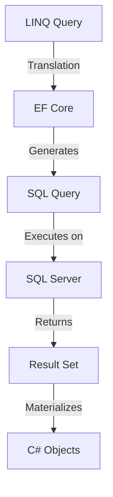
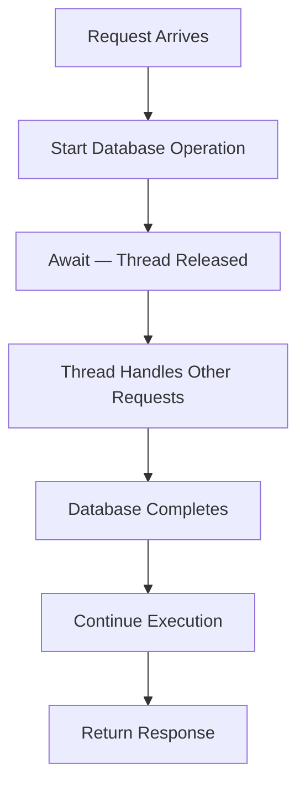

# Day 2 — Advanced C#

## Professional Training Course

**Duration:** 4 hours  
**Level:** Beginner-Intermediate — Building on Day 1  
**Prerequisites:** Day 1 (ASP.NET Core Fundamentals), basic C# syntax knowledge  
**Framework:** .NET 8 / C# 12

---

## 🎯 Day 2 Learning Objectives

By the end of this session, you will understand:

- How to choose the right collection for the right problem
- What generics are and why they matter
- How lambda expressions work and when to use them
- How to write clean, efficient LINQ queries
- The difference between deferred and immediate execution
- How to write correct asynchronous code with async/await
- How experienced C# developers think about data and operations

---

## Training Schedule

| Part | Topic | Duration |
|------|-------|----------|
| 1 | Collections & Generics | ~55 min |
| 2 | Lambda Expressions | ~35 min |
| 3 | LINQ | ~70 min |
| 4 | async / await | ~50 min |
| 5 | Practical Exercises & Review | ~30 min |

---

# Part 1 — Collections & Generics

## 1.1 Why Collections Exist

> **Instructor Note:** Ask participants — *"What if you needed to store 100 employee names? Would you create 100 variables?"*

Consider this approach:

```csharp
string employee1 = "Alice";
string employee2 = "Bob";
string employee3 = "Charlie";
// ... 97 more variables
```

This is obviously impractical. We need a way to store **multiple values of the same type** in a single variable. That is what collections are for.

```csharp
List<string> employees = new()
{
    "Alice",
    "Bob",
    "Charlie"
};
```

Collections solve:
- Storing multiple values
- Iterating over those values
- Adding and removing values dynamically
- Performing operations on groups of data

---

## 1.2 Main Collection Types

### Array

```csharp
int[] numbers = { 1, 2, 3, 4, 5 };
string[] names = new string[3];
```

| Aspect | Detail |
|--------|--------|
| **Size** | Fixed at creation |
| **Performance** | Fastest access by index |
| **Use when** | Size is known and will not change |
| **Avoid when** | You need to add or remove elements |

**Real-world example:** Month names, days of the week, configuration values loaded once.

---

### List\<T\>

```csharp
List<Employee> employees = new();
employees.Add(new Employee { Name = "Alice" });
employees.Add(new Employee { Name = "Bob" });
```

| Aspect | Detail |
|--------|--------|
| **Size** | Dynamic (grows as needed) |
| **Access** | Fast by index, slower by value |
| **Use when** | General-purpose collection of items |
| **Avoid when** | You need fast key-based lookups |

**Real-world example:** A list of employees loaded from a database, a shopping cart.

---

### Dictionary\<TKey, TValue\>

```csharp
Dictionary<int, Employee> employeesById = new()
{
    [1] = new Employee { Id = 1, Name = "Alice" },
    [2] = new Employee { Id = 2, Name = "Bob" }
};

Employee alice = employeesById[1];  // Fast lookup by key
```

| Aspect | Detail |
|--------|--------|
| **Size** | Dynamic |
| **Access** | Very fast by key |
| **Use when** | You need to find items quickly by a unique key |
| **Avoid when** | You need to iterate in order or search by value |

**Real-world example:** Lookup user by ID, product by SKU, configuration by key.

---

### HashSet\<T\>

```csharp
HashSet<string> roles = new()
{
    "Admin",
    "Editor",
    "Admin"  // Duplicate is ignored
};

roles.Count;  // 2 — "Admin" appears only once
```

| Aspect | Detail |
|--------|--------|
| **Size** | Dynamic |
| **Uniqueness** | Guarantees no duplicates |
| **Use when** | You need unique values or set operations (union, intersection) |
| **Avoid when** | You need duplicate values or indexed access |

**Real-world example:** Unique tags on a post, distinct user roles, checking if a value exists.

---

### Queue\<T\>

```csharp
Queue<string> orderQueue = new();
orderQueue.Enqueue("Order 1");
orderQueue.Enqueue("Order 2");

string next = orderQueue.Dequeue();  // "Order 1" — first in, first out
```

| Aspect | Detail |
|--------|--------|
| **Pattern** | FIFO (First In, First Out) |
| **Use when** | Processing items in the order they arrive |
| **Avoid when** | You need random access |

**Real-world example:** Print job queue, message processing, task scheduling.

---

### Stack\<T\>

```csharp
Stack<string> undoStack = new();
undoStack.Push("Action 1");
undoStack.Push("Action 2");

string last = undoStack.Pop();  // "Action 2" — last in, first out
```

| Aspect | Detail |
|--------|--------|
| **Pattern** | LIFO (Last In, First Out) |
| **Use when** | You need to reverse order or track the last operation |
| **Avoid when** | You need FIFO behavior |

**Real-world example:** Undo/redo operations, expression parsing, navigation history.

---

## 1.3 Collection Comparison

| Collection | Main Use | Key Characteristic | Lookup Speed | Example |
|------------|----------|-------------------|--------------|---------|
| **Array** | Fixed-size data | Fixed length | O(1) by index | Monthly values |
| **List\<T\>** | General collections | Dynamic size | O(1) by index, O(n) by value | Employees |
| **Dictionary\<TKey,TValue\>** | Key/value lookup | Fast key lookup | O(1) average | Employee by ID |
| **HashSet\<T\>** | Unique values | No duplicates | O(1) average | Unique roles |
| **Queue\<T\>** | FIFO processing | First in, first out | O(1) enqueue/dequeue | Processing jobs |
| **Stack\<T\>** | LIFO processing | Last in, first out | O(1) push/pop | Undo operations |

> 🟦 **Concept:** "O(1)" means constant time — the operation takes roughly the same time regardless of collection size. "O(n)" means the time grows linearly with the number of elements.

---

## 1.4 Collection Problems

### Problem 1: List\<T\> for Everything

```csharp
List<Employee> employees = GetAllEmployees();  // 100,000 records

// ❌ Searching by ID thousands of times
for (int i = 0; i < 10000; i++)
{
    var emp = employees.FirstOrDefault(e => e.Id == searchIds[i]);
}
```

**The problem:** `FirstOrDefault` scans the entire list each time. With 100,000 employees and 10,000 searches, that is up to 1 billion comparisons.

**The solution:** Use a Dictionary for O(1) lookups.

```csharp
var employeesById = employees.ToDictionary(e => e.Id);

// ✅ Each lookup is O(1)
for (int i = 0; i < 10000; i++)
{
    var emp = employeesById.GetValueOrDefault(searchIds[i]);
}
```

### Problem 2: Duplicates in a List

```csharp
List<string> tags = new();
tags.Add("C#");
tags.Add("ASP.NET");
tags.Add("C#");  // Duplicate added
tags.Add("LINQ");
tags.Add("C#");  // Another duplicate

// tags.Count = 5, but we only have 3 unique tags
```

**The problem:** Lists allow duplicates. If you need unique values, you must manually check or use LINQ `Distinct()` every time.

**The solution:** Use HashSet.

```csharp
HashSet<string> tags = new();
tags.Add("C#");
tags.Add("ASP.NET");
tags.Add("C#");  // Ignored
tags.Add("LINQ");
tags.Add("C#");  // Ignored

// tags.Count = 3 — only unique values
```

> 💡 **Senior Tip:** Choose the collection based on **what you need to do with it**, not based on habit. If you always reach for `List<T>`, you are probably making suboptimal choices.

---

## 1.5 IEnumerable, ICollection, IList

### IEnumerable\<T\>

The most basic contract for a collection: "I can be iterated over."

```csharp
IEnumerable<Employee> employees = GetEmployees();

foreach (var emp in employees)
{
    Console.WriteLine(emp.Name);
}
```

**What it provides:**
- Iteration (foreach)
- Nothing about size, indexing, or modification

### ICollection\<T\>

Extends IEnumerable with the ability to count, add, remove, and check containment.

```csharp
ICollection<Employee> employees = GetEmployees();
employees.Count;
employees.Add(new Employee());
employees.Remove(existingEmployee);
```

### IList\<T\>

Extends ICollection with indexed access.

```csharp
IList<Employee> employees = GetEmployees();
Employee first = employees[0];
employees[1] = new Employee();
```

### Why This Matters

```csharp
// ✅ Good — method communicates what it needs
public void ProcessEmployees(IEnumerable<Employee> employees)
{
    foreach (var emp in employees) { ... }
}

// ❌ Less flexible — forces the caller to provide a List
public void ProcessEmployees(List<Employee> employees)
{
    foreach (var emp in employees) { ... }
}
```

The first version accepts **any enumerable**: array, List, HashSet, or even a database query. The second version only accepts a List.

> 🟨 **Important:** Program to interfaces, not concrete types. `IEnumerable<T>` is the most flexible return type when you only need to iterate.

---

> **Instructor Note:** Before moving to generics, ask the class — *"Why do you think .NET provides so many different collection types instead of just one?"*

---

## 1.6 Generics

### The Problem Without Generics

Imagine you need to write methods that return different types:

```csharp
int GetIntValue(int id)
{
    return database.GetInt(id);
}

string GetStringValue(int id)
{
    return database.GetString(id);
}

Employee GetEmployeeValue(int id)
{
    return database.GetEmployee(id);
}
```

The logic is identical. Only the type changes. This is duplication.

### The Solution: Generics

```csharp
T GetValue<T>(int id)
{
    return database.Get<T>(id);
}

// Usage
int number = GetValue<int>(42);
string name = GetValue<string>(7);
Employee emp = GetValue<Employee>(10);
```

`T` is a **type parameter** — a placeholder that gets replaced with a real type when the method is called.

### Generic Types

```csharp
public class Repository<T>
{
    private readonly List<T> _items = new();

    public void Add(T item) => _items.Add(item);
    public T? GetById(int id) => _items.FirstOrDefault(i => ...);
    public IEnumerable<T> GetAll() => _items;
}

// Usage
var employeeRepo = new Repository<Employee>();
var productRepo = new Repository<Product>();
```

One class works for any type. No duplication.

### Why Generics Matter

| Benefit | Explanation |
|---------|-------------|
| **Type Safety** | Compile-time checking — no invalid casts |
| **Reusability** | Write once, use for any type |
| **Performance** | No boxing/unboxing for value types |
| **No Casting** | Results come out as the correct type |

---

## 1.7 Generic Constraints

Sometimes you need to restrict what `T` can be:

```csharp
// T must be a reference type (class)
public void Print<T>(T item) where T : class
{
    Console.WriteLine(item?.ToString());
}

// T must have a parameterless constructor
public T Create<T>() where T : new()
{
    return new T();
}

// T must implement an interface
public void Save<T>(T entity) where T : IEntity
{
    _context.Set<T>().Add(entity);
    _context.SaveChanges();
}

// T must inherit from a base class
public void Process<T>(T item) where T : BaseEntity
{
    item.LastModified = DateTime.UtcNow;
}
```

### Why Constraints Exist

Without constraints, you cannot call any methods on `T` because the compiler does not know what `T` is.

```csharp
// ❌ This won't compile — T might not have a Name property
public void PrintName<T>(T item)
{
    Console.WriteLine(item.Name);  // Error!
}

// ✅ With constraint, the compiler knows T has Name
public void PrintName<T>(T item) where T : IEntity
{
    Console.WriteLine(item.Name);  // Works!
}
```

> 💡 **Senior Tip:** Use constraints when you need them, not preemptively. Adding `where T : class` "just in case" adds complexity without value.

---

# Part 2 — Lambda Expressions

## 2.1 From Methods to Lambdas

### Starting Point: A Named Method

```csharp
bool IsActive(Employee employee)
{
    return employee.IsActive;
}
```

This method takes an Employee and returns true if it is active. Simple enough, but the method name and body are verbose for such a simple check.

### Converting to a Lambda

```csharp
employee => employee.IsActive
```

Breaking it down:

```text
employee      =>      employee.IsActive
   ↑                    ↑
 parameter          expression
```

- **Left side:** The input parameter(s)
- **`=>`:** The "goes to" operator
- **Right side:** The expression to evaluate

### Multiple Parameters

```csharp
(x, y) => x.Price > y.Price
```

### No Parameters

```csharp
() => DateTime.UtcNow
```

### Multiple Statements

```csharp
 employee =>
 {
     var tax = employee.Salary * 0.2m;
     return employee.Salary - tax;
 }
```

> 🟨 **Important:** When the body has multiple statements, use curly braces and an explicit `return`.

---

## 2.2 Where Lambdas Are Used

Lambdas are used everywhere in modern C#:

```csharp
// Filtering
employees.Where(e => e.IsActive);

// Sorting
employees.OrderBy(e => e.Salary);

// Transformation
employees.Select(e => e.Name);

// Event handlers
button.Click += (sender, args) => HandleClick();

// Custom comparers
employees.Sort((a, b) => a.Name.CompareTo(b.Name));
```

---

## 2.3 Common Lambda Mistakes

### Mistake 1: Overly Complex Lambdas

```csharp
// ❌ Hard to read
var result = employees.Where(e =>
    e.IsActive && e.Department != null &&
    e.Salary > 50000 && e.Name.Length > 3 &&
    (e.Department == "IT" || e.Department == "Engineering") &&
    e.HireDate.Year >= 2020);

// ✅ Better — extract to a method for clarity
var result = employees.Where(IsQualifiedEmployee);

bool IsQualifiedEmployee(Employee e)
{
    return e.IsActive
        && e.Department is not null
        && e.Salary > 50_000
        && e.Name.Length > 3
        && e.Department is "IT" or "Engineering"
        && e.HireDate.Year >= 2020;
}
```

### Mistake 2: Captured Variable Confusion

```csharp
// ❌ Classic closure bug
var actions = new List<Action>();

for (int i = 0; i < 5; i++)
{
    actions.Add(() => Console.WriteLine(i));
}

// All actions print 5! The variable 'i' is captured by reference.
foreach (var action in actions)
    action();  // 5, 5, 5, 5, 5

// ✅ Fix — capture the value, not the reference
for (int i = 0; i < 5; i++)
{
    int captured = i;
    actions.Add(() => Console.WriteLine(captured));
}
```

### Mistake 3: Using Lambdas When Named Methods Are Clearer

```csharp
// ❌ Lambda is less readable here
var active = employees.Where(e => e.IsActive && e.Department == "IT" && e.Salary > 50000 && e.HireDate.Year >= 2020);

// ✅ Named method is self-documenting
var active = employees.Where(IsEligibleITEmployee);
```

> 💡 **Senior Tip:** Shorter code is not automatically better code. A named method that explains its intent is often superior to a clever one-liner.

---

> **Ask the Class:** *"At what point does a lambda become too complex? How do you decide between a lambda and a named method?"*

---

# Part 3 — LINQ

## 3.1 The Problem LINQ Solves

Given a list of employees, find all active employees:

```csharp
List<Employee> employees = GetEmployees();

// Traditional approach
var result = new List<Employee>();
foreach (var employee in employees)
{
    if (employee.IsActive)
    {
        result.Add(employee);
    }
}
```

This works, but:
- It is verbose
- The intent ("filter active employees") is buried in loop mechanics
- It is error-prone (easy to forget the `Add` call)

### The LINQ Approach

```csharp
var result = employees
    .Where(e => e.IsActive)
    .ToList();
```

Same result. Clear intent. Less code. Less room for error.

---

## 3.2 LINQ Flow


---

## 3.3 Core LINQ Operators

### Filtering: Where

```csharp
var activeEmployees = employees
    .Where(e => e.IsActive);

// Real-world: Get employees earning more than 50,000
var highEarners = employees
    .Where(e => e.Salary > 50_000);
```

### Projection: Select

```csharp
var names = employees
    .Select(e => e.Name);

// Real-world: Create a lightweight view
var summaries = employees
    .Select(e => new
    {
        e.Id,
        e.Name,
        e.Department
    });
```

### Sorting: OrderBy / OrderByDescending

```csharp
var bySalary = employees
    .OrderBy(e => e.Salary);

var bySalaryDesc = employees
    .OrderByDescending(e => e.Salary);

// Chained sorting
var sorted = employees
    .OrderBy(e => e.Department)
    .ThenByDescending(e => e.Salary);
```

### Element Access: First / FirstOrDefault

```csharp
// Throws if no match
Employee first = employees.First(e => e.IsActive);

// Returns default (null) if no match
Employee? first = employees.FirstOrDefault(e => e.IsActive);
```

### Element Access: Single / SingleOrDefault

```csharp
// Throws if zero or more than one match
Employee only = employees.Single(e => e.Id == 10);

// Returns default if no match, throws if more than one
Employee? only = employees.SingleOrDefault(e => e.Id == 10);
```

> 🟨 **Important:** `Single` enforces that exactly one element matches. Use it when the query **must** return exactly one result.

### Existence Checks: Any / All

```csharp
// Is there at least one active employee?
bool hasActive = employees.Any(e => e.IsActive);

// Are all employees active?
bool allActive = employees.All(e => e.IsActive);
```

### Aggregation

```csharp
int count = employees.Count();
decimal totalSalary = employees.Sum(e => e.Salary);
decimal minSalary = employees.Min(e => e.Salary);
decimal maxSalary = employees.Max(e => e.Salary);
decimal avgSalary = employees.Average(e => e.Salary);
```

### Other Useful Operators

```csharp
// Check if collection contains a value
bool hasCSharp = employees.Any(e => e.Skills.Contains("C#"));

// Remove duplicates
var departments = employees
    .Select(e => e.Department)
    .Distinct();

// Pagination
var page = employees
    .Skip(20)
    .Take(10);
```

---

## 3.4 Select vs Where — The Critical Distinction

This is one of the most common points of confusion.

### Where: Filters (same shape, fewer items)

```csharp
// Input: 100 employees → Output: 30 active employees (same shape)
var activeEmployees = employees
    .Where(e => e.IsActive);
```

### Select: Transforms (different shape, same count)

```csharp
// Input: 100 employees → Output: 100 strings (names only)
var names = employees
    .Select(e => e.Name);
```

### Combined

```csharp
var result = employees
    .Where(e => e.IsActive)       // Filter: keep active only
    .Select(e => new               // Transform: create a new shape
    {
        e.Id,
        e.Name,
        e.Salary
    });
```


> 🟦 **Concept:** **Where** selects **which rows**. **Select** selects **which columns**. This is the same mental model as SQL.

---

## 3.5 FirstOrDefault vs SingleOrDefault

| Method | Expected Result | Multiple Matches | No Match |
|--------|-----------------|------------------|----------|
| `FirstOrDefault()` | 0 or 1 | Returns first | Returns `default(T)` |
| `SingleOrDefault()` | Exactly 1 | **Throws exception** | Returns `default(T)` |

### When to Use Each

```csharp
// ✅ Use FirstOrDefault when multiple matches are acceptable
var product = products.FirstOrDefault(p => p.Name == "Laptop");

// ✅ Use SingleOrDefault when exactly one match is expected
var user = users.SingleOrDefault(u => u.Email == "alice@example.com");
```

### Why This Matters

```csharp
// ❌ Hides a data integrity problem
var user = users.FirstOrDefault(u => u.Email == email);
// If two users have the same email, you silently get the wrong one

// ✅ Fails loudly if the data is corrupted
var user = users.SingleOrDefault(u => u.Email == email);
// Throws if duplicates exist — you discover the bug
```

> 💡 **Senior Tip:** Using `FirstOrDefault()` everywhere is a code smell. If a query should return exactly one result, enforce it with `SingleOrDefault()`.

---

## 3.6 Any vs Count

```csharp
// ❌ Less efficient — counts all matching elements
if (employees.Count() > 0) { ... }

// ✅ More efficient — stops at the first match
if (employees.Any()) { ... }
```

**Why?** `Count()` must iterate through all elements. `Any()` stops at the first element it finds.

### When Count Is Actually Correct

```csharp
// ✅ When you need the actual number
int count = employees.Count(e => e.IsActive);

// ✅ When comparing counts
if (employees.Count(e => e.Salary > 100_000) > 5) { ... }
```

> 🟦 **Concept:** Use `Any()` to check existence. Use `Count()` when you need the number.

---

## 3.7 Deferred Execution

This is one of the most important concepts in LINQ.

### Deferred Execution

```csharp
var query = employees.Where(e => e.IsActive);
// ⚠️ Nothing has happened yet — no filtering has occurred

employees.Add(new Employee { IsActive = true });

var result = query.ToList();
// ✅ NOW the filtering happens, including the newly added employee
```

### Immediate Execution

```csharp
var result = employees
    .Where(e => e.IsActive)
    .ToList();  // ✅ Filtering happens HERE, result is a snapshot

employees.Add(new Employee { IsActive = true });

// result does NOT include the new employee
```

### The Difference

| Aspect | Deferred | Immediate |
|--------|----------|-----------|
| **When it executes** | When iterated or materialized | Immediately |
| **Materialization** | No | Yes (ToList, ToArray, Count, etc.) |
| **Reflects source changes** | Yes | No (snapshot) |

### Why This Matters

```csharp
// ❌ Trap: query is deferred, source changes before enumeration
var query = products.Where(p => p.IsActive);

RemoveAllInactiveProducts();  // Modifies the source

foreach (var product in query)  // Query runs AFTER modification
{
    // Unexpected results
}

// ✅ Safe: materialize before modifying the source
var activeProducts = products.Where(p => p.IsActive).ToList();

RemoveAllInactiveProducts();

foreach (var product in activeProducts)  // Uses the snapshot
{
    // Correct results
}
```

> 🟥 **Warning:** Deferred execution is powerful but can cause surprising behavior. When in doubt, call `.ToList()` to materialize the query.

---

## 3.8 LINQ and Entity Framework Core

### In-Memory vs Database Execution

When you write LINQ with Entity Framework Core, the query does **not** execute in C#. It gets translated to SQL.

```csharp
// This LINQ:
var employees = await _context.Employees
    .Where(e => e.IsActive)
    .Select(e => new EmployeeDto
    {
        Id = e.Id,
        Name = e.Name
    })
    .ToListAsync();

// Becomes this SQL:
// SELECT Id, Name FROM Employees WHERE IsActive = 1
```



### Projection Is Critical

```csharp
// ❌ BAD — loads entire entity with all columns
var employees = await _context.Employees
    .Where(e => e.IsActive)
    .ToListAsync();

// ✅ GOOD — loads only what you need
var employees = await _context.Employees
    .Where(e => e.IsActive)
    .Select(e => new EmployeeDto
    {
        Id = e.Id,
        Name = e.Name,
        Department = e.Department
    })
    .ToListAsync();
```

**Why projection matters:**
- Less data transferred from database to application
- Less memory usage
- Faster queries
- Avoids loading sensitive data you do not need

---

## 3.9 Common LINQ Performance Problems

### Problem 1: Loading Everything into Memory

```csharp
// ❌ Loads 100,000 rows into memory, then filters in C#
var allEmployees = await _context.Employees.ToListAsync();
var active = allEmployees.Where(e => e.IsActive);

// ✅ Filters in the database
var active = await _context.Employees
    .Where(e => e.IsActive)
    .ToListAsync();
```

### Problem 2: Calling ToList() Too Early

```csharp
// ❌ Materializes the full query, then filters
var all = await _context.Employees.ToListAsync();
var active = all.Where(e => e.IsActive).ToList();  // Two database round-trips

// ✅ Single query, filters in database
var active = await _context.Employees
    .Where(e => e.IsActive)
    .ToListAsync();
```

### Problem 3: Loading Full Entities When Only Two Fields Are Needed

```csharp
// ❌ Transfers all columns for all rows
var employees = await _context.Employees.ToListAsync();
var names = employees.Select(e => new { e.Id, e.Name });

// ✅ Projects in the query
var names = await _context.Employees
    .Select(e => new { e.Id, e.Name })
    .ToListAsync();
```

### Problem 4: N+1 Query Problem

```csharp
// ❌ N+1 queries: 1 query for employees, then N queries for departments
var employees = await _context.Employees.ToListAsync();
foreach (var emp in employees)
{
    var dept = await _context.Departments.FindAsync(emp.DepartmentId);  // N queries!
}

// ✅ Eager loading: 1 query with JOIN
var employees = await _context.Employees
    .Include(e => e.Department)
    .ToListAsync();
```

### Problem 5: Inefficient Operations in Loops

```csharp
// ❌ Database hit for every employee
foreach (var emp in employees)
{
    var orders = await _context.Orders
        .Where(o => o.EmployeeId == emp.Id)
        .ToListAsync();
}

// ✅ Single query with join
var employeeOrders = await _context.Employees
    .Select(e => new
    {
        e.Name,
        OrderCount = e.Orders.Count
    })
    .ToListAsync();
```

> 💡 **Senior Tip:** Every LINQ operator that materializes data (ToList, ToArray, First, Count) triggers execution. Keep materialization at the end of the chain.

---

> **Instructor Note:** Ask the class — *"What happens if we call ToList() before Where() when querying a database?"*

---

# Part 4 — async / await

## 4.1 The Problem

Consider an API endpoint that queries a database:

```csharp
[HttpGet("{id}")]
public IActionResult GetEmployee(int id)
{
    var employee = _database.Query<Employee>(id);  // Takes 500ms
    return Ok(employee);
}
```

While this single request waits 500ms, the thread handling it is **blocked**. It cannot serve other requests. On a server handling 100 concurrent requests, that means 100 threads sitting idle, waiting for databases, APIs, or files.

### The Restaurant Analogy

```text
SYNCHRONOUS (one waiter, one table at a time):
  Waiter takes order → goes to kitchen → waits → brings food → takes next order

ASYNCHRONOUS (one waiter, many tables):
  Waiter takes order → goes to kitchen → takes NEXT order while waiting → brings food when ready
```

Asynchronous programming allows a single thread to handle multiple operations without being blocked.

---

## 4.2 Task and Task\<T\>

A `Task` represents an ongoing operation.

```csharp
// A task that returns nothing
Task SaveEmployeeAsync(Employee employee);

// A task that returns a value
Task<Employee?> GetEmployeeAsync(int id);
```

| Type | Purpose | Example |
|------|---------|---------|
| `Task` | Asynchronous operation, no return value | `SaveAsync()` |
| `Task<T>` | Asynchronous operation with return value | `GetAsync()` |

> 🟨 **Important:** `Task` does **not** mean "new thread." Asynchronous I/O operations (database, file, HTTP) do not occupy a thread while waiting. The thread is released to handle other work.

---

## 4.3 async and await

```csharp
public async Task<Employee?> GetEmployeeAsync(int id)
{
    return await _repository.GetByIdAsync(id);
}
```

Breaking it down:

| Keyword | Meaning |
|---------|---------|
| `async` | This method contains asynchronous operations |
| `await` | Wait for an asynchronous operation to complete, without blocking |
| `Task<Employee?>` | This method returns a Task that will eventually produce an Employee or null |

### The Flow



### What Happens Under the Hood

```csharp
public async Task<Employee?> GetEmployeeAsync(int id)
{
    // Thread starts here
    var employee = await _repository.GetByIdAsync(id);
    // Thread is released here while waiting for database
    // Thread resumes here when database responds
    return employee;
}
```

The `await` keyword does two things:
1. **Releases the thread** so it can do other work
2. **Registers a continuation** — what to do when the operation completes

> 🟨 **Important:** `async/await` is NOT multithreading. It is a way to write asynchronous code that looks synchronous. The thread is not blocked; it is released and reused.

---

## 4.4 Correct Async Patterns

```csharp
// ✅ Correct — proper async/await
public async Task<Employee?> GetEmployeeAsync(int id)
{
    return await _repository.GetByIdAsync(id);
}

// ✅ Correct — multiple awaited operations
public async Task<Employee?> CreateAndReturnAsync(Employee employee)
{
    await _repository.AddAsync(employee);
    await _repository.SaveChangesAsync();
    return await _repository.GetByIdAsync(employee.Id);
}
```

---

## 4.5 Common async/await Mistakes

### Mistake 1: Using .Result or .Wait()

```csharp
// ❌ DEADLOCK RISK — blocks the thread waiting for an async operation
var employee = service.GetEmployeeAsync(id).Result;

// ❌ Same problem
service.GetEmployeeAsync(id).Wait();

// ✅ Correct
var employee = await service.GetEmployeeAsync(id);
```

**Why this is dangerous:** In ASP.NET Core, `.Result` or `.Wait()` can cause deadlocks. The synchronization context tries to resume the method on the same thread, but the thread is blocked waiting for the method to complete. Deadlock.

### Mistake 2: async Without Await

```csharp
// ❌ Pointless — this is synchronous disguised as async
public async Task<Employee?> GetEmployeeAsync(int id)
{
    return _repository.GetById(id);  // No await
}
```

If a method does not use `await`, it does not need to be `async`.

### Mistake 3: Unnecessary async Everywhere

```csharp
// ❌ Unnecessarily async — pure computation, no I/O
public async Task<int> AddAsync(int a, int b)
{
    return a + b;  // Nothing asynchronous here
}

// ✅ Correct — no async needed
public int Add(int a, int b)
{
    return a + b;
}
```

### Mistake 4: Forgetting to Await

```csharp
// ❌ Fire-and-forget — the operation may fail silently
public IActionResult GetEmployee(int id)
{
    _service.LogAccessAsync(id);  // No await — exception may be lost
    return Ok();
}

// ✅ Either await it or explicitly ignore
public async Task<IActionResult> GetEmployee(int id)
{
    await _service.LogAccessAsync(id);
    return Ok();
}
```

### Mistake 5: Mixing Sync and Async Incorrectly

```csharp
// ❌ Mixing async and sync database calls
public async Task<Employee?> GetEmployeeAsync(int id)
{
    var employee = _context.Employees.Find(id);  // Sync
    var orders = await _context.Orders
        .Where(o => o.EmployeeId == id)
        .ToListAsync();  // Async
    return employee;
}

// ✅ All async
public async Task<Employee?> GetEmployeeAsync(int id)
{
    var employee = await _context.Employees.FindAsync(id);  // Async
    var orders = await _context.Orders
        .Where(o => o.EmployeeId == id)
        .ToListAsync();  // Async
    return employee;
}
```

---

## 4.6 CancellationToken

When an API request is cancelled by the client, the server should stop processing. `CancellationToken` enables this.

```csharp
[HttpGet("{id}")]
public async Task<IActionResult> GetEmployee(
    int id,
    CancellationToken cancellationToken)
{
    var employee = await _repository.GetByIdAsync(id, cancellationToken);
    if (employee is null)
        return NotFound();
    return Ok(employee);
}
```

```csharp
public async Task<Employee?> GetByIdAsync(int id, CancellationToken ct)
{
    return await _context.Employees
        .FirstOrDefaultAsync(e => e.Id == id, ct);
}
```

> 💡 **Senior Tip:** Always pass `CancellationToken` through your async call chain. It costs nothing when not used, but saves resources when a client disconnects.

---

> **Ask the Class:** *"Does `async` mean another thread is created? What actually happens to the thread?"*

---

# Senior Developer Notes

> 💡 **Practical lessons from real-world experience.**

## Lesson 1: Choose the Collection Based on the Operation

> Do not use `List<T>` automatically. Ask: "What will I do with this data most often?"

| If You Need To... | Use... |
|-------------------|--------|
| Access by index | `List<T>` or `Array` |
| Look up by key | `Dictionary<TKey, TValue>` |
| Ensure uniqueness | `HashSet<T>` |
| Process in order | `Queue<T>` |
| Undo operations | `Stack<T>` |

## Lesson 2: LINQ Improves Readability, But Chain Carefully

```csharp
// ✅ Good — clear and readable
var result = employees
    .Where(e => e.IsActive)
    .OrderBy(e => e.Name)
    .Select(e => new { e.Id, e.Name })
    .ToList();

// ❌ Hard to read — too many chained operations
var result = employees
    .Where(e => e.IsActive && e.Department != null && e.Salary > 50000)
    .OrderBy(e => e.Department).ThenByDescending(e => e.Salary)
    .GroupBy(e => e.Department)
    .Select(g => new { Department = g.Key, Count = g.Count(), Avg = g.Average(e => e.Salary) })
    .Where(g => g.Count > 5)
    .OrderByDescending(g => g.Avg)
    .Take(3)
    .ToList();
```

If a query is hard to read, break it into steps.

## Lesson 3: Understand Where Your LINQ Executes

```csharp
// In memory (after ToList)
var all = await context.Employees.ToListAsync();
var filtered = all.Where(e => e.IsActive);  // C# loop

// In database (before ToList)
var filtered = await context.Employees
    .Where(e => e.IsActive)  // SQL WHERE clause
    .ToListAsync();
```

## Lesson 4: Avoid Unnecessary .ToList()

```csharp
// ❌ Materializes early, loses deferred execution benefits
var query = employees.Where(e => e.IsActive).ToList();
var sorted = query.OrderByDescending(e => e.Salary).ToList();  // Second iteration

// ✅ Single materialization at the end
var result = employees
    .Where(e => e.IsActive)
    .OrderByDescending(e => e.Salary)
    .ToList();
```

## Lesson 5: Select Only What You Need

```csharp
// ❌ Transfers all columns
var employees = await context.Employees.ToListAsync();

// ✅ Transfers only required data
var employees = await context.Employees
    .Select(e => new { e.Id, e.Name })
    .ToListAsync();
```

## Lesson 6: async Is Not a Magic Thread Machine

```csharp
// ❌ Incorrect mental model: "async creates a thread"
public async Task<Employee> GetAsync(int id) { ... }

// ✅ Correct mental model: "async frees the thread during I/O waits"
```

## Lesson 7: Readable Code Over Clever Code

```csharp
// Clever but hard to understand at 3am
var r = e.Where(x => x.S > 50k && x.A && x.D == "IT").OrderBy(x => x.N).Select(x => new { x.I, x.N }).ToList();

// Clear and maintainable
var result = employees
    .Where(e => e.Salary > 50_000 && e.IsActive && e.Department == "IT")
    .OrderBy(e => e.Name)
    .Select(e => new { e.Id, e.Name })
    .ToList();
```

---

# Problem-Solving Scenarios

## Scenario 1: Slow Search

> A developer loads 100,000 employees into memory and filters with LINQ.

```csharp
var allEmployees = await _context.Employees.ToListAsync();
var active = allEmployees.Where(e => e.IsActive).ToList();
```

**What is wrong:** Two problems — (1) loads all 100K rows into memory, (2) filters in C# instead of the database.

**Better approach:**
```csharp
var active = await _context.Employees
    .Where(e => e.IsActive)
    .ToListAsync();
```

One query. Filtering in the database. Only active rows transferred.

---

## Scenario 2: Wrong Collection

> A developer performs thousands of ID lookups on a List.

```csharp
var employees = await _context.Employees.ToListAsync();

foreach (var id in request.UserIds)
{
    var emp = employees.FirstOrDefault(e => e.Id == id);  // O(n) each time
}
```

**What is wrong:** Each `FirstOrDefault` scans the entire list. With 10,000 users and 50,000 employees, that is up to 500 million comparisons.

**Better approach:**
```csharp
var employeesById = (await _context.Employees.ToListAsync())
    .ToDictionary(e => e.Id);

foreach (var id in request.UserIds)
{
    employeesById.GetValueOrDefault(id);  // O(1) each time
}
```

Or better yet, query the database directly with a filter:
```csharp
var employees = await _context.Employees
    .Where(e => request.UserIds.Contains(e.Id))
    .ToListAsync();
```

---

## Scenario 3: Overly Complex LINQ

> A developer writes one huge LINQ statement with filtering, grouping, sorting, and calculations.

```csharp
var result = products
    .Where(p => p.IsActive && p.Price > 0 && p.Stock > 0 && p.Category != null)
    .GroupBy(p => p.Category!.Name)
    .Select(g => new
    {
        Category = g.Key,
        Count = g.Count(),
        Total = g.Sum(p => p.Price * p.Stock),
        Average = g.Average(p => p.Price),
        Cheapest = g.Min(p => p.Price),
        MostExpensive = g.Max(p => p.Price)
    })
    .Where(x => x.Count > 3)
    .OrderByDescending(x => x.Total)
    .Take(10)
    .ToList();
```

**What is wrong:** Hard to read, hard to modify, hard to debug.

**Better approach:**
```csharp
var activeProducts = products
    .Where(p => p.IsActive && p.Price > 0 && p.Stock > 0 && p.Category != null);

var categoryStats = activeProducts
    .GroupBy(p => p.Category!.Name)
    .Select(BuildCategorySummary)
    .Where(x => x.Count > 3)
    .OrderByDescending(x => x.Total)
    .Take(10)
    .ToList();

CategorySummary BuildCategorySummary(IGrouping<string, Product> group)
{
    return new CategorySummary
    {
        Category = group.Key,
        Count = group.Count(),
        Total = group.Sum(p => p.Price * p.Stock),
        Average = group.Average(p => p.Price),
        Cheapest = group.Min(p => p.Price),
        MostExpensive = group.Max(p => p.Price)
    };
}
```

---

## Scenario 4: Blocking Async Code

> A developer writes:

```csharp
[HttpGet("{id}")]
public IActionResult GetEmployee(int id)
{
    var employee = _service.GetEmployeeAsync(id).Result;  // ❌ .Result
    return Ok(employee);
}
```

**What is wrong:** `.Result` blocks the thread. In ASP.NET Core, this can cause deadlocks. The thread pool thread is blocked waiting for an async operation that needs the same thread to complete.

**Better approach:**
```csharp
[HttpGet("{id}")]
public async Task<IActionResult> GetEmployee(int id)
{
    var employee = await _service.GetEmployeeAsync(id);
    return Ok(employee);
}
```

---

## Scenario 5: Unnecessary Data

> An API returns an entire Employee entity when the client only needs Id, Name, and Department.

```csharp
[HttpGet]
public async Task<IActionResult> GetAll()
{
    var employees = await _context.Employees.ToListAsync();  // All columns, all data
    return Ok(employees);
}
```

**What is wrong:** Loading unnecessary columns wastes bandwidth, memory, and may expose sensitive data.

**Better approach:**
```csharp
[HttpGet]
public async Task<IActionResult> GetAll()
{
    var employees = await _context.Employees
        .Select(e => new EmployeeDto
        {
            Id = e.Id,
            Name = e.Name,
            Department = e.Department
        })
        .ToListAsync();
    return Ok(employees);
}
```

---

# Practical Mini Project: Employee Query System

> 🎯 **Objective:** Practice collections, LINQ, and async operations on a realistic dataset.

## Setup

```csharp
public class Employee
{
    public int Id { get; set; }
    public string Name { get; set; } = string.Empty;
    public string Department { get; set; } = string.Empty;
    public decimal Salary { get; set; }
    public bool IsActive { get; set; }
}
```

```csharp
List<Employee> employees = new()
{
    new Employee { Id = 1,  Name = "Alice",   Department = "Engineering", Salary = 95_000,  IsActive = true },
    new Employee { Id = 2,  Name = "Bob",     Department = "Marketing",   Salary = 65_000,  IsActive = true },
    new Employee { Id = 3,  Name = "Charlie", Department = "Engineering", Salary = 110_000, IsActive = true },
    new Employee { Id = 4,  Name = "Diana",   Department = "HR",          Salary = 70_000,  IsActive = false },
    new Employee { Id = 5,  Name = "Eve",     Department = "Engineering", Salary = 85_000,  IsActive = true },
    new Employee { Id = 6,  Name = "Frank",   Department = "Marketing",   Salary = 55_000,  IsActive = true },
    new Employee { Id = 7,  Name = "Grace",   Department = "HR",          Salary = 72_000,  IsActive = true },
    new Employee { Id = 8,  Name = "Hank",    Department = "Engineering", Salary = 120_000, IsActive = true },
    new Employee { Id = 9,  Name = "Ivy",     Department = "Marketing",   Salary = 60_000,  IsActive = false },
    new Employee { Id = 10, Name = "Jack",    Department = "HR",          Salary = 68_000,  IsActive = true },
};
```

---

## Tasks

### Task 1: Get All Active Employees

```csharp
// Your code here
```

**Expected:** Returns employees where IsActive is true.

<details>
<summary>Solution</summary>

```csharp
var activeEmployees = employees
    .Where(e => e.IsActive)
    .ToList();
```

</details>

---

### Task 2: Get Employees from a Specific Department

```csharp
// Get all Engineering employees
```

**Expected:** Returns only employees in the "Engineering" department.

<details>
<summary>Solution</summary>

```csharp
var engineers = employees
    .Where(e => e.Department == "Engineering")
    .ToList();
```

</details>

---

### Task 3: Order Employees by Salary

```csharp
// Order active employees by salary (highest first)
```

**Expected:** Active employees sorted by salary descending.

<details>
<summary>Solution</summary>

```csharp
var bySalary = employees
    .Where(e => e.IsActive)
    .OrderByDescending(e => e.Salary)
    .ToList();
```

</details>

---

### Task 4: Get the Top 5 Highest-Paid Employees

```csharp
// Get top 5 by salary
```

<details>
<summary>Solution</summary>

```csharp
var top5 = employees
    .OrderByDescending(e => e.Salary)
    .Take(5)
    .ToList();
```

</details>

---

### Task 5: Calculate the Average Salary

```csharp
// Calculate average salary of active employees
```

<details>
<summary>Solution</summary>

```csharp
var averageSalary = employees
    .Where(e => e.IsActive)
    .Average(e => e.Salary);
```

</details>

---

### Task 6: Check Salary Threshold

```csharp
// Check if at least one employee earns more than 100,000
```

<details>
<summary>Solution</summary>

```csharp
bool hasHighEarner = employees.Any(e => e.Salary > 100_000);
```

</details>

---

### Task 7: Create a Lightweight Projection

```csharp
// Create a list of objects with only Id, Name, and Department
```

<details>
<summary>Solution</summary>

```csharp
var projections = employees
    .Select(e => new { e.Id, e.Name, e.Department })
    .ToList();
```

</details>

---

### Task 8: Create a Dictionary by Employee ID

```csharp
// Create a Dictionary<int, Employee> indexed by Id
```

<details>
<summary>Solution</summary>

```csharp
var employeesById = employees
    .ToDictionary(e => e.Id);
```

</details>

---

### Task 9: Async Simulation

```csharp
// Implement an async method that simulates fetching employees
// with a 100ms delay (use Task.Delay)
```

<details>
<summary>Solution</summary>

```csharp
public async Task<List<Employee>> GetEmployeesAsync()
{
    await Task.Delay(100);  // Simulate I/O
    return employees.ToList();
}
```

</details>

---

### Task 10: Combine Async with LINQ

```csharp
// Fetch employees asynchronously, then filter active ones
// and return only Name and Department
```

<details>
<summary>Solution</summary>

```csharp
public async Task<List<object>> GetActiveEmployeeSummariesAsync()
{
    var allEmployees = await GetEmployeesAsync();

    return allEmployees
        .Where(e => e.IsActive)
        .Select(e => new { e.Name, e.Department })
        .ToList<object>();
}
```

</details>

---

# Exercises With Progressive Difficulty

## 🟢 Beginner Exercises

### Exercise B1: Collection Selection

> Choose the best collection for each scenario.

| Scenario | Best Collection |
|----------|-----------------|
| Store 12 monthly revenue values | ? |
| Look up user by email address | ? |
| Track unique IP addresses that visited a page | ? |
| Process print jobs in order | ? |
| Store a dynamic list of shopping cart items | ? |
| Implement undo functionality | ? |

<details>
<summary>Answers</summary>

| Scenario | Answer |
|----------|--------|
| 12 monthly values | `decimal[]` (fixed size) |
| User by email | `Dictionary<string, User>` |
| Unique IPs | `HashSet<string>` |
| Print jobs | `Queue<PrintJob>` |
| Shopping cart | `List<CartItem>` |
| Undo | `Stack<Action>` |

</details>

---

### Exercise B2: Basic LINQ

> Write LINQ queries for the following using the employee dataset.

1. Get all employees in the "HR" department
2. Get employee names only
3. Get employees sorted by name alphabetically
4. Count how many employees are inactive
5. Get the highest salary

<details>
<summary>Solutions</summary>

```csharp
// 1
employees.Where(e => e.Department == "HR")

// 2
employees.Select(e => e.Name)

// 3
employees.OrderBy(e => e.Name)

// 4
employees.Count(e => !e.IsActive)

// 5
employees.Max(e => e.Salary)
```

</details>

---

## 🟡 Intermediate Exercises

### Exercise M1: Department Statistics

> Create a summary of each department showing: department name, employee count, average salary, highest salary.

<details>
<summary>Solution</summary>

```csharp
var stats = employees
    .GroupBy(e => e.Department)
    .Select(g => new
    {
        Department = g.Key,
        Count = g.Count(),
        AverageSalary = g.Average(e => e.Salary),
        HighestSalary = g.Max(e => e.Salary)
    })
    .ToList();
```

</details>

---

### Exercise M2: Paginated Results

> Implement a method that returns a page of employees (page number and page size), ordered by name.

```csharp
public List<Employee> GetPage(int pageNumber, int pageSize)
{
    return employees
        .OrderBy(e => e.Name)
        .Skip((pageNumber - 1) * pageSize)
        .Take(pageSize)
        .ToList();
}
```

---

### Exercise M3: Combined Filtering

> Get active employees in Engineering with salary above 80,000, ordered by salary descending, returning only Name and Salary.

<details>
<summary>Solution</summary>

```csharp
var result = employees
    .Where(e => e.IsActive && e.Department == "Engineering" && e.Salary > 80_000)
    .OrderByDescending(e => e.Salary)
    .Select(e => new { e.Name, e.Salary })
    .ToList();
```

</details>

---

## 🔴 Advanced Exercises

### Exercise A1: Refactor This Code

> This code is inefficient and poorly written. Identify the problems and rewrite it.

```csharp
public async Task<List<EmployeeDto>> GetHighEarners()
{
    var all = await _context.Employees.ToListAsync();
    var result = new List<EmployeeDto>();

    foreach (var emp in all)
    {
        if (emp.Salary > 80000 && emp.IsActive)
        {
            var dto = new EmployeeDto
            {
                Id = emp.Id,
                Name = emp.Name,
                Salary = emp.Salary
            };
            result.Add(dto);
        }
    }

    result = result.OrderBy(x => x.Salary).ToList();
    return result;
}
```

<details>
<summary>Solution</summary>

```csharp
public async Task<List<EmployeeDto>> GetHighEarners()
{
    return await _context.Employees
        .Where(e => e.IsActive && e.Salary > 80_000)
        .OrderBy(e => e.Salary)
        .Select(e => new EmployeeDto
        {
            Id = e.Id,
            Name = e.Name,
            Salary = e.Salary
        })
        .ToListAsync();
}
```

**Problems fixed:**
1. Loads all employees into memory (should filter in database)
2. Uses foreach loop instead of LINQ
3. Manual DTO mapping (should use Select projection)
4. Two separate ordering operations
5. Missing async/await properly

</details>

---

### Exercise A2: Find the Bug

> This code has several problems. Find them all.

```csharp
public class EmployeeService
{
    public Employee GetEmployee(int id)
    {
        var employees = GetAllEmployees().Result;
        var result = employees.Where(e => e.Id == id).ToList();
        return result[0];
    }

    public List<Employee> GetActiveEmployees()
    {
        return GetAllEmployees().Result
            .Where(e => e.IsActive == true)
            .ToList()
            .OrderBy(e => e.Name)
            .ToList();
    }

    private async Task<List<Employee>> GetAllEmployees()
    {
        return await _context.Employees.ToListAsync();
    }
}
```

<details>
<summary>Problems Found</summary>

1. **`.Result` usage** — Blocks the thread, risk of deadlock. Should be `await`.
2. **Method is not async** — `GetEmployee` should return `Task<Employee>` and use `await`.
3. **`result[0]` without check** — Throws `IndexOutOfRangeException` if no match. Use `FirstOrDefault`.
4. **Double `.ToList()`** — `GetActiveEmployees` materializes twice. Move `OrderBy` before `ToList`.
5. **`e.IsActive == true`** — Redundant comparison. Just use `e.IsActive`.
6. **Inconsistent async** — `GetAllEmployees` is async but callers use `.Result`.

</details>

---

### Exercise A3: Async Transformation

> Convert this synchronous code to proper async/await. Explain each change.

```csharp
public ProductDto GetProduct(int id)
{
    var product = _context.Products.Find(id);
    if (product == null) return null;

    var category = _context.Categories.Find(product.CategoryId);

    return new ProductDto
    {
        Id = product.Id,
        Name = product.Name,
        CategoryName = category?.Name
    };
}
```

<details>
<summary>Solution</summary>

```csharp
public async Task<ProductDto?> GetProductAsync(int id)
{
    var product = await _context.Products.FindAsync(id);
    if (product is null) return null;

    var category = await _context.Categories.FindAsync(product.CategoryId);

    return new ProductDto
    {
        Id = product.Id,
        Name = product.Name,
        CategoryName = category?.Name
    };
}
```

**Changes:**
1. Method returns `Task<ProductDto?>` instead of `ProductDto`
2. Added `async` keyword
3. `Find` → `await FindAsync`
4. Null check uses `is null` pattern
5. Nullable return type annotated

</details>

---

# Debugging Exercise

> 🐛 **This code contains multiple problems. Find them all before reading the solution.**

```csharp
public class EmployeeController : ControllerBase
{
    private readonly EmployeeService _service;

    public EmployeeController()
    {
        _service = new EmployeeService();
    }

    [HttpGet("{id}")]
    public IActionResult GetEmployee(int id)
    {
        var emp = _service.GetByIdAsync(id).Result;
        return Ok(emp);
    }

    [HttpGet("active")]
    public IActionResult GetActive()
    {
        var employees = _service.GetAllAsync().Result;
        var active = employees.Where(e => e.IsActive).ToList();
        var sorted = active.OrderBy(e => e.Salary).ToList();
        var result = sorted.Select(e => new
        {
            e.Id,
            e.Name,
            e.Salary,
            e.Department,
            e.HireDate,
            e.Email,
            e.PhoneNumber
        }).ToList();
        return Ok(result);
    }

    [HttpGet("search")]
    public IActionResult Search(string department)
    {
        var all = _service.GetAllAsync().Result;
        var result = all.Where(e => e.Department == department).ToList();
        return Ok(result);
    }
}
```

<details>
<summary>Problems Found</summary>

| # | Problem | Fix |
|---|---------|-----|
| 1 | **`new EmployeeService()` in constructor** — tight coupling, no DI | Use Dependency Injection |
| 2 | **`.Result`** — blocks thread, deadlock risk | Use `async`/`await` |
| 3 | **Methods are not async** — should return `Task<IActionResult>` | Add `async` keyword and return type |
| 4 | **Returns all entity fields** — potential data exposure | Use DTO with projection |
| 5 | **Loads all employees into memory** — performance issue | Filter in database, not in C# |
| 6 | **`Search` returns full entities** — loads unnecessary data | Project to DTO in query |
| 7 | **No `CancellationToken`** — cannot cancel long operations | Add cancellation token |

</details>

---

# Knowledge Check

Test your understanding of today's material.

### Questions

1. When would you choose `Dictionary<TKey, TValue>` over `List<T>`?
2. What problem do generics solve?
3. What is the difference between `Where` and `Select`?
4. What is deferred execution?
5. What is the difference between `IEnumerable<T>` and `IQueryable<T>`?
6. Why can `.ToList()` be dangerous when used too early?
7. What does `Task<T>` represent?
8. Why should `.Result` generally be avoided in async code?
9. Does `async` automatically create a new thread?
10. When should you use `Any()` instead of `Count() > 0`?
11. What is projection?
12. Why should code readability be prioritized over clever LINQ?

---

### Answers

<details>
<summary>Click to reveal answers</summary>

1. **Dictionary vs List:** Use Dictionary when you need frequent lookups by a unique key. List is better for sequential access or when the key is not unique.

2. **Generics solve:** Code duplication and type safety. They allow you to write one class/method that works with any type, with compile-time type checking.

3. **Where vs Select:** Where **filters** rows (same shape, fewer items). Select **transforms** columns (different shape, same count).

4. **Deferred execution:** The query is defined but not executed until it is iterated or materialized (ToList, First, Count, etc.).

5. **IEnumerable vs IQueryable:** IEnumerable executes in memory (C# loop). IQueryable is translatable to SQL (executes in the database).

6. **ToList() danger:** It materializes the query immediately, losing deferred execution. If the source changes later, the materialized list does not reflect those changes.

7. **Task\<T\> represents:** A promise of a future value. It is an asynchronous operation that will eventually produce a result of type T.

8. **.Result avoidance:** It blocks the current thread, which can cause deadlocks in ASP.NET Core's synchronization context. Always use `await` instead.

9. **async and threads:** No. Async/await releases the thread during I/O waits and resumes when the operation completes. It does not create new threads.

10. **Any vs Count:** Use `Any()` when you only need to know if elements exist. It stops at the first match. Use `Count()` when you need the actual number.

11. **Projection:** Transforming data into a different shape, typically selecting only the fields you need (e.g., selecting Name and Id instead of the entire entity).

12. **Readability over cleverness:** Code is read far more often than it is written. Clear code reduces bugs, speeds up maintenance, and helps the entire team — especially at 3am during an incident.

</details>

---

# Day 2 Final Summary

```text
Collections
     ↓
Generics — Write once, use for any type
     ↓
Lambda Expressions — Inline behavior
     ↓
LINQ — Query data declaratively
     ↓
IEnumerable / IQueryable — Where does the query run?
     ↓
Async Programming — Non-blocking I/O
     ↓
Real-World Performance — Choose wisely, measure always
     ↓
Clean & Maintainable C#
```

---

## ✅ What You Should Know After Day 2

- [ ] The main collection types and when to use each
- [ ] Why generics improve code reuse and type safety
- [ ] How to write lambda expressions
- [ ] The difference between Where (filter) and Select (transform)
- [ ] How to use key LINQ operators (Where, Select, OrderBy, FirstOrDefault, Any, Count, Sum)
- [ ] The difference between FirstOrDefault and SingleOrDefault
- [ ] What deferred execution is and when to materialize a query
- [ ] The difference between in-memory LINQ and database-backed LINQ
- [ ] How to project data to reduce memory usage and improve performance
- [ ] How to write correct async/await code
- [ ] Why .Result should be avoided
- [ ] The relationship between Task, async, and await
- [ ] How to pass CancellationToken through async call chains
- [ ] Common performance pitfalls and how to avoid them

---

# 📅 Preview of Day 3

# Day 3 — SQL Server & Database Design

In the next session, you will learn:

- **Relational Database Concepts** — Tables, rows, columns, and relationships
- **Database Design** — Normalization, schema design, and best practices
- **Keys and Relationships** — Primary keys, foreign keys, one-to-many, many-to-many
- **SQL Queries** — SELECT, WHERE, ORDER BY, GROUP BY
- **JOINs** — INNER JOIN, LEFT JOIN, RIGHT JOIN
- **Constraints** — NOT NULL, UNIQUE, CHECK, DEFAULT
- **Indexes** — How they work and why they matter
- **Transactions** — ACID properties and data integrity
- **Query Performance** — Writing efficient SQL

You will learn how the database layer works so you can make better decisions when using Entity Framework Core.

---

> 🟦 **Remember:** Don't memorize syntax. Understand the problem. Choose the appropriate tool. Understand the cost. Write readable code.

---

*End of Day 2 Training Material*
