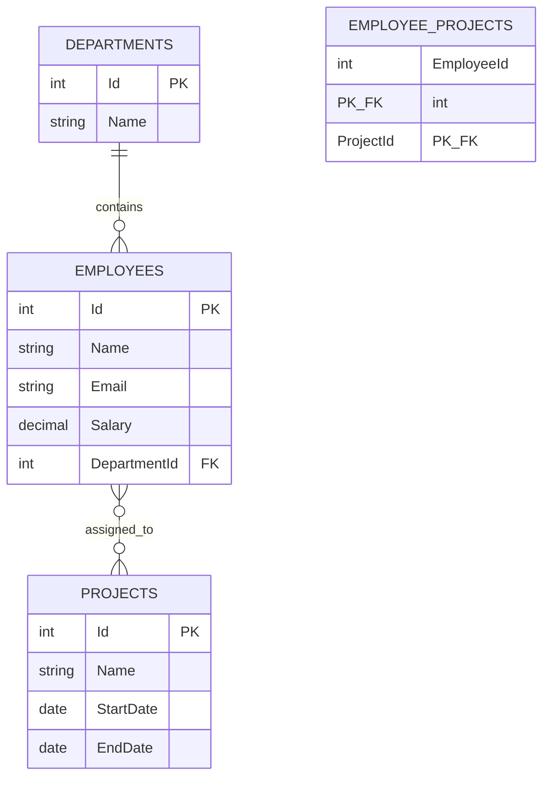

# Day 3 — SQL Server

## Professional Training Course (Week 1)

**Duration:** 4 hours  
**Level:** Beginner — Building on Days 1-2  
**Prerequisites:** Day 1 (C# Fundamentals), Day 2 (Advanced C#)  
**Database:** Microsoft SQL Server

---

## ًںژ¯ Day 3 Learning Objectives

By the end of this session, you will understand:

- What a relational database is and why it matters
- How to design tables, choose data types, and define keys
- How to create constraints that protect data integrity
- How to model one-to-one, one-to-many, and many-to-many relationships
- How to write SQL queries: SELECT, INSERT, UPDATE, DELETE
- How to filter, sort, and aggregate data
- How to use JOINs to query multiple tables
- Why indexes matter for performance
- How to think like a database designer, not just a SQL writer

---

## Training Schedule

| Part | Topic | Duration |
|------|-------|----------|
| 1 | Relational Database Fundamentals | ~40 min |
| 2 | Database Design, Tables, Keys & Constraints | ~55 min |
| 3 | Relationships & Normalization | ~45 min |
| 4 | SQL Queries | ~50 min |
| 5 | JOINs & Multi-Table Queries | ~55 min |
| 6 | Practical Database Project & Review | ~35 min |

---

# Part 1 — Relational Database Fundamentals

## 1.1 The Problem

> **Instructor Note:** Ask participants — *"We are building an Employee Management System. We need to store employees, departments, positions, salaries, and projects. Where should this information live?"*

Then ask:

> *"Could we store everything in one giant table?"*

### The Bad Design

Imagine storing everything in a single flat structure:

```text
| EmployeeName | DepartmentName | DepartmentManager | Project1 | Project2 | Project3 | Salary |
|--------------|----------------|-------------------|----------|----------|----------|--------|
| Ahmed        | IT             | Ali               | Web App  | Mobile   |          | 5000   |
| Sara         | IT             | Ali               | Web App  |          |          | 4500   |
| Omar         | HR             | Mona              |          |          |          | 4000   |
```

> ًں§  **Think About It:** "What problems do you see with this design?"

### The Problems

| Problem | Explanation |
|---------|-------------|
| **Duplication** | "IT" and "Ali" are repeated for every IT employee |
| **Inconsistent data** | What if one row says "IT" and another says "Information Technology"? |
| **Difficult updates** | Changing the department manager means updating every employee row |
| **Difficult searching** | "Find all employees in IT" requires scanning every row |
| **Poor scalability** | Adding a new project column means altering the table |
| **Data integrity** | Nothing stops you from entering a non-existent department |

---

## 1.2 What Is a Relational Database?

A **relational database** stores data in **tables** that can **relate** to each other.

```text
Database
   ↓
Tables
   ↓
Rows (records)
   ↓
Columns (fields)
```

### Key Terms

| Term | Meaning | Example |
|------|---------|---------|
| **Database** | A collection of related tables | EmployeeManagementDb |
| **Table** | A structured set of rows and columns | Employees |
| **Row (Record)** | A single entry in a table | One employee |
| **Column (Field)** | A property of the data | Name, Salary |

Instead of one giant table, we split data into logical tables:

```text
Departments table          Employees table           Projects table
| Id | Name     |         | Id | Name | DeptId |    | Id | Name     |
|----|----------|         |----|------|--------|    |----|----------|
| 1  | IT       |         | 1  | Ahmed| 1      |    | 1  | Web App  |
| 2  | HR       |         | 2  | Sara | 1      |    | 2  | Mobile   |
```

The `DepartmentId` in Employees **references** the `Id` in Departments. This is the "relational" part.

---

## 1.3 Relational Thinking

Relational database design is about representing:

> **Things + Properties + Relationships**

```text
Things:        Department, Employee, Project
Properties:    Name, Salary, Email, StartDate
Relationships: Employee belongs to Department
               Employee works on Project
```

> ًں’، **Senior Developer Lesson:** "Before writing any CREATE TABLE statement, ask yourself: What are the things? What are their properties? How do they relate to each other?"

---

## 1.4 Classroom Questions

> ًں§  "What should be a table?"

**Answer:** An entity — something the business cares about as a distinct thing. Employees, Departments, Projects.

> ًں§  "Should DepartmentName be repeated for every employee?"

**Answer:** No. Store it once in a Departments table. Reference it with a foreign key.

> ًں§  "What happens if the department name changes and we stored it in every employee row?"

**Answer:** We must update every single employee row. If we miss one, the data is inconsistent.


---

# Part 2 — Database Design, Tables, Keys & Constraints

## 2.1 Creating a Database

```sql
CREATE DATABASE EmployeeManagementDb;
GO

USE EmployeeManagementDb;
GO
```

> ًںں¦ **Concept:** A database is a container for tables. You create it once, then create tables inside it.

---

## 2.2 Creating Tables

### Departments Table

```sql
CREATE TABLE Departments
(
    Id   INT NOT NULL PRIMARY KEY,
    Name NVARCHAR(100) NOT NULL
);
```

### Employees Table

```sql
CREATE TABLE Employees
(
    Id           INT NOT NULL PRIMARY KEY,
    Name         NVARCHAR(100) NOT NULL,
    Email        NVARCHAR(255) NOT NULL,
    Salary       DECIMAL(18, 2) NOT NULL,
    IsActive     BIT NOT NULL,
    DepartmentId INT NOT NULL
);
```

---

## 2.3 Data Types

> ًں’، **Senior Developer Lesson:** "Choosing a data type is a design decision, not just a syntax decision."

| Data Type | Use Case | Example |
|-----------|----------|---------|
| `INT` | Whole numbers (up to ~2 billion) | Id, DepartmentId |
| `BIGINT` | Very large whole numbers | Audit logs, large datasets |
| `DECIMAL(p,s)` | Exact numeric (money, percentages) | Salary, Price |
| `NVARCHAR(n)` | Variable-length Unicode text | Name, Email |
| `VARCHAR(n)` | Variable-length non-Unicode text | Code, Abbreviation |
| `DATE` | Date only (no time) | BirthDate, StartDate |
| `DATETIME2` | Date and time with precision | CreatedAt, UpdatedAt |
| `BIT` | Boolean (0 or 1) | IsActive, IsDeleted |

### Common Mistakes

| Mistake | Why It Is Wrong |
|---------|-----------------|
| Storing numbers as `NVARCHAR` | Cannot sort or calculate correctly |
| Using `NVARCHAR(MAX)` for everything | Wastes storage, poor performance |
| Using `FLOAT` for money | Floating-point imprecision — use `DECIMAL` |
| Using `DATETIME` instead of `DATETIME2` | `DATETIME2` has better precision |

---

## 2.4 Primary Keys

> **Instructor Note:** Ask participants — *"How do we uniquely identify an employee?"*

A **primary key** uniquely identifies each row in a table.

```sql
CREATE TABLE Employees
(
    Id   INT NOT NULL PRIMARY KEY,
    Name NVARCHAR(100) NOT NULL
);
```

### Why Every Table Needs a Primary Key

- **Uniqueness** — no two rows can have the same Id
- **Identity** — you can reference any row precisely
- **Relationships** — other tables can reference this row
- **Performance** — the primary key is automatically indexed

### Natural Keys vs Surrogate Keys

| Type | Example | Pros | Cons |
|------|---------|------|------|
| **Natural key** | Email as PK | Meaningful | Can change, may be long |
| **Surrogate key** | Id (auto-generated) | Stable, simple | meaningless to business |

> ًں’، **Senior Developer Lesson:** "Use surrogate keys (auto-generated Id) as primary keys in most cases. Natural keys like Email can change, and that creates problems."

---

## 2.5 IDENTITY — Auto-Increment

Instead of manually assigning Id values, let the database generate them:

```sql
CREATE TABLE Employees
(
    Id   INT IDENTITY(1,1) NOT NULL PRIMARY KEY,
    Name NVARCHAR(100) NOT NULL
);
```

| Part | Meaning |
|------|---------|
| `IDENTITY(1,1)` | Start at 1, increment by 1 |
| `IDENTITY(1,10)` | Start at 1, increment by 10 |

The database automatically assigns the next Id when you insert a row.

---

## 2.6 Constraints

Constraints protect data integrity at the database level.

### PRIMARY KEY

```sql
Id INT IDENTITY(1,1) PRIMARY KEY
```

Uniquely identifies each row.

### NOT NULL

```sql
Name NVARCHAR(100) NOT NULL
```

The column must have a value.

### UNIQUE

```sql
Email NVARCHAR(255) NOT NULL UNIQUE
```

No two rows can have the same value.

### CHECK

```sql
Salary DECIMAL(18, 2) NOT NULL CHECK (Salary >= 0)
```

The value must satisfy a condition.

### DEFAULT

```sql
IsActive BIT NOT NULL DEFAULT 1
```

If no value is provided, use the default.

### Complete Example

```sql
CREATE TABLE Employees
(
    Id           INT IDENTITY(1,1) NOT NULL PRIMARY KEY,
    Name         NVARCHAR(100) NOT NULL,
    Email        NVARCHAR(255) NOT NULL UNIQUE,
    Salary       DECIMAL(18, 2) NOT NULL CHECK (Salary >= 0),
    IsActive     BIT NOT NULL DEFAULT 1,
    DepartmentId INT NOT NULL
);
```

---

## 2.7 Why Constraints Matter

> ًں§  **Think About It:** "Should the application be the only thing preventing an employee from having a negative salary?"

**Answer:** No. Application validation is important, but:

- Someone might insert data directly into the database
- A bug in the application might skip validation
- Multiple applications might share the same database

The database is the **final guardian** of data integrity.

> ًں’، **Senior Developer Lesson:** "Never rely on developer discipline alone to protect critical data integrity. Use database constraints as a safety net."


---

# Part 3 — Relationships & Normalization

## 3.1 Foreign Keys

A **foreign key** links one table to another.

### Departments Table

```sql
CREATE TABLE Departments
(
    Id   INT IDENTITY(1,1) NOT NULL PRIMARY KEY,
    Name NVARCHAR(100) NOT NULL UNIQUE
);
```

### Employees Table with Foreign Key

```sql
CREATE TABLE Employees
(
    Id           INT IDENTITY(1,1) NOT NULL PRIMARY KEY,
    Name         NVARCHAR(100) NOT NULL,
    Email        NVARCHAR(255) NOT NULL UNIQUE,
    Salary       DECIMAL(18, 2) NOT NULL CHECK (Salary >= 0),
    IsActive     BIT NOT NULL DEFAULT 1,
    DepartmentId INT NOT NULL,

    CONSTRAINT FK_Employees_Departments
        FOREIGN KEY (DepartmentId)
        REFERENCES Departments(Id)
);
```

### What This Means

```text
Departments.Id  â†گ──  Employees.DepartmentId
```

- Every employee must belong to a valid department
- You cannot insert an employee with a DepartmentId that does not exist
- You cannot delete a department that still has employees (by default)

> ًںں¦ **Concept:** This is called **referential integrity** — the database enforces that relationships are valid.

---

## 3.2 Relationship Types

### One-to-One

```text
Employee ──────── EmployeeProfile
```

One employee has one profile. One profile belongs to one employee.

**When to use:** Separate optional or large data from the main entity (e.g., biography, photo).

### One-to-Many

```text
Department
    │
    ├── Employee
    ├── Employee
    └── Employee
```

One department has many employees. Each employee belongs to one department.

**This is the most common relationship.**

### Many-to-Many

```text
Employee â†گ──────→ Project
```

An employee can work on many projects. A project can have many employees.

**Requires a junction table** (also called a join table or bridge table).

---

## 3.3 Many-to-Many — Junction Table

```sql
CREATE TABLE Projects
(
    Id        INT IDENTITY(1,1) NOT NULL PRIMARY KEY,
    Name      NVARCHAR(100) NOT NULL,
    StartDate DATE NULL,
    EndDate   DATE NULL
);

CREATE TABLE EmployeeProjects
(
    EmployeeId INT NOT NULL,
    ProjectId  INT NOT NULL,

    PRIMARY KEY (EmployeeId, ProjectId),

    CONSTRAINT FK_EmployeeProjects_Employees
        FOREIGN KEY (EmployeeId)
        REFERENCES Employees(Id),

    CONSTRAINT FK_EmployeeProjects_Projects
        FOREIGN KEY (ProjectId)
        REFERENCES Projects(Id)
);
```

### Why a Junction Table?

You cannot put `ProjectId` in Employees (an employee has many projects).  
You cannot put `EmployeeId` in Projects (a project has many employees).

The junction table resolves this by storing **pairs** of related IDs.

### Composite Primary Key

```sql
PRIMARY KEY (EmployeeId, ProjectId)
```

The combination of both columns is unique — an employee cannot be assigned to the same project twice.

---

## 3.4 ER Diagram



**Reading the diagram:**
- One Department contains many Employees (1:N)
- Employees and Projects have a many-to-many relationship via EmployeeProjects

---

## 3.5 Normalization

> **Instructor Note:** Show this bad design and ask *"What is repeated here?"*

### Bad Design (Unnormalized)

```text
| EmpId | EmpName | DeptName | DeptManager | ProjectName |
|-------|---------|----------|-------------|-------------|
| 1     | Ahmed   | IT       | Ali         | Web App     |
| 2     | Sara    | IT       | Ali         | Web App     |
| 3     | Omar    | HR       | Mona        | Mobile      |
```

**Problems:**
- "IT" and "Ali" are repeated
- If Ali leaves, we must update every IT employee row
- If we delete Ahmed, we lose the information that "IT" is managed by "Ali"

### Normalized Design

```text
Departments:            Employees:              Projects:
| Id | Name | Mgr |    | Id | Name | DeptId |   | Id | Name    |
|----|------|-----|    |----|------|--------|   |----|---------|
| 1  | IT   | Ali |    | 1  | Ahmed| 1      |   | 1  | Web App |
| 2  | HR   | Mona|    | 2  | Sara | 1      |   | 2  | Mobile  |
                        | 3  | Omar | 2      |
```

Each piece of information is stored **once**, in the place where it logically belongs.

### Normal Forms (Simplified)

| Form | Rule | In Plain Language |
|------|------|-------------------|
| **1NF** | Each column contains atomic values | No lists or comma-separated values in a cell |
| **2NF** | No partial dependency | Every non-key column depends on the whole primary key |
| **3NF** | No transitive dependency | Non-key columns do not depend on other non-key columns |

> ًں’، **Senior Developer Lesson:** "Normalization is not about creating as many tables as possible. It is about storing each piece of information where it belongs — once."

---

## 3.6 When to Denormalize

Sometimes you intentionally duplicate data for performance:

- **Reporting databases** — pre-calculated sums for fast reports
- **Caching** — storing a department name in an employee table to avoid JOINs
- **High-read, low-write** — read-heavy systems where JOIN cost is high

> âڑ ï¸ڈ **Important:** Denormalize only when you have measured a performance problem. Do not denormalize "just in case."


---

# Part 4 — SQL Queries

> "We designed the database. Now let us talk to it."

## 4.1 SELECT — Retrieving Data

### Select All Columns

```sql
SELECT *
FROM Employees;
```

### Select Specific Columns

```sql
SELECT
    Id,
    Name,
    Email,
    Salary
FROM Employees;
```

> ًں§  **Think About It:** "Why should we prefer selecting specific columns over `SELECT *`?"
>
> **Answer:** `SELECT *` returns every column, including ones the application does not need. This wastes network bandwidth, memory, and can break clients if columns are added later.

---

## 4.2 WHERE — Filtering Rows

### Basic Filtering

```sql
SELECT Id, Name, Salary
FROM Employees
WHERE IsActive = 1;
```

### Comparisons

```sql
-- Salary greater than or equal to 3000
SELECT Id, Name, Salary
FROM Employees
WHERE Salary >= 3000;

-- Multiple conditions
SELECT Id, Name, Salary
FROM Employees
WHERE IsActive = 1
  AND Salary >= 3000;
```

### WHERE Operators

| Operator | Meaning | Example |
|----------|---------|---------|
| `=` | Equal | `WHERE Id = 1` |
| `<>` or `!=` | Not equal | `WHERE IsActive <> 0` |
| `>` | Greater than | `WHERE Salary > 3000` |
| `>=` | Greater or equal | `WHERE Salary >= 3000` |
| `<` | Less than | `WHERE Salary < 5000` |
| `<=` | Less or equal | `WHERE Salary <= 5000` |
| `BETWEEN` | Within range | `WHERE Salary BETWEEN 3000 AND 5000` |
| `IN` | Matches a list | `WHERE DepartmentId IN (1, 2, 3)` |
| `LIKE` | Pattern match | `WHERE Name LIKE '%ahmed%'` |
| `IS NULL` | Is null | `WHERE EndDate IS NULL` |
| `IS NOT NULL` | Is not null | `WHERE Email IS NOT NULL` |

### AND / OR / NOT

```sql
-- AND: both conditions must be true
SELECT * FROM Employees
WHERE DepartmentId = 1 AND Salary > 4000;

-- OR: at least one condition must be true
SELECT * FROM Employees
WHERE DepartmentId = 1 OR DepartmentId = 2;

-- NOT: reverses the condition
SELECT * FROM Employees
WHERE NOT IsActive = 0;
```

### IN

```sql
-- Find employees in departments 1, 2, or 3
SELECT Id, Name, DepartmentId
FROM Employees
WHERE DepartmentId IN (1, 2, 3);
```

### BETWEEN

```sql
-- Find employees with salary between 3000 and 5000
SELECT Id, Name, Salary
FROM Employees
WHERE Salary BETWEEN 3000 AND 5000;
```

### LIKE

```sql
-- Names containing 'ahmed'
SELECT * FROM Employees WHERE Name LIKE '%ahmed%';

-- Names starting with 'a'
SELECT * FROM Employees WHERE Name LIKE 'a%';

-- Names with exactly 5 characters
SELECT * FROM Employees WHERE Name LIKE '_____';
```

| Pattern | Meaning |
|---------|---------|
| `%ahmed%` | Contains "ahmed" |
| `a%` | Starts with "a" |
| `%a` | Ends with "a" |
| `_` | Exactly one character |

### NULL

> ًںں¥ **Warning:** `WHERE Column = NULL` does **NOT** work as beginners expect.

```sql
-- WRONG: This returns no rows
SELECT * FROM Employees
WHERE EndDate = NULL;

-- CORRECT: Use IS NULL
SELECT * FROM Employees
WHERE EndDate IS NULL;
```

**Why?** NULL means "unknown." `NULL = NULL` is not TRUE — it is UNKNOWN. SQL uses `IS NULL` to check for null values.

---

## 4.3 ORDER BY — Sorting

```sql
-- Sort by salary ascending (lowest first)
SELECT Id, Name, Salary
FROM Employees
ORDER BY Salary ASC;

-- Sort by salary descending (highest first)
SELECT Id, Name, Salary
FROM Employees
ORDER BY Salary DESC;

-- Multiple sort fields
SELECT Id, Name, DepartmentId, Salary
FROM Employees
ORDER BY DepartmentId ASC, Salary DESC;
```

| Keyword | Meaning |
|---------|---------|
| `ASC` | Ascending (default) — lowest to highest |
| `DESC` | Descending — highest to lowest |

---

## 4.4 INSERT — Adding Data

```sql
-- Insert a department
INSERT INTO Departments (Name)
VALUES ('IT');

-- Insert an employee
INSERT INTO Employees (Name, Email, Salary, IsActive, DepartmentId)
VALUES ('Ahmed', 'ahmed@company.com', 5000, 1, 1);
```

> ًںں¦ **Concept:** Always specify column names explicitly. Do not rely on column order — it is safer and more readable.

### Insert Multiple Rows

```sql
INSERT INTO Departments (Name)
VALUES
    ('IT'),
    ('HR'),
    ('Finance'),
    ('Marketing');
```

---

## 4.5 UPDATE — Modifying Data

```sql
-- Update a specific employee
UPDATE Employees
SET Salary = 5500
WHERE Id = 1;
```

> ًںں¥ **Critical Warning:** Always use a WHERE clause with UPDATE.

### The Dangerous Mistake

```sql
-- THIS UPDATES EVERY ROW IN THE TABLE
UPDATE Employees
SET Salary = Salary + 500;
```

Without WHERE, **every employee** gets a raise. This is one of the most common and costly SQL mistakes.

> ًں’، **Senior Developer Lesson:** "Before executing UPDATE, ask yourself: 'Which rows will this affect?' If the answer is 'I am not sure,' do not run it."

---

## 4.6 DELETE — Removing Data

```sql
-- Delete a specific employee
DELETE FROM Employees
WHERE Id = 10;
```

### The Dangerous Mistake

```sql
-- THIS DELETES EVERYTHING
DELETE FROM Employees;
```

> ًں’، **Senior Developer Lesson:** "Before executing DELETE, run a SELECT with the same WHERE clause first. Verify which rows will be affected."

```sql
-- Step 1: Check which rows will be affected
SELECT * FROM Employees WHERE Id = 10;

-- Step 2: If correct, then delete
DELETE FROM Employees WHERE Id = 10;
```

---

## 4.7 Aggregate Functions

Aggregate functions calculate a single value from multiple rows.

| Function | Purpose | Example |
|----------|---------|---------|
| `COUNT(*)` | Count rows | How many employees? |
| `SUM(column)` | Total | Total salary cost |
| `AVG(column)` | Average | Average salary |
| `MIN(column)` | Minimum | Lowest salary |
| `MAX(column)` | Maximum | Highest salary |

### Examples

```sql
-- How many employees?
SELECT COUNT(*) AS TotalEmployees
FROM Employees;

-- Average salary
SELECT AVG(Salary) AS AverageSalary
FROM Employees;

-- Highest salary
SELECT MAX(Salary) AS HighestSalary
FROM Employees;

-- Total salary cost
SELECT SUM(Salary) AS TotalSalaryCost
FROM Employees;
```

---

## 4.8 GROUP BY — Grouping Data

> **Instructor Note:** Ask — *"How many employees are in each department?"*

You cannot answer this with a simple `COUNT(*)` — you need to **group** by department.

```sql
SELECT
    DepartmentId,
    COUNT(*) AS EmployeeCount
FROM Employees
GROUP BY DepartmentId;
```

Result:

```text
| DepartmentId | EmployeeCount |
|--------------|---------------|
| 1            | 15            |
| 2            | 8             |
| 3            | 12            |
```

### GROUP BY with JOIN

```sql
SELECT
    d.Name AS DepartmentName,
    COUNT(*) AS EmployeeCount
FROM Employees e
INNER JOIN Departments d ON e.DepartmentId = d.Id
GROUP BY d.Name
ORDER BY EmployeeCount DESC;
```

---

## 4.9 HAVING — Filtering Groups

> **Instructor Note:** Ask — *"How do we find departments with more than 5 employees?"*

You cannot use `WHERE` for this — `WHERE` filters rows **before** grouping. You need `HAVING` to filter **after** grouping.

```sql
SELECT
    d.Name AS DepartmentName,
    COUNT(*) AS EmployeeCount
FROM Employees e
INNER JOIN Departments d ON e.DepartmentId = d.Id
GROUP BY d.Name
HAVING COUNT(*) > 5
ORDER BY EmployeeCount DESC;
```

### WHERE vs HAVING

| Clause | Filters | When |
|--------|---------|------|
| `WHERE` | Individual rows | Before grouping |
| `HAVING` | Groups | After grouping |

```text
WHERE  → filters rows before grouping
HAVING → filters groups after grouping
```

> ًں§  **Think About It:** "Can we use HAVING without GROUP BY?"
>
> **Answer:** Technically yes, but it is meaningless. HAVING exists to filter grouped results.


---

# Part 5 — JOINs & Multi-Table Queries

This is one of the most important sections of the entire course.

## 5.1 The Problem

> **Instructor Note:** Ask — *"Employees contain DepartmentId, but the user wants the Department Name. How do we get it?"*

You cannot get `Departments.Name` from the Employees table — it is stored in a different table. You need to **combine** data from both tables.

This is what JOINs do.

---

## 5.2 INNER JOIN

Returns rows that have **matching values in both tables**.

```sql
SELECT
    e.Id,
    e.Name,
    d.Name AS DepartmentName
FROM Employees AS e
INNER JOIN Departments AS d
    ON e.DepartmentId = d.Id;
```

### Reading This Query

| Line | Meaning |
|------|---------|
| `FROM Employees AS e` | Start with the Employees table (aliased as "e") |
| `INNER JOIN Departments AS d` | Combine with the Departments table (aliased as "d") |
| `ON e.DepartmentId = d.Id` | Match rows where Employee.DepartmentId equals Department.Id |

### Visual

```text
Employees                          Departments
| Id | Name  | DepartmentId |     | Id | Name |
|----|-------|--------------|     |----|------|
| 1  | Ahmed | 1            | --> | 1  | IT   |
| 2  | Sara  | 1            | --> | 1  | IT   |
| 3  | Omar  | 2            | --> | 2  | HR   |
| 4  | Mona  | 5            | x   | null    |

Result:
| Id | Name  | DepartmentName |
|----|-------|----------------|
| 1  | Ahmed | IT             |
| 2  | Sara  | IT             |
| 3  | Omar  | HR             |
-- Mona is NOT in the result (DepartmentId 5 does not exist)
```

> ًںں¦ **Concept:** INNER JOIN only returns rows where there is a match in **both** tables.

---

## 5.3 LEFT JOIN

Returns **all rows from the left table**, and matching rows from the right table. If there is no match, the right side returns NULL.

```sql
SELECT
    d.Name AS DepartmentName,
    e.Name AS EmployeeName
FROM Departments AS d
LEFT JOIN Employees AS e
    ON e.DepartmentId = d.Id;
```

### Visual

```text
Departments (left)                Employees (right)
| Id | Name |                    | Id | Name  | DepartmentId |
|----|------|                    |----|-------|--------------|
| 1  | IT   | --> matches       | 1  | Ahmed | 1            |
| 2  | HR   | --> matches       | 3  | Omar  | 2            |
| 3  | Sales| --> no match      | null     |

Result:
| DepartmentName | EmployeeName |
|----------------|--------------|
| IT             | Ahmed        |
| IT             | Sara         |
| HR             | Omar         |
| Sales          | NULL         |  <-- Sales has no employees
```

> ًںں¦ **Concept:** LEFT JOIN keeps all departments, even those with no employees.

---

## 5.4 INNER JOIN vs LEFT JOIN

| | INNER JOIN | LEFT JOIN |
|--|-----------|-----------|
| Returns | Only matching rows | All left rows + matching right rows |
| Non-matching rows | Excluded | Included with NULL on right side |
| Use when | You only want matched data | You want all records from the left table |

### Classroom Challenge

> ًں§  **Think About It:** "We have 10 departments but only 7 have employees. How many departments does an INNER JOIN return?"
>
> **Answer:** 7 — only departments with matching employees.

> "How many does a LEFT JOIN from Departments return?"
>
> **Answer:** 10 — all departments, including the 3 with no employees.

---

## 5.5 Many-to-Many JOIN

> **Instructor Note:** Ask — *"How do we find which projects each employee is assigned to?"*

```sql
SELECT
    e.Name AS EmployeeName,
    p.Name AS ProjectName
FROM Employees AS e
INNER JOIN EmployeeProjects AS ep
    ON e.Id = ep.EmployeeId
INNER JOIN Projects AS p
    ON ep.ProjectId = p.Id
ORDER BY e.Name, p.Name;
```

### Reading Step by Step

1. Start with Employees
2. Join with EmployeeProjects on EmployeeId
3. Join with Projects on ProjectId
4. Each row shows one employee-project pair

### Understanding Duplicate Rows

> ًں§  **Think About It:** "An employee is assigned to 3 projects. How many rows does this query return for that employee?"
>
> **Answer:** 3 rows — one for each project. This is **correct behavior**, not a bug. The relationship is many-to-many, so one employee naturally produces multiple rows.

---

## 5.6 Multiple JOINs — Realistic Query

```sql
SELECT
    e.Name AS EmployeeName,
    d.Name AS DepartmentName,
    p.Name AS ProjectName
FROM Employees AS e
INNER JOIN Departments AS d
    ON e.DepartmentId = d.Id
LEFT JOIN EmployeeProjects AS ep
    ON e.Id = ep.EmployeeId
LEFT JOIN Projects AS p
    ON ep.ProjectId = p.Id
ORDER BY e.Name;
```

**Note:** We use LEFT JOIN for Projects because not every employee is assigned to a project. INNER JOIN would exclude those employees.

---

## 5.7 Common JOIN Mistakes

| Mistake | Problem |
|---------|---------|
| Missing ON condition | Cartesian product — every row combined with every other row |
| Wrong ON condition | Incorrect data matching |
| Using INNER when LEFT is needed | Excludes rows that should be included |
| Not understanding cardinality | Unexpected duplicate rows |

> ًں’، **Senior Developer Lesson:** "If your JOIN returns more rows than expected, check the relationship cardinality. One employee in three projects = three rows. That is correct."

---

## 5.8 Subqueries — Introduction

A subquery is a query inside another query.

### Example: Above Average Salary

```sql
SELECT
    Id,
    Name,
    Salary
FROM Employees
WHERE Salary >
(
    SELECT AVG(Salary)
    FROM Employees
);
```

The inner query calculates the average salary. The outer query finds employees earning above that average.

### Subquery in FROM

```sql
SELECT
    DepartmentId,
    AvgSalary
FROM
(
    SELECT
        DepartmentId,
        AVG(Salary) AS AvgSalary
    FROM Employees
    GROUP BY DepartmentId
) AS DeptAverages
WHERE AvgSalary > 4000;
```

---

## 5.9 SQL Logical Processing Order

SQL syntax order and logical processing order are different:

| Syntax Order | Logical Processing Order |
|-------------|------------------------|
| SELECT | 6. SELECT |
| FROM | 1. FROM |
| WHERE | 2. WHERE |
| GROUP BY | 3. GROUP BY |
| HAVING | 4. HAVING |
| ORDER BY | 7. ORDER BY |
| | 5. JOIN |

```text
FROM
  ↓
JOIN
  ↓
WHERE
  ↓
GROUP BY
  ↓
HAVING
  ↓
SELECT
  ↓
ORDER BY
```

This explains why you cannot use a column alias from SELECT in the WHERE clause — the WHERE is processed before SELECT.

> ًں’، **Senior Developer Lesson:** "Understanding the logical processing order helps you write correct SQL and debug queries that do not behave as expected."

---

## 5.10 Indexes — Introduction

> **Instructor Note:** Ask — *"What happens when the Employees table contains 5 million rows and we search by Email?"*

Without an index, SQL Server scans **every row** to find a match. With an index, it can jump directly to the right row — like the index at the back of a book.

### Creating an Index

```sql
CREATE INDEX IX_Employees_Email
ON Employees(Email);
```

### When Indexes Help

| Query | Index Helps? |
|-------|-------------|
| `WHERE Email = 'x'` | Yes — direct lookup |
| `ORDER BY Salary` | Yes — avoids sorting |
| `WHERE Name LIKE '%x%'` | Limited — leading wildcard |
| `SELECT *` (no filter) | No — scans entire table |

### The Cost of Indexes

| Aspect | Effect |
|--------|--------|
| Read performance | Faster |
| Write performance | Slower (index must be updated) |
| Storage | Additional disk space |
| Maintenance | Must be maintained as data changes |

> ًں’، **Senior Developer Lesson:** "Indexes are not free. They improve reads but cost writes and storage. Create indexes on columns that are frequently searched or filtered."


---

# Part 6 — Practical Database Project

## Employee Management Database

Build a complete mini-project from scratch.

### Step 1 — Create the Database

```sql
CREATE DATABASE EmployeeManagementDb;
GO
USE EmployeeManagementDb;
GO
```

### Step 2 — Create Tables

```sql
CREATE TABLE Departments
(
    Id   INT IDENTITY(1,1) NOT NULL PRIMARY KEY,
    Name NVARCHAR(100) NOT NULL UNIQUE
);

CREATE TABLE Employees
(
    Id           INT IDENTITY(1,1) NOT NULL PRIMARY KEY,
    Name         NVARCHAR(100) NOT NULL,
    Email        NVARCHAR(255) NOT NULL UNIQUE,
    Salary       DECIMAL(18, 2) NOT NULL CHECK (Salary >= 0),
    IsActive     BIT NOT NULL DEFAULT 1,
    DepartmentId INT NOT NULL,

    CONSTRAINT FK_Employees_Departments
        FOREIGN KEY (DepartmentId)
        REFERENCES Departments(Id)
);

CREATE TABLE Projects
(
    Id        INT IDENTITY(1,1) NOT NULL PRIMARY KEY,
    Name      NVARCHAR(100) NOT NULL,
    StartDate DATE NULL,
    EndDate   DATE NULL
);

CREATE TABLE EmployeeProjects
(
    EmployeeId INT NOT NULL,
    ProjectId  INT NOT NULL,

    PRIMARY KEY (EmployeeId, ProjectId),

    CONSTRAINT FK_EmployeeProjects_Employees
        FOREIGN KEY (EmployeeId)
        REFERENCES Employees(Id),

    CONSTRAINT FK_EmployeeProjects_Projects
        FOREIGN KEY (ProjectId)
        REFERENCES Projects(Id)
);
```

### Step 3 — Insert Test Data

```sql
-- Departments
INSERT INTO Departments (Name) VALUES
    ('IT'),
    ('HR'),
    ('Finance'),
    ('Marketing'),
    ('Sales');

-- Employees
INSERT INTO Employees (Name, Email, Salary, IsActive, DepartmentId) VALUES
    ('Ahmed Ali',     'ahmed@company.com',    5500, 1, 1),
    ('Sara Mohamed',  'sara@company.com',     4800, 1, 1),
    ('Omar Hassan',   'omar@company.com',     4200, 1, 2),
    ('Mona Salem',    'mona@company.com',     6000, 1, 3),
    ('Khaled Nour',   'khaled@company.com',   3500, 1, 1),
    ('Fatma Adel',    'fatma@company.com',    4000, 1, 4),
    ('Youssef Kamal', 'youssef@company.com',  5200, 1, 2),
    ('Nora Hisham',   'nora@company.com',     3800, 1, 3),
    ('Tamer Rashed',  'tamer@company.com',    4500, 0, 5),
    ('Layla Ibrahim', 'layla@company.com',    3200, 1, 4),
    ('Hassan Mostafa','hassan@company.com',   5800, 1, 1),
    ('Dina Wael',     'dina@company.com',     4100, 1, 2),
    ('Amr Salah',     'amr@company.com',      3900, 1, 3),
    ('Mai Adnan',     'mai@company.com',      4700, 1, 5),
    ('Islam Farouk',  'islam@company.com',    3600, 1, 1);

-- Projects
INSERT INTO Projects (Name, StartDate, EndDate) VALUES
    ('Web App',      '2024-01-01', '2024-06-30'),
    ('Mobile App',   '2024-03-01', '2024-12-31'),
    ('Data Migration','2024-02-15', '2024-05-15'),
    ('ERP System',   '2024-04-01', NULL);

-- EmployeeProjects
INSERT INTO EmployeeProjects (EmployeeId, ProjectId) VALUES
    (1, 1), (1, 2),
    (2, 1),
    (3, 3),
    (4, 4),
    (5, 1), (5, 2), (5, 4),
    (6, 2),
    (7, 3),
    (11, 1), (11, 4),
    (12, 3),
    (15, 2);
```

### Step 4 — Queries to Solve

| # | Query |
|---|-------|
| 1 | List all employees |
| 2 | List active employees |
| 3 | Find employees earning more than 3000 |
| 4 | Sort employees by salary descending |
| 5 | Find employees in the IT department |
| 6 | Count total employees |
| 7 | Calculate average salary |
| 8 | Find the highest salary |
| 9 | Count employees by department |
| 10 | Find departments with more than 2 employees |
| 11 | List employees with department names |
| 12 | List all departments including those with no employees |
| 13 | List employees and their projects |
| 14 | Find employees assigned to multiple projects |
| 15 | Find employees earning above average salary |

### Instructor Solutions

**1. List all employees:**
```sql
SELECT Id, Name, Email, Salary, IsActive, DepartmentId
FROM Employees;
```

**2. List active employees:**
```sql
SELECT Id, Name, Email, Salary
FROM Employees
WHERE IsActive = 1;
```

**3. Find employees earning more than 3000:**
```sql
SELECT Id, Name, Salary
FROM Employees
WHERE Salary > 3000
ORDER BY Salary DESC;
```

**4. Sort employees by salary descending:**
```sql
SELECT Id, Name, Salary
FROM Employees
ORDER BY Salary DESC;
```

**5. Find employees in the IT department:**
```sql
SELECT e.Id, e.Name, e.Salary
FROM Employees AS e
INNER JOIN Departments AS d ON e.DepartmentId = d.Id
WHERE d.Name = 'IT';
```

**6. Count total employees:**
```sql
SELECT COUNT(*) AS TotalEmployees
FROM Employees;
```

**7. Calculate average salary:**
```sql
SELECT AVG(Salary) AS AverageSalary
FROM Employees;
```

**8. Find the highest salary:**
```sql
SELECT MAX(Salary) AS HighestSalary
FROM Employees;
```

**9. Count employees by department:**
```sql
SELECT
    d.Name AS DepartmentName,
    COUNT(*) AS EmployeeCount
FROM Employees AS e
INNER JOIN Departments AS d ON e.DepartmentId = d.Id
GROUP BY d.Name
ORDER BY EmployeeCount DESC;
```

**10. Find departments with more than 2 employees:**
```sql
SELECT
    d.Name AS DepartmentName,
    COUNT(*) AS EmployeeCount
FROM Employees AS e
INNER JOIN Departments AS d ON e.DepartmentId = d.Id
GROUP BY d.Name
HAVING COUNT(*) > 2
ORDER BY EmployeeCount DESC;
```

**11. List employees with department names:**
```sql
SELECT
    e.Name AS EmployeeName,
    e.Salary,
    d.Name AS DepartmentName
FROM Employees AS e
INNER JOIN Departments AS d ON e.DepartmentId = d.Id
ORDER BY d.Name, e.Name;
```

**12. List all departments including those with no employees:**
```sql
SELECT
    d.Name AS DepartmentName,
    COUNT(e.Id) AS EmployeeCount
FROM Departments AS d
LEFT JOIN Employees AS e ON e.DepartmentId = d.Id
GROUP BY d.Name
ORDER BY EmployeeCount DESC;
```

**13. List employees and their projects:**
```sql
SELECT
    e.Name AS EmployeeName,
    p.Name AS ProjectName
FROM Employees AS e
INNER JOIN EmployeeProjects AS ep ON e.Id = ep.EmployeeId
INNER JOIN Projects AS p ON ep.ProjectId = p.Id
ORDER BY e.Name, p.Name;
```

**14. Find employees assigned to multiple projects:**
```sql
SELECT
    e.Name AS EmployeeName,
    COUNT(ep.ProjectId) AS ProjectCount
FROM Employees AS e
INNER JOIN EmployeeProjects AS ep ON e.Id = ep.EmployeeId
GROUP BY e.Name
HAVING COUNT(ep.ProjectId) > 1
ORDER BY ProjectCount DESC;
```

**15. Find employees earning above average salary:**
```sql
SELECT
    Name,
    Salary
FROM Employees
WHERE Salary > (SELECT AVG(Salary) FROM Employees)
ORDER BY Salary DESC;
```


---

# Practical Exercises

## ًںں¢ Beginner — Exercise 1: Basic SELECT

### Problem

Write a query to retrieve all columns for all employees in the Employees table.

### Expected Result

All rows and columns from the Employees table.

### Hints

- Use `SELECT *`
- Use `FROM Employees`

### Instructor Solution

```sql
SELECT *
FROM Employees;
```

### Common Mistakes

- Forgetting the `FROM` clause
- Typing the table name incorrectly

> ًں’، **Senior Developer Note:** "In practice, prefer selecting specific columns instead of `*`. It is clearer and more efficient."

---

## ًںں¢ Beginner — Exercise 2: WHERE Filter

### Problem

Write a query to find all active employees with a salary greater than 4000.

### Expected Result

Only active employees earning more than 4000.

### Instructor Solution

```sql
SELECT Id, Name, Email, Salary
FROM Employees
WHERE IsActive = 1
  AND Salary > 4000
ORDER BY Salary DESC;
```

### Common Mistakes

- Using `=` instead of `>` for salary comparison
- Forgetting that `IsActive` is a BIT (0 or 1), not a boolean keyword

---

## ًںں¢ Beginner — Exercise 3: INSERT

### Problem

Insert a new department called 'Research' into the Departments table.

### Instructor Solution

```sql
INSERT INTO Departments (Name)
VALUES ('Research');
```

### Common Mistakes

- Forgetting to specify column names
- Inserting a duplicate value into a UNIQUE column

---

## ًںں¢ Beginner — Exercise 4: UPDATE

### Problem

Give all employees in the IT department a 10% raise.

### Hints

- Use a JOIN in the UPDATE statement
- Verify with a SELECT first

### Instructor Solution

```sql
UPDATE e
SET e.Salary = e.Salary * 1.10
FROM Employees AS e
INNER JOIN Departments AS d ON e.DepartmentId = d.Id
WHERE d.Name = 'IT';
```

### Common Mistakes

- Running `UPDATE Employees SET Salary = Salary * 1.10` without a WHERE — this raises everyone's salary

> ًں’، **Senior Developer Note:** "Always run a SELECT with the same WHERE clause before running UPDATE. Verify which rows will be affected."

---

## ًںں¢ Beginner — Exercise 5: DELETE

### Problem

Write a query to remove the inactive employee from the Employees table.

### Hints

- First, find inactive employees with SELECT
- Then delete

### Instructor Solution

```sql
-- Step 1: Check
SELECT * FROM Employees WHERE IsActive = 0;

-- Step 2: Delete
DELETE FROM Employees WHERE IsActive = 0;
```

---

## ًںں، Intermediate — Exercise 6: GROUP BY

### Problem

Write a query that shows each department name and the number of employees in it. Sort by employee count descending.

### Instructor Solution

```sql
SELECT
    d.Name AS DepartmentName,
    COUNT(*) AS EmployeeCount
FROM Employees AS e
INNER JOIN Departments AS d ON e.DepartmentId = d.Id
GROUP BY d.Name
ORDER BY EmployeeCount DESC;
```

### Common Mistakes

- Selecting columns not in the GROUP BY or aggregate
- Forgetting to JOIN with Departments

---

## ًںں، Intermediate — Exercise 7: HAVING

### Problem

Find departments that have more than 2 employees. Show department name and employee count.

### Instructor Solution

```sql
SELECT
    d.Name AS DepartmentName,
    COUNT(*) AS EmployeeCount
FROM Employees AS e
INNER JOIN Departments AS d ON e.DepartmentId = d.Id
GROUP BY d.Name
HAVING COUNT(*) > 2
ORDER BY EmployeeCount DESC;
```

### Common Mistakes

- Using `WHERE COUNT(*) > 2` instead of `HAVING COUNT(*) > 2`
- Forgetting that HAVING comes after GROUP BY

> ًں’، **Senior Developer Note:** "`WHERE` filters rows. `HAVING` filters groups. If you are filtering based on an aggregate function, you need `HAVING`."

---

## ًںں، Intermediate — Exercise 8: INNER JOIN

### Problem

Write a query that shows each employee's name and their department name.

### Expected Result

Only employees that belong to a valid department.

### Instructor Solution

```sql
SELECT
    e.Name AS EmployeeName,
    d.Name AS DepartmentName
FROM Employees AS e
INNER JOIN Departments AS d
    ON e.DepartmentId = d.Id
ORDER BY d.Name, e.Name;
```

### Common Mistakes

- Forgetting the ON condition
- Joining on the wrong columns

---

## ًںں، Intermediate — Exercise 9: LEFT JOIN

### Problem

Write a query that shows all departments and their employee count, including departments with zero employees.

### Instructor Solution

```sql
SELECT
    d.Name AS DepartmentName,
    COUNT(e.Id) AS EmployeeCount
FROM Departments AS d
LEFT JOIN Employees AS e
    ON e.DepartmentId = d.Id
GROUP BY d.Name
ORDER BY EmployeeCount DESC;
```

### Explanation

- LEFT JOIN keeps all departments
- COUNT(e.Id) counts only non-null employee IDs (departments with no employees show 0)

---

## ًں”´ Advanced — Exercise 10: Many-to-Many Query

### Problem

Write a query that shows each employee and all their assigned projects. Include employees with no projects.

### Hints

- Use LEFT JOIN from Employees to EmployeeProjects
- Use LEFT JOIN from EmployeeProjects to Projects

### Instructor Solution

```sql
SELECT
    e.Name AS EmployeeName,
    p.Name AS ProjectName
FROM Employees AS e
LEFT JOIN EmployeeProjects AS ep
    ON e.Id = ep.EmployeeId
LEFT JOIN Projects AS p
    ON ep.ProjectId = p.Id
ORDER BY e.Name, p.Name;
```

### Common Mistakes

- Using INNER JOIN instead of LEFT JOIN (excludes employees with no projects)
- Not understanding why employees with no projects show NULL for ProjectName

---

## ًں”´ Advanced — Exercise 11: Subquery

### Problem

Find all employees who earn more than the average salary. Show their name, salary, and how much above average they earn.

### Instructor Solution

```sql
SELECT
    Name,
    Salary,
    Salary - (SELECT AVG(Salary) FROM Employees) AS AboveAverage
FROM Employees
WHERE Salary > (SELECT AVG(Salary) FROM Employees)
ORDER BY Salary DESC;
```

---

## ًں”´ Advanced — Exercise 12: Complex Query

### Problem

For each department, show the department name, employee count, average salary, and the name of the highest-paid employee.

### Hints

- Use GROUP BY for department aggregates
- Use a subquery or window function for the highest-paid employee name

### Instructor Solution

```sql
SELECT
    d.Name AS DepartmentName,
    COUNT(e.Id) AS EmployeeCount,
    ROUND(AVG(e.Salary), 2) AS AvgSalary,
    (
        SELECT TOP 1 e2.Name
        FROM Employees AS e2
        WHERE e2.DepartmentId = d.Id
        ORDER BY e2.Salary DESC
    ) AS TopEarner
FROM Departments AS d
LEFT JOIN Employees AS e ON e.DepartmentId = d.Id
GROUP BY d.Id, d.Name
ORDER BY EmployeeCount DESC;
```


---

# Debugging Challenge

## Find the Problems

The following SQL queries contain several realistic mistakes. Find all of them.

### Query 1

```sql
UPDATE Employees
SET Salary = 5000;
```

### Query 2

```sql
SELECT *
FROM Employees
WHERE DepartmentName = 'IT';
```

### Query 3

```sql
SELECT
    e.Name,
    d.Name
FROM Employees AS e
INNER JOIN Departments AS d
    ON e.DepartmentId = d.Id
WHERE COUNT(*) > 5;
```

### Query 4

```sql
SELECT
    e.Name,
    p.Name
FROM Employees AS e
INNER JOIN Projects AS p
    ON e.Id = p.Id;
```

### Query 5

```sql
SELECT *
FROM Employees
WHERE Salary = NULL;
```

### Query 6

```sql
DELETE FROM Employees;
```

### Query 7

```sql
SELECT
    d.Name,
    COUNT(e.Id)
FROM Departments AS d
INNER JOIN Employees AS e
    ON e.DepartmentId = d.Id
GROUP BY d.Name;
-- Question: Does this show departments with no employees?
```

---

### Answers

**Query 1:** Missing WHERE clause. Updates **every** employee's salary to 5000. Should target specific rows.

**Query 2:** `DepartmentName` does not exist in the Employees table. Must JOIN with Departments and use `d.Name`.

**Query 3:** Cannot use `COUNT(*)` in WHERE — aggregates belong in HAVING. Also, WHERE filters rows before grouping; HAVING filters after.

**Query 4:** Wrong JOIN condition. `e.Id = p.Id` matches employee ID with project ID — meaningless. Should use a junction table (EmployeeProjects).

**Query 5:** `WHERE Salary = NULL` never works. Use `WHERE Salary IS NULL`.

**Query 6:** Deletes **all** rows from the table. Always use a WHERE clause unless you truly intend to delete everything.

**Query 7:** INNER JOIN excludes departments with no employees. Use LEFT JOIN to include them.


---

# Common Beginner Mistakes

## 1. No Primary Key

**What developers do:**
```sql
CREATE TABLE Employees (
    Name NVARCHAR(100),
    Salary DECIMAL(18,2)
);
```

**Why it is a problem:** No way to uniquely identify rows. No way to reliably reference a specific employee. No automatic index.

**Better approach:**
```sql
CREATE TABLE Employees (
    Id INT IDENTITY(1,1) NOT NULL PRIMARY KEY,
    Name NVARCHAR(100) NOT NULL,
    Salary DECIMAL(18,2) NOT NULL
);
```

> ًں’، **Senior Developer Lesson:** "Every table should have a primary key. Always."

---

## 2. Everything Stored as NVARCHAR

**What developers do:**
```sql
CREATE TABLE Employees (
    Id NVARCHAR(100),
    Name NVARCHAR(100),
    Salary NVARCHAR(100),
    IsActive NVARCHAR(100)
);
```

**Why it is a problem:** Cannot sort or filter numerically. Wastes storage. Loses type safety.

**Better approach:** Use the correct data type for each column.

---

## 3. Missing Foreign Keys

**What developers do:**
```sql
CREATE TABLE Employees (
    Id INT PRIMARY KEY,
    Name NVARCHAR(100),
    DepartmentId INT  -- no foreign key constraint
);
```

**Why it is a problem:** Nothing prevents inserting `DepartmentId = 999` when department 999 does not exist.

**Better approach:**
```sql
CONSTRAINT FK_Employees_Departments
    FOREIGN KEY (DepartmentId)
    REFERENCES Departments(Id)
```

---

## 4. Repeating Data Unnecessarily

**What developers do:**
```sql
-- Storing department name in every employee row
| Name  | DepartmentName | DepartmentManager |
|-------|----------------|-------------------|
| Ahmed | IT             | Ali               |
| Sara  | IT             | Ali               |
```

**Why it is a problem:** If the manager changes, every row must be updated. Data inconsistency.

**Better approach:** Store department info in a Departments table. Reference with a foreign key.

---

## 5. Confusing PK and FK

**What developers do:**
```sql
-- Using DepartmentId as the primary key of Employees
CREATE TABLE Employees (
    DepartmentId INT PRIMARY KEY  -- This is wrong
);
```

**Why it is a problem:** Multiple employees in the same department would have the same primary key — violates uniqueness.

**Better approach:** Use a separate Id as primary key. DepartmentId is a foreign key.

---

## 6. Using SELECT *

**What developers do:**
```sql
SELECT * FROM Employees;
```

**Why it is a problem:** Returns all columns, even ones not needed. Can break clients if columns change. Inefficient.

**Better approach:** Select only the columns you need.

---

## 7. Forgetting WHERE in UPDATE

**What developers do:**
```sql
UPDATE Employees SET Salary = Salary + 500;
```

**Why it is a problem:** Updates every single row in the table.

**Better approach:** Always include a WHERE clause to target specific rows.

---

## 8. Forgetting WHERE in DELETE

**What developers do:**
```sql
DELETE FROM Employees;
```

**Why it is a problem:** Deletes all data from the table.

**Better approach:** Always use WHERE to specify which rows to delete.

---

## 9. Confusing WHERE and HAVING

**What developers do:**
```sql
-- WRONG
SELECT DepartmentId, COUNT(*) AS Cnt
FROM Employees
WHERE COUNT(*) > 5
GROUP BY DepartmentId;
```

**Why it is a problem:** WHERE cannot use aggregate functions. This query fails.

**Better approach:**
```sql
SELECT DepartmentId, COUNT(*) AS Cnt
FROM Employees
GROUP BY DepartmentId
HAVING COUNT(*) > 5;
```

---

## 10. Confusing INNER JOIN and LEFT JOIN

**What developers do:**
```sql
-- Uses INNER JOIN but wants all departments
SELECT d.Name, COUNT(e.Id)
FROM Departments AS d
INNER JOIN Employees AS e ON e.DepartmentId = d.Id
GROUP BY d.Name;
```

**Why it is a problem:** Departments with no employees are excluded from the result.

**Better approach:** Use LEFT JOIN to include all departments.

---

## 11. Unexpected Duplicate Rows After JOIN

**What developers do:**
```sql
-- "Why do I get 3 rows for one employee?"
SELECT e.Name, p.Name
FROM Employees AS e
INNER JOIN Projects AS p ON ...
```

**Why it is a problem:** It is not a bug. An employee assigned to 3 projects produces 3 rows. This is correct behavior for a many-to-many relationship.

**Better approach:** Understand relationship cardinality. Use DISTINCT if needed, or aggregate.

---

## 12. WHERE Column = NULL

**What developers do:**
```sql
SELECT * FROM Employees WHERE EndDate = NULL;
```

**Why it is a problem:** Returns no rows. NULL = NULL evaluates to UNKNOWN, not TRUE.

**Better approach:**
```sql
SELECT * FROM Employees WHERE EndDate IS NULL;
```

---

## 13. Creating Indexes Without Understanding Cost

**What developers do:**
```sql
-- Creating indexes on every column "just in case"
CREATE INDEX IX_Employees_Name ON Employees(Name);
CREATE INDEX IX_Employees_Email ON Employees(Email);
CREATE INDEX IX_Employees_Salary ON Employees(Salary);
CREATE INDEX IX_Employees_DepartmentId ON Employees(DepartmentId);
-- ... and 10 more
```

**Why it is a problem:** Each index slows down INSERT, UPDATE, and DELETE operations. Wastes storage.

**Better approach:** Create indexes on columns that are frequently searched, filtered, or joined. Measure performance before adding indexes.

---

## 14. Filtering in Application Code Unnecessarily

**What developers do:**
```csharp
// Loading all rows, then filtering in C#
var all = await context.Employees.ToListAsync();
var active = all.Where(e => e.IsActive).ToList();
```

**Why it is a problem:** The database is much better at filtering. This wastes memory and network.

**Better approach:** Filter in SQL with WHERE, or in EF Core with `.Where()` before `.ToListAsync()`.

---

## 15. Not Using Constraints

**What developers do:**
```sql
-- No CHECK, no UNIQUE, no DEFAULT
CREATE TABLE Employees (
    Id INT PRIMARY KEY,
    Salary DECIMAL(18,2)  -- could be negative
);
```

**Why it is a problem:** Invalid data can enter the database. Application bugs or direct inserts can corrupt data.

**Better approach:** Use CHECK, UNIQUE, DEFAULT, and NOT NULL constraints to protect data integrity.


---

# Knowledge Check

## Questions

### Question 1 — Multiple Choice

What is the purpose of a primary key?

A. To store text data  
B. To uniquely identify each row in a table  
C. To link two tables together  
D. To sort data  

---

### Question 2 — Multiple Choice

What is the purpose of a foreign key?

A. To generate automatic IDs  
B. To uniquely identify each row  
C. To reference a row in another table  
D. To prevent null values  

---

### Question 3 — True/False

Storing DepartmentName in every Employee row is a good design because it avoids JOINs.

---

### Question 4 — Multiple Choice

What is the difference between INNER JOIN and LEFT JOIN?

A. INNER JOIN is faster  
B. LEFT JOIN returns all rows from the left table; INNER JOIN returns only matches  
C. They are the same  
D. LEFT JOIN is outdated  

---

### Question 5 — Multiple Choice

Why is WHERE different from HAVING?

A. WHERE is faster  
B. WHERE filters rows before grouping; HAVING filters groups after grouping  
C. They are the same  
D. HAVING works without GROUP BY  

---

### Question 6 — Code Analysis

What happens when this query runs?

```sql
UPDATE Employees
SET Salary = Salary + 500;
```

---

### Question 7 — True/False

`WHERE Column = NULL` works the same as `WHERE Column IS NULL`.

---

### Question 8 — Multiple Choice

Why might `SELECT *` be undesirable?

A. It is slower to type  
B. It returns all columns, which wastes resources and can break clients  
C. It does not work in SQL Server  
D. It is only for beginners  

---

### Question 9 — Multiple Choice

Why can an index improve SELECT performance?

A. It sorts the data automatically  
B. It creates a lookup structure that avoids scanning every row  
C. It compresses the data  
D. It deletes old data  

---

### Question 10 — Code Analysis

What is wrong with this query?

```sql
SELECT
    d.Name,
    COUNT(e.Id)
FROM Departments AS d
INNER JOIN Employees AS e
    ON e.DepartmentId = d.Id
GROUP BY d.Name;
```

---

### Question 11 — Multiple Choice

What type of key does a junction table use as its primary key?

A. A single auto-increment Id  
B. A composite key (combination of both foreign keys)  
C. A uniqueidentifier  
D. A string  

---

### Question 12 — True/False

A table can have multiple primary keys.

---

### Question 13 — Code Analysis

What is wrong with this query?

```sql
SELECT
    Name,
    DepartmentId,
    COUNT(*) AS Cnt
FROM Employees
GROUP BY DepartmentId;
```

---

### Question 14 — Multiple Choice

Which data type should you use for monetary amounts?

A. FLOAT  
B. INT  
C. DECIMAL  
D. NVARCHAR  

---

### Question 15 — Performance Scenario

The Employees table has 5 million rows. The application frequently searches by Email. What should you investigate?

---

## Answers

### Answer 1

**B.** A primary key uniquely identifies each row in a table.

### Answer 2

**C.** A foreign key references a row in another table, enforcing referential integrity.

### Answer 3

**False.** This causes data redundancy, update anomalies, and inconsistency. Store department info in a separate Departments table.

### Answer 4

**B.** LEFT JOIN returns all rows from the left table (with NULLs on the right if no match). INNER JOIN returns only matching rows.

### Answer 5

**B.** WHERE filters individual rows before grouping. HAVING filters groups after GROUP BY.

### Answer 6

Every row in the Employees table gets a salary increase of 500. There is no WHERE clause to limit which rows are affected.

### Answer 7

**False.** `WHERE Column = NULL` never returns TRUE. You must use `IS NULL`.

### Answer 8

**B.** It returns all columns, wastes resources, and can break clients if the schema changes.

### Answer 9

**B.** An index creates a lookup structure (like a book index) that allows SQL Server to find rows without scanning the entire table.

### Answer 10

The `Name` column is in the SELECT but not in the GROUP BY or an aggregate function. This is invalid in SQL Server.

### Answer 11

**B.** A junction table typically uses a composite primary key (EmployeeId + ProjectId).

### Answer 12

**False.** A table can have only one primary key (though it can be a composite key of multiple columns).

### Answer 13

`Name` is in SELECT but not in GROUP BY or an aggregate. Every non-aggregated column in SELECT must be in GROUP BY.

### Answer 14

**C.** DECIMAL provides exact numeric precision. FLOAT has rounding issues for financial data.

### Answer 15

1. Check if an index exists on Email
2. If not, create one: `CREATE INDEX IX_Employees_Email ON Employees(Email)`
3. Measure query performance before and after


---

# Senior Developer Scenarios

## Scenario 1 — Bad Database Design

A developer stores department name and manager in every employee row:

```text
| EmployeeName | DepartmentName | DepartmentManager |
|--------------|----------------|-------------------|
| Ahmed        | IT             | Ali               |
| Sara         | IT             | Ali               |
```

> **Question:** "What happens when the department manager changes?"

**Answer:** You must update every employee row for that department. If you miss one, the data is inconsistent. If there are 1000 employees in IT, you update 1000 rows.

**Solution:** Store manager in the Departments table. Update one row.

---

## Scenario 2 — Dangerous UPDATE

A developer executes:

```sql
UPDATE Employees
SET Salary = Salary * 1.10;
```

> **Question:** "Would you approve this Pull Request?"

**Answer:** No. Without a WHERE clause, this gives every employee a 10% raise. The developer probably intended to update only specific employees.

**Safe approach:**
```sql
-- First, check which rows are affected
SELECT Id, Name, Salary, Salary * 1.10 AS NewSalary
FROM Employees
WHERE DepartmentId = 1;

-- Then, execute the update
UPDATE Employees
SET Salary = Salary * 1.10
WHERE DepartmentId = 1;
```

---

## Scenario 3 — Slow Query

The table has 5 million employees. The application frequently searches:

```sql
WHERE Email = @Email
```

> **Question:** "What would you investigate?"

**Answer:** Without an index on Email, SQL Server scans every row. Create an index:

```sql
CREATE INDEX IX_Employees_Email ON Employees(Email);
```

This changes the lookup from a full table scan to an index seek.

---

## Scenario 4 — Unexpected Duplicates

A developer says:

> "My JOIN returns 3 rows for one employee. SQL Server duplicated my employee!"

> **Question:** "Is this a bug?"

**Answer:** No. If the employee is assigned to 3 projects, the JOIN produces 3 rows. This is correct behavior for a many-to-many relationship. The developer needs to understand the data model.

---

# Comparison Tables

## Keys

| Key | Purpose | Example |
|-----|---------|---------|
| Primary Key | Uniquely identifies a row | `Employee.Id` |
| Foreign Key | References another table | `Employee.DepartmentId` |
| Composite Key | Uses multiple columns | `EmployeeProjects (EmployeeId, ProjectId)` |
| Unique Constraint | Prevents duplicate values | `Employee.Email` |

## Relationships

| Relationship | Example | Junction Table Needed? |
|-------------|---------|----------------------|
| One-to-One | Employee → EmployeeProfile | No |
| One-to-Many | Department → Employees | No |
| Many-to-Many | Employee ↔ Project | Yes |

## JOINs

| JOIN | Meaning | When to Use |
|------|---------|-------------|
| INNER JOIN | Only matching rows | You only want matched data |
| LEFT JOIN | All left rows + matching right | You want all records from the left table |
| RIGHT JOIN | All right rows + matching left | Rarely used (rewrite as LEFT JOIN) |
| FULL OUTER JOIN | All rows from both sides | Finding unmatched rows in both tables |

## WHERE vs HAVING

| Clause | Filters | Processing Stage |
|--------|---------|-----------------|
| WHERE | Individual rows | Before GROUP BY |
| HAVING | Groups | After GROUP BY |

## Data Types

| Type | Use Case | Avoid For |
|------|----------|-----------|
| INT | Whole numbers | Very large numbers (use BIGINT) |
| DECIMAL | Money, exact values | Approximate values (use FLOAT) |
| NVARCHAR | Unicode text | Binary data |
| DATE | Date only | Date + time (use DATETIME2) |
| BIT | Boolean flags | Multi-state values |

---

# Mermaid Diagrams

## Database Structure

```text
Database
   |
   v
Tables
   |
   v
Rows + Columns
```

## Employee Database

```text
Departments
    |
    | 1:N
    v
Employees
    |
    | N:M (via EmployeeProjects)
    v
Projects
```

## Query Processing Order

```text
FROM
  |
  v
JOIN
  |
  v
WHERE
  |
  v
GROUP BY
  |
  v
HAVING
  |
  v
SELECT
  |
  v
ORDER BY
```


---

# Final Project Review

Simulate a Senior Developer database review of the Employee Management Database.

## Database Design

| Check | Status |
|-------|--------|
| Is the schema logical? | Entities map to real business things |
| Is data duplicated unnecessarily? | No — department info is in Departments table |
| Are relationships correct? | One-to-Many (Department→Employee), Many-to-Many (Employee↔Project) |

## Integrity

| Check | Status |
|-------|--------|
| Primary keys? | Every table has a PK |
| Foreign keys? | FK constraints on Employees and EmployeeProjects |
| Constraints? | UNIQUE on Email, CHECK on Salary, DEFAULT on IsActive |

## SQL

| Check | Status |
|-------|--------|
| Are queries readable? | Yes — explicit columns, meaningful aliases |
| Are JOINs correct? | Yes — proper ON conditions |
| Is filtering performed correctly? | WHERE for rows, HAVING for groups |

## Performance

| Check | Status |
|-------|--------|
| Is unnecessary data retrieved? | No — explicit column selection |
| Are indexes considered? | PKs are auto-indexed; Email has UNIQUE index |

## Maintainability

| Check | Status |
|-------|--------|
| Are names clear? | Yes — Departments, Employees, Projects |
| Are constraints meaningful? | Yes — they protect data integrity |
| Can the database evolve? | Yes — new tables can be added without breaking existing ones |

> ًں’، **Senior Developer Lesson:** "A good database design is not just about making it work today. It is about making it maintainable, reliable, and performant as the application grows."

---

# Final Summary

## What We Covered Today

```text
Business Requirements
        |
        v
Data Modeling (Things, Properties, Relationships)
        |
        v
Tables
        |
        v
Keys & Constraints (PK, FK, UNIQUE, CHECK, DEFAULT)
        |
        v
Relationships (One-to-One, One-to-Many, Many-to-Many)
        |
        v
Normalization (1NF, 2NF, 3NF)
        |
        v
SQL Queries (SELECT, INSERT, UPDATE, DELETE)
        |
        v
Filtering (WHERE, AND, OR, IN, BETWEEN, LIKE, NULL)
        |
        v
Sorting (ORDER BY)
        |
        v
Aggregation (COUNT, SUM, AVG, MIN, MAX)
        |
        v
Grouping (GROUP BY, HAVING)
        |
        v
JOINs (INNER JOIN, LEFT JOIN)
        |
        v
Indexes
        |
        v
Reliable, Performant Data
```

## What You Should Be Able To Do Now

- [ ] Understand relational databases and why they matter
- [ ] Design basic tables with appropriate data types
- [ ] Create primary keys and understand their purpose
- [ ] Create foreign keys and understand referential integrity
- [ ] Apply constraints (NOT NULL, UNIQUE, CHECK, DEFAULT)
- [ ] Model one-to-one, one-to-many, and many-to-many relationships
- [ ] Write SELECT queries to retrieve data
- [ ] Filter data with WHERE
- [ ] Sort data with ORDER BY
- [ ] Insert, update, and delete data safely
- [ ] Use aggregate functions (COUNT, SUM, AVG, MIN, MAX)
- [ ] Group data with GROUP BY
- [ ] Filter groups with HAVING
- [ ] Understand the difference between WHERE and HAVING
- [ ] Write INNER JOIN queries
- [ ] Write LEFT JOIN queries
- [ ] Query many-to-many relationships with junction tables
- [ ] Understand why indexes matter for performance
- [ ] Recognize common database design mistakes
- [ ] Review SQL like a Senior Developer

---

# Senior Developer Notes

> "The database is not a dump bucket. It is a carefully designed structure that protects your data."

> "Every constraint is a promise to your data."

> "Normalization is not about more tables. It is about the right tables."

> "SQL is declarative — you describe what you want, not how to get it."

> "The database is part of your application's performance, not separate from it."

> "Before running UPDATE or DELETE, know which rows your WHERE clause targets."

> "Indexes are not free. They improve reads but cost writes and storage."

> "A JOIN that returns more rows than expected is usually a relationship understanding problem, not a SQL bug."

---

# Preview of Day 4

## Tomorrow — Git & Software Engineering Practices

Now that you know:

```text
C# + SQL Server
```

You need to learn how professional developers **manage** this code:

**Topics:**
- Git workflow (init, add, commit, push, pull)
- Branching and merging
- Pull Requests
- Merge conflicts
- Code review practices
- Debugging techniques
- Problem-solving approaches
- Real-world software engineering practices

> "You have learned the building blocks. Tomorrow you will learn how professional developers manage, review, debug, and collaborate on this code."

---

*End of Day 3 — SQL Server*

