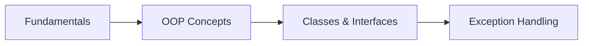
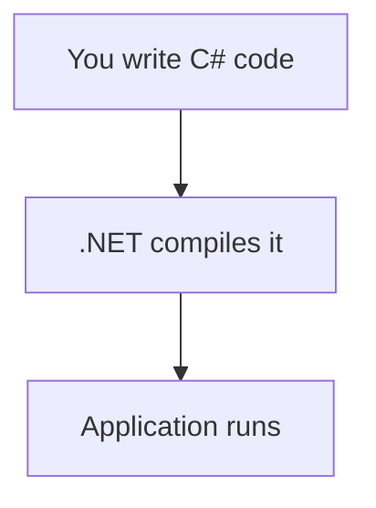

# Day 1 — C# Fundamentals

---

## 🎯 Today's Mission

By the end of this session, you will:

- Understand what C# and .NET are
- Write basic C# programs
- Use variables, conditions, loops, and methods
- Think in objects and understand OOP
- Create classes, interfaces, and use inheritance
- Handle exceptions properly

**Duration:** 4 hours | **Level:** Beginner

---

## 🗺️ What We Will Learn



| Time      | Topic                        |
| --------- | ---------------------------- |
| 0:00–0:20 | Introduction + C# Fundamentals |
| 0:20–0:55 | Variables, Types, Conditions |
| 0:55–1:20 | Loops + Methods              |
| 1:20–1:30 | ☕ Short Break               |
| 1:30–2:10 | OOP Concepts                 |
| 2:10–2:45 | Classes + Encapsulation      |
| 2:45–3:15 | Inheritance + Interfaces     |
| 3:15–3:40 | Polymorphism                 |
| 3:40–4:00 | Exception Handling + Review  |

---

## 1. What Is C#?

### The Problem

Imagine you need to build a system that manages employees, salaries, departments, and training.

> What would happen if we wrote everything inside one huge method?

You would have:

- Code that is impossible to read
- Code that is impossible to reuse
- Code that is impossible to fix when something breaks

This is why we need **programming concepts** — they exist to solve real problems.

### What is C#?

C# is a **programming language** created by Microsoft. It is used to build:

- Web APIs and services
- Web applications
- Desktop applications
- Mobile applications
- Games (Unity)
- Enterprise systems

### What is .NET?

.NET is the **platform** that runs C# code. Think of it like this:

```text
C# Code
   ↓
.NET Platform
   ↓
Running Application
```

When you write C# code, .NET compiles it and runs it on your computer.

### The Simple Picture



> 💡 **Senior Developer Note:** You don't need to understand .NET internals on Day 1. Just know: C# is the language, .NET is the platform that makes it run.

---

## 2. The First C# Program

### The Simplest Code

```csharp
Console.WriteLine("Hello, developers!");
```

That's it. One line. It prints a message to the screen.

### Adding a Variable

```csharp
string name = "Ali";
Console.WriteLine($"Hello, {name}!");
```

**What happened here?**

- `string name = "Ali"` — We created a **variable** called `name` and stored `"Ali"` in it
- `$"Hello, {name}!"` — We **interpolated** the variable into the text

> 🧪 **Try it:** Change `"Ali"` to your name. What happens?

### Output

```text
Hello, Ali!
```

### 🤔 Think

> What is the difference between `"Hello"` and `name`?

**Answer:** `"Hello"` is a fixed value (a literal). `name` is a variable that can hold different values.

---

## 3. Variables and Data Types

### What is a Variable?

A variable is a **named container** that stores a value.

Think of it like a labeled box:

```text
┌─────────────┐
│  name = "Ali" │
└─────────────┘
```

### Common Data Types

| Type       | Example          | Used for                     |
| ---------- | ---------------- | ---------------------------- |
| `int`      | `25`             | Whole numbers                |
| `decimal`  | `1250.50m`       | Money / precise decimal values |
| `double`   | `3.14`           | Floating-point calculations  |
| `bool`     | `true`           | Yes/no conditions            |
| `char`     | `'A'`            | One character                |
| `string`   | `"Salah"`        | Text                         |
| `DateTime` | `DateTime.Now`   | Date and time                |

### Declaration and Initialization

```csharp
int age = 25;                    // declaration + initialization
string name = "Ahmed";          // declaration + initialization
bool isActive = true;           // declaration + initialization
decimal salary = 2500.50m;      // declaration + initialization

age = 26;                       // assignment (changing the value)
```

### Constants

A constant is a value that **cannot change**.

```csharp
const int MaxEmployees = 100;
// MaxEmployees = 200;  ← This would cause an error!
```

> ❓ **Question:** Which type would you use for an employee's salary?

**Answer:** `decimal` — because money needs precise decimal values, not floating-point approximations.

### 🧪 Mini Exercise

Declare variables for the following:

- Employee name
- Employee age
- Employee salary
- Is the employee active?

```csharp
// Write your code here
```

---

## 4. Operators and Conditions

### Arithmetic Operators

| Operator | Meaning    | Example     |
| -------- | ---------- | ----------- |
| `+`      | Addition   | `5 + 3`     |
| `-`      | Subtraction| `5 - 3`     |
| `*`      | Multiplication| `5 * 3`  |
| `/`      | Division   | `6 / 3`     |
| `%`      | Modulus (remainder)| `5 % 2` |

### Comparison Operators

| Operator | Meaning               | Example      |
| -------- | --------------------- | ------------ |
| `==`     | Equal to              | `5 == 5`     |
| `!=`     | Not equal to          | `5 != 3`     |
| `>`      | Greater than          | `5 > 3`      |
| `<`      | Less than             | `3 < 5`      |
| `>=`     | Greater than or equal | `5 >= 5`     |
| `<=`     | Less than or equal    | `3 <= 5`     |

### Logical Operators

| Operator | Meaning | Example                    |
| -------- | ------- | -------------------------- |
| `&&`     | AND     | `true && true` → `true`    |
| `\|\|`   | OR      | `true \|\| false` → `true` |
| `!`      | NOT     | `!true` → `false`          |

### Conditions

```csharp
int age = 25;

if (age >= 18)
{
    Console.WriteLine("Adult");
}
else
{
    Console.WriteLine("Minor");
}
```

**Output:** `Adult`

### Combining Conditions

```csharp
bool isActive = true;
decimal salary = 2500;

if (isActive && salary > 2000)
{
    Console.WriteLine("Employee qualifies for the bonus.");
}
```

**Output:** `Employee qualifies for the bonus.`

> ❓ **Question:** What will this print?

```csharp
int x = 10;
if (x > 5 && x < 20)
{
    Console.WriteLine("Yes");
}
else
{
    Console.WriteLine("No");
}
```

**Answer:** `Yes` — because 10 is greater than 5 AND less than 20.

---

## 5. Loops

### The Problem

> What if we need to process 100 employees?

Writing 100 separate lines is not practical. This is why we have **loops**.

### The `for` Loop

```csharp
for (int i = 0; i < 5; i++)
{
    Console.WriteLine($"Number: {i}");
}
```

**Output:**

```text
Number: 0
Number: 1
Number: 2
Number: 3
Number: 4
```

### The `foreach` Loop

Used when you have a collection (a group of items) and want to go through each one.

```csharp
var employees = new List<string>
{
    "Ali",
    "Sara",
    "Omar"
};

foreach (var employee in employees)
{
    Console.WriteLine(employee);
}
```

**Output:**

```text
Ali
Sara
Omar
```

### The `while` Loop

Runs as long as a condition is true.

```csharp
int count = 0;

while (count < 3)
{
    Console.WriteLine($"Count: {count}");
    count++;
}
```

**Output:**

```text
Count: 0
Count: 1
Count: 2
```

> 💡 **Senior Developer Note:** Use `foreach` when you want to go through a list. Use `for` when you need to control the index. Use `while` when you don't know how many times you need to loop.

> 🤔 **Think:** What happens if you forget `count++` in the `while` loop?

**Answer:** The loop runs forever (infinite loop). Be careful!

---

## 6. Methods

### The Problem

> If we write the same logic five times, what happens?

The code becomes duplicated, hard to read, and hard to fix.

### What is a Method?

A method is a **reusable block of code** that does a specific task.

### Example

```csharp
static decimal CalculateAnnualSalary(decimal monthlySalary)
{
    return monthlySalary * 12;
}
```

**Breaking it down:**

- `static` — We'll explain this later, for now just include it
- `decimal` — The **return type** (what the method gives back)
- `CalculateAnnualSalary` — The **method name**
- `decimal monthlySalary` — The **parameter** (input)
- `return monthlySalary * 12` — The **return value** (output)

### Using the Method

```csharp
decimal annualSalary = CalculateAnnualSalary(2500);
Console.WriteLine(annualSalary);
```

**Output:** `30000`

### Methods with No Return Value

```csharp
static void PrintMessage(string message)
{
    Console.WriteLine(message);
}
```

- `void` means the method does not return anything

### 🧪 Mini Exercise

Create a method called `CalculateBonus` that:

- Takes a salary as input
- Returns 10% of the salary as the bonus

```csharp
// Write your method here
```

---

## ☕ Short Break

Take 10 minutes. Stretch. Drink water.

When you come back, we start thinking in **objects**.

---

## 7. From Code to Objects

### The Problem

Look at this code:

```csharp
string employeeName = "Ali";
decimal employeeSalary = 2500;
string employeeDepartment = "IT";
```

Now imagine we have 500 employees. We would need:

```csharp
string employee1Name = "Ali";
decimal employee1Salary = 2500;
string employee1Department = "IT";

string employee2Name = "Sara";
decimal employee2Salary = 3000;
string employee2Department = "HR";

// ... 497 more employees
```

> This is impossible to manage. We need a better way.

### The Solution: Objects

What if we could create a **template** for employees and reuse it?

```text
Employee Template
├── Name
├── Salary
├── Department
└── Methods (calculate salary, display info, etc.)
```

Then we create objects from this template:

```text
Employee: Ali, 2500, IT
Employee: Sara, 3000, HR
Employee: Omar, 2800, Finance
```

This is the idea behind **Object-Oriented Programming (OOP)**.

---

## 8. Object-Oriented Programming

### What is OOP?

OOP is a way of organizing code by creating **objects** that combine:

- **Data** (what the object knows)
- **Behavior** (what the object does)

### Real-World Analogy

Think about a real employee:

```text
Real World Employee
├── Has a name
├── Has a salary
├── Has a department
├── Can calculate their salary
└── Can display their information
```

In code, we represent this as an **object**.

### The Four Pillars of OOP

| Concept       | Simple Meaning                       |
| ------------- | ------------------------------------ |
| **Encapsulation** | Protect object state             |
| **Abstraction**   | Focus on what matters            |
| **Inheritance**   | Reuse through an "is-a" relationship |
| **Interface**     | A contract                       |
| **Polymorphism**  | Same contract, different behavior |

> 🧠 **Think Like a Developer:** Before writing code, ask: "What problem am I solving?"

---

## 9. Classes and Objects

### What is a Class?

A class is a **blueprint** for creating objects.

> Think of it like an architect's plan for a house. The plan is not a house — you can't live in it. But you can build many houses from it.

### Example

```csharp
public class Employee
{
    public string Name { get; set; } = string.Empty;
    public decimal Salary { get; set; }

    public void DisplayInfo()
    {
        Console.WriteLine($"{Name} - {Salary}");
    }
}
```

**Breaking it down:**

- `public class Employee` — We define a class called `Employee`
- `public string Name { get; set; }` — A **property** (data)
- `public void DisplayInfo()` — A **method** (behavior)

### Creating an Object

```csharp
var employee = new Employee
{
    Name = "Ali",
    Salary = 2500
};

employee.DisplayInfo();
```

**Output:** `Ali - 2500`

### The Diagram

```text
Employee Class (Blueprint)
      ↓
 ┌──────────────────┐
 │ Employee         │
 │ - Name           │
 │ - Salary         │
 │ - DisplayInfo()  │
 └──────────────────┘
      ↓
   Objects (Instances)
   ↙          ↘
Ali (2500)    Sara (3000)
```

> ❓ **Question:** What is the difference between a class and an object?

**Answer:** A class is the blueprint. An object is the actual thing created from that blueprint. `Employee` is the class. `Ali` is an object (an instance of `Employee`).

---

## 10. Constructors and Access Modifiers

### Constructors

A constructor is a special method that runs **when an object is created**.

```csharp
public class Employee
{
    public string Name { get; }

    public Employee(string name)
    {
        Name = name;
    }
}
```

**Usage:**

```csharp
var employee = new Employee("Ali");
Console.WriteLine(employee.Name);  // Output: Ali
```

> 💡 **Senior Developer Note:** Constructors ensure that an object starts with valid data. This is better than creating an empty object and forgetting to set important values.

### Access Modifiers

Access modifiers control **who can see and use** our code.

| Modifier   | Meaning                                    |
| ---------- | ------------------------------------------ |
| `public`   | Accessible from anywhere                   |
| `private`  | Accessible only within the same class      |
| `protected`| Accessible within the class and its children |

### Why Does This Matter?

```csharp
public class Employee
{
    private decimal salary;  // Only this class can change salary directly

    public decimal GetSalary()
    {
        return salary;
    }
}
```

If `salary` was `public`, anyone could change it to any value — including negative numbers.

---

## 11. Encapsulation

### The Problem

What if anyone can do this?

```csharp
employee.Salary = -5000;
```

> Should our application allow this? Of course not!

### The Solution: Encapsulation

**Encapsulation** means keeping data and the code that works with it together, while controlling what other code can access.

### Example

```csharp
public class Employee
{
    public decimal Salary { get; private set; }

    public Employee(decimal salary)
    {
        SetSalary(salary);
    }

    public void SetSalary(decimal salary)
    {
        if (salary < 0)
        {
            throw new ArgumentException("Salary cannot be negative.");
        }

        Salary = salary;
    }
}
```

**What happened?**

- `Salary` has a `private set` — only this class can change it
- To change the salary, you must use `SetSalary()`
- `SetSalary()` checks if the value is valid before setting it

### The Benefit

```csharp
var employee = new Employee(2500);
employee.SetSalary(-5000);  // This throws an exception!
```

> Encapsulation helps protect an object's valid state.

> ❓ **Question:** Why shouldn't every property be publicly writable?

**Answer:** Because some values have rules. A salary cannot be negative. An age cannot be negative. Encapsulation enforces these rules.

---

## 12. Inheritance

### The Problem

We have `Employee`, `Developer`, and `Manager`. They all share some properties (like `Name`), but each has unique features.

### The Solution: Inheritance

Inheritance lets us create a **base class** and **specialized classes** that reuse and extend it.

```text
             Employee
                |
        ┌───────┴───────┐
        ↓               ↓
    Developer         Manager
```

### Example

```csharp
public class Employee
{
    public string Name { get; set; } = string.Empty;

    public void DisplayInfo()
    {
        Console.WriteLine($"Employee: {Name}");
    }
}

public class Developer : Employee
{
    public string ProgrammingLanguage { get; set; } = string.Empty;

    public void WriteCode()
    {
        Console.WriteLine($"{Name} is writing {ProgrammingLanguage} code.");
    }
}
```

### Using It

```csharp
var dev = new Developer
{
    Name = "Ali",
    ProgrammingLanguage = "C#"
};

dev.DisplayInfo();   // From Employee
dev.WriteCode();     // From Developer
```

**Output:**

```text
Employee: Ali
Ali is writing C# code.
```

### When to Use Inheritance?

Inheritance represents an **"is-a"** relationship:

- A `Developer` **is an** `Employee` ✓
- A `Car` **is an** `Vehicle` ✓
- A `Dog` **is an** `Animal` ✓

> ⚠️ **Common Trap:** Just because inheritance is available does not mean you should use it. If there is no clear "is-a" relationship, do not use inheritance.

---

## 13. Interfaces

### The Problem

We have different types of notifications: Email, SMS, Push Notification. They all do the same thing (send a notification) but in different ways.

> How do we make them interchangeable?

### The Solution: An Interface

An interface defines a **contract** — a set of methods that a class must implement.

```csharp
public interface INotificationService
{
    void Send(string message);
}
```

### Implementing the Interface

```csharp
public class EmailNotificationService : INotificationService
{
    public void Send(string message)
    {
        Console.WriteLine($"Email: {message}");
    }
}

public class SmsNotificationService : INotificationService
{
    public void Send(string message)
    {
        Console.WriteLine($"SMS: {message}");
    }
}
```

### The Diagram

```text
INotificationService (Contract)
        ↓
 ┌──────┴──────┐
 ↓             ↓
Email          SMS
```

### Using It

```csharp
INotificationService notification = new EmailNotificationService();
notification.Send("Welcome!");

notification = new SmsNotificationService();
notification.Send("Hello!");
```

**Output:**

```text
Email: Welcome!
SMS: Hello!
```

> ❓ **Question:** Can two classes implement the same interface?

**Answer:** Yes! That's the whole point. Different classes can follow the same contract but behave differently.

---

## 14. Polymorphism

### What is Polymorphism?

**Polymorphism** means "many forms." It allows us to use the same interface but get different behavior depending on the actual object.

> "Same contract, different behavior."

### Example

```csharp
INotificationService notification1 = new EmailNotificationService();
INotificationService notification2 = new SmsNotificationService();

notification1.Send("Welcome!");  // Email: Welcome!
notification2.Send("Welcome!");  // SMS: Welcome!
```

Same method call (`Send`), different behavior.

### Method Overriding

Polymorphism also works with inheritance using `virtual` and `override`:

```csharp
public class Employee
{
    public string Name { get; set; } = string.Empty;

    public virtual void Display()
    {
        Console.WriteLine($"Employee: {Name}");
    }
}

public class Developer : Employee
{
    public string ProgrammingLanguage { get; set; } = string.Empty;

    public override void Display()
    {
        Console.WriteLine($"Developer: {Name} ({ProgrammingLanguage})");
    }
}
```

**Usage:**

```csharp
Employee emp1 = new Employee { Name = "Sara" };
Employee emp2 = new Developer { Name = "Ali", ProgrammingLanguage = "C#" };

emp1.Display();  // Employee: Sara
emp2.Display();  // Developer: Ali (C#)
```

> 💡 **Senior Developer Note:** The variable type is `Employee`, but the actual behavior depends on the real object. This is the power of polymorphism.

---

## 15. OOP Summary

| Concept       | Simple Meaning                       |
| ------------- | ------------------------------------ |
| **Class**         | Blueprint                        |
| **Object**        | Instance of a class              |
| **Encapsulation** | Protect object state             |
| **Abstraction**   | Focus on what matters            |
| **Inheritance**   | Reuse through an "is-a" relationship |
| **Interface**     | A contract                       |
| **Polymorphism**  | Same contract, different behavior |

> 🧠 **Remember:** OOP is not about using as many classes as possible. It is about organizing software so that it is easier to understand, change, and maintain.

---

## 16. Exception Handling

### The Problem

What happens when something goes wrong?

```csharp
int number = int.Parse("abc");
```

This code tries to convert `"abc"` to a number. It fails. The program crashes.

### The Solution: Exception Handling

We can **catch** errors and handle them gracefully.

### Basic Syntax

```csharp
try
{
    int number = int.Parse("abc");
}
catch (FormatException)
{
    Console.WriteLine("Invalid number format.");
}
```

**Output:** `Invalid number format.`

### The Flow

```text
try
  ↓
Code that may fail
  ↓
catch
  ↓
Handle the error
  ↓
finally
  ↓
Cleanup (optional)
```

### `finally`

The `finally` block runs **always** — whether an exception happened or not. It is used for cleanup.

```csharp
try
{
    int number = int.Parse("abc");
}
catch (FormatException)
{
    Console.WriteLine("Invalid number.");
}
finally
{
    Console.WriteLine("Done processing.");
}
```

**Output:**

```text
Invalid number.
Done processing.
```

### `throw`

We can create and throw our own exceptions:

```csharp
if (salary < 0)
{
    throw new ArgumentException("Salary cannot be negative.");
}
```

> ❓ **Question:** What is the difference between a bug and an exception?

**Answer:** A bug is a mistake in your code. An exception is a runtime error that happens during execution. Bugs should be fixed. Exceptions should be handled.

---

## 17. Common Exception Mistakes

### ❌ Mistake 1 — Empty Catch

```csharp
try
{
    DoSomething();
}
catch
{
}
```

**Why it's bad:** Errors are silently ignored. You will never know something went wrong.

### ❌ Mistake 2 — Catch Everything

```csharp
catch (Exception)
{
    Console.WriteLine("Something went wrong.");
}
```

**Why it's bad:** This hides useful information. Which exception? Where? Why?

### ❌ Mistake 3 — Using Exceptions for Normal Flow

```csharp
// Bad: Using exception to check if a value exists
try
{
    var value = dictionary["key"];
}
catch (KeyNotFoundException)
{
    // do something
}
```

**Better:** Use `TryGetValue()` or check if the key exists first.

### ❌ Mistake 4 — Exposing Sensitive Details

```csharp
catch (Exception ex)
{
    Console.WriteLine(ex.StackTrace);  // Don't show this to users!
}
```

**Why it's bad:** Stack traces, database details, and internal information should never be shown to end users.

> 💡 **Senior Developer Note:** Good exception handling means handling errors at the right level. Catch specific exceptions. Log the details. Show friendly messages to users.

---

## 🧪 Practical Exercises

### Exercise 1 — Employee Information

Create an `Employee` class with:

- `Name` (string)
- `Salary` (decimal)
- `Department` (string)

Create an object and display its information.

```csharp
// Your code here
```

---

### Exercise 2 — Salary Calculation

Create a method called `CalculateAnnualSalary` that:

- Accepts a monthly salary (decimal)
- Returns the annual salary

```csharp
// Your method here
```

---

### Exercise 3 — Employee Validation

Modify your `Employee` class to:

- Prevent negative salaries
- Throw an exception if someone tries to set a negative salary

```csharp
// Your code here
```

---

### Exercise 4 — Notification Interface

Create an `INotificationService` interface with a `Send(string message)` method.

Implement:

- `EmailNotificationService`
- `SmsNotificationService`

```csharp
// Your code here
```

---

### Exercise 5 — Polymorphism

Create multiple notification implementations and process them through the interface.

```csharp
// Create a list of INotificationService
// Loop through and call Send() on each
// Your code here
```

---

### Exercise 6 — Debug the Code

Find and fix the problems in this code:

```csharp
public class Employee
{
    public string Name;
    public decimal Salary;

    public Employee(string name)
    {
        Name = name;
    }

    public decimal CalculateBonus()
    {
        return Salary * 10;  // Problem 1
    }
}

// Problem 2
var emp = new Employee("Ali");
Console.WriteLine(emp.Salary);

// Problem 3
string age = 25;
if (age > 18)  // Problem 4
{
    Console.WriteLine("Adult");
}
```

**Hints:**

- Problem 1: Bonus calculation is wrong (10% should be `* 0.10`)
- Problem 2: Salary is not initialized
- Problem 3: Wrong data type for age
- Problem 4: Comparing string with number

---

## 🏆 Mini Challenge — Simple Employee System

Create a small console application that demonstrates everything you learned today.

### Requirements

```text
Employee
├── Name
├── Salary
├── Department
├── CalculateAnnualSalary()
└── ValidateSalary()
```

Plus:

```text
INotificationService
├── EmailNotificationService
└── SmsNotificationService
```

### Your Application Should:

1. Create 3 employees with different names, salaries, and departments
2. Display each employee's information
3. Calculate and display their annual salary
4. Validate that no salary is negative
5. Create email and SMS notification services
6. Send a welcome message to each employee using both notification types

### Starter Code

```csharp
// 1. Create the Employee class

// 2. Create the INotificationService interface

// 3. Create EmailNotificationService

// 4. Create SmsNotificationService

// 5. Create employees and test everything
```

---

## 🧠 Knowledge Check

### Question 1

What is the correct data type for storing money?

- A) `int`
- B) `double`
- C) `decimal`
- D) `string`

**Answer:** C) `decimal` — designed for precise decimal values like money.

---

### Question 2

What does `var` do in C#?

- A) Creates a variable with no type
- B) Lets the compiler figure out the type
- C) Creates a constant
- D) Declares a global variable

**Answer:** B) Lets the compiler figure out the type. `var name = "Ali"` — the compiler knows it's a `string`.

---

### Question 3

What is the output?

```csharp
int x = 5;
if (x > 3)
{
    Console.WriteLine("A");
}
else
{
    Console.WriteLine("B");
}
```

**Answer:** `A` — because 5 is greater than 3.

---

### Question 4

True or False: A class is an object.

**Answer:** False. A class is a blueprint. An object is an instance created from that class.

---

### Question 5

What does encapsulation protect?

- A) The class name
- B) The object's valid state
- C) The method parameters
- D) The return type

**Answer:** B) The object's valid state — by controlling access to data.

---

### Question 6

What is the output?

```csharp
for (int i = 0; i < 3; i++)
{
    Console.Write(i + " ");
}
```

**Answer:** `0 1 2` — the loop runs from 0 to 2 (3 iterations).

---

### Question 7

Which keyword is used to create a constant?

- A) `var`
- B) `let`
- C) `const`
- D) `final`

**Answer:** C) `const`

---

### Question 8

What is an interface?

- A) A class with no methods
- B) A contract that classes must implement
- C) A type of variable
- D) A loop structure

**Answer:** B) A contract that classes must implement.

---

### Question 9

What does polymorphism allow?

- A) Creating multiple classes
- B) Using the same interface with different implementations
- C) Hiding data
- D) Reusing code through inheritance

**Answer:** B) Using the same interface with different implementations.

---

### Question 10

What does `finally` do in exception handling?

- A) Throws an exception
- B) Catches an exception
- C) Runs always, whether an exception occurred or not
- D) Ignores the exception

**Answer:** C) Runs always, whether an exception occurred or not.

---

### Question 11

What is the output?

```csharp
int a = 10;
int b = 3;
Console.WriteLine(a / b);
```

**Answer:** `3` — integer division truncates the decimal part.

---

### Question 12

When should you use inheritance?

- A) Always, for every class
- B) When there is a clear "is-a" relationship
- C) When you want to share code between unrelated classes
- D) Never

**Answer:** B) When there is a clear "is-a" relationship (like `Developer` is an `Employee`).

---

## ⚠️ Common Beginner Mistakes

| Mistake | Why It's Wrong | Fix |
|---------|---------------|-----|
| Choosing `int` for money | Precision loss | Use `decimal` |
| `=` instead of `==` | Assignment instead of comparison | Use `==` in conditions |
| Forgetting `m` for decimals | Compiler error | Use `2500.50m` |
| Giant methods | Hard to read and maintain | Break into smaller methods |
| Duplicating code | Changes must be made in multiple places | Use methods and classes |
| Everything `public` | No protection for data | Use encapsulation |
| Inheritance everywhere | Unnecessary complexity | Use only for "is-a" relationships |
| Confusing interface with class | Different purposes | Interface = contract, Class = blueprint |
| Catching `Exception` everywhere | Hides specific errors | Catch specific exceptions |
| Empty `catch` blocks | Errors silently ignored | Always handle or log exceptions |
| Unclear names | Hard to understand code | Use descriptive names |
| Not thinking about the problem | Code without purpose | Ask "what am I solving?" first |

---

## 💡 Senior Developer Notes

> Good code is not code with the most features. Good code is code that is easy for the next developer to understand and change.

> Before writing code, ask: "What problem am I solving?"

> Just because inheritance is available does not mean you should use it.

> Read the exception message and stack trace before changing code randomly.

> Keep your methods small. If a method does more than one thing, split it.

> Name things clearly. `CalculateAnnualSalary()` is better than `Calc()`.

---

## 🎯 What You Should Remember

```text
C# gives us the language.

Methods organize our logic.

Classes organize our objects.

Encapsulation protects our data.

Interfaces define contracts.

Inheritance can reuse behavior.

Polymorphism allows different implementations
to work through the same contract.

Exceptions help us handle unexpected failures.

And good developers always think about
the problem before the code.
```

---

## 🔜 Next: Day 2 — Advanced C#

Tomorrow we will learn:

- **Collections** — Lists, Dictionaries, Arrays
- **Generics** — Write flexible, reusable code
- **Lambda Expressions** — Short, powerful functions
- **LINQ** — Query your data like a pro
- **async / await** — Write modern asynchronous code
- **Practical exercises** — Apply everything

> Today you learned how to structure basic C# programs and think in objects. Tomorrow, we will learn how to work with collections of data, query that data with LINQ, and write modern asynchronous C#.

---

**Great work today! See you tomorrow. 🚀**
