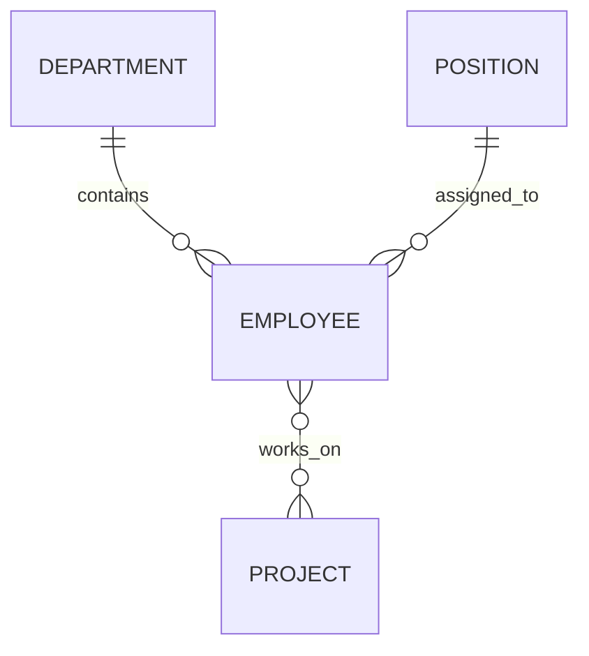

# 03 — Relationships

---

## Why Relationships?

If we put all information in one table, we get problems:

```text
EmployeeId | FullName | DepartmentName | PositionTitle
1          | Ali      | IT             | Developer
2          | Sara     | HR             | Manager
3          | Omar     | IT             | Developer
```

If the IT department changes its name, we must update every row.

If we forget one row, the data becomes inconsistent.

> Relationships let us store data once and connect it.

---

## One-to-Many

The most common relationship.

```text
Department
     │
     ├── Employee
     ├── Employee
     └── Employee
```

One department has many employees. Each employee belongs to one department.

```sql
CREATE TABLE Departments
(
    DepartmentId   INT IDENTITY(1,1) PRIMARY KEY,
    DepartmentName NVARCHAR(100) NOT NULL
);

CREATE TABLE Employees
(
    EmployeeId   INT IDENTITY(1,1) PRIMARY KEY,
    FullName     NVARCHAR(100) NOT NULL,
    DepartmentId INT,
    FOREIGN KEY (DepartmentId) REFERENCES Departments(DepartmentId)
);
```

The foreign key lives on the "many" side — the `Employees` table.

---

## One-to-One

Less common. Each record in Table A relates to exactly one record in Table B.

```text
Employee ─── EmployeeProfile
```

Example:

```sql
CREATE TABLE EmployeeProfiles
(
    EmployeeId INT PRIMARY KEY,
    Bio        NVARCHAR(500),
    PhotoUrl   NVARCHAR(200),
    FOREIGN KEY (EmployeeId) REFERENCES Employees(EmployeeId)
);
```

Used when you want to split optional or detailed data into a separate table.

---

## Many-to-Many

Many employees can work on many projects.

```text
Employees
    │
    │
EmployeeProjects (junction table)
    │
    │
Projects
```

You need a **junction table** (also called a linking table):

```sql
CREATE TABLE Projects
(
    ProjectId   INT IDENTITY(1,1) PRIMARY KEY,
    ProjectName NVARCHAR(100) NOT NULL
);

CREATE TABLE EmployeeProjects
(
    EmployeeId INT,
    ProjectId  INT,
    PRIMARY KEY (EmployeeId, ProjectId),
    FOREIGN KEY (EmployeeId) REFERENCES Employees(EmployeeId),
    FOREIGN KEY (ProjectId) REFERENCES Projects(ProjectId)
);
```

The junction table connects the two tables:

```text
Employees                EmployeeProjects            Projects
EmployeeId  FullName     EmployeeId  ProjectId       ProjectId  ProjectName
1           Ali          1           1                1          Website
2           Sara         1           2                2          Mobile App
3           Omar         2           1                3          API
                          3           2
```

- Ali works on Website and Mobile App
- Sara works on Website
- Omar works on Mobile App

---

## ER Diagram



---

## Which Relationship Do I Use?

| Relationship | When to Use | Example |
|-------------|-------------|---------|
| One-to-Many | One entity has many related entities | Department → Employees |
| One-to-One | Data belongs to one specific record | Employee → EmployeeProfile |
| Many-to-Many | Both sides can have multiple related items | Employees ↔ Projects |

---

## 🤔 Think

> We have `Employees` and `Departments`. Where should the `DepartmentId` foreign key go?

**Answer:** On the `Employees` table. Each employee belongs to one department. The "many" side holds the foreign key.

---

## Sample Data

```sql
INSERT INTO Departments VALUES ('IT', 'Building A');
INSERT INTO Departments VALUES ('HR', 'Building B');
INSERT INTO Departments VALUES ('Finance', 'Building A');

INSERT INTO Positions VALUES ('Developer', 'Mid');
INSERT INTO Positions VALUES ('Manager', 'Senior');
INSERT INTO Positions VALUES ('Analyst', 'Junior');

INSERT INTO Employees (FullName, Salary, DepartmentId, PositionId) VALUES
('Ali',    1800, 1, 1),
('Sara',   2200, 2, 2),
('Omar',   1900, 1, 1),
('Ahmed',  2500, 3, 3),
('Fatima', 3000, 2, 2),
('Khalid', 1600, 1, 1),
('Nora',   2100, 3, 3);

INSERT INTO Projects VALUES ('Website');
INSERT INTO Projects VALUES ('Mobile App');
INSERT INTO Projects VALUES ('API');

INSERT INTO EmployeeProjects VALUES (1, 1);
INSERT INTO EmployeeProjects VALUES (1, 2);
INSERT INTO EmployeeProjects VALUES (2, 1);
INSERT INTO EmployeeProjects VALUES (3, 3);
INSERT INTO EmployeeProjects VALUES (4, 2);
INSERT INTO EmployeeProjects VALUES (5, 1);
```

---

## Summary

| Relationship | Key Pattern | Foreign Key Location |
|-------------|-------------|---------------------|
| One-to-Many | One table has many rows in another | On the "many" side |
| One-to-One | One row in each table matches exactly | Either table |
| Many-to-Many | Both sides have multiple | Junction table |

> 💡 **Senior Developer Note:** Most relationships in real applications are one-to-many. Many-to-many is common too, but always through a junction table. Never try to store multiple IDs in a single column.

---

**Next: [04 — SQL Queries and JOINs](04-SQL-Queries-and-JOINs.md)**
