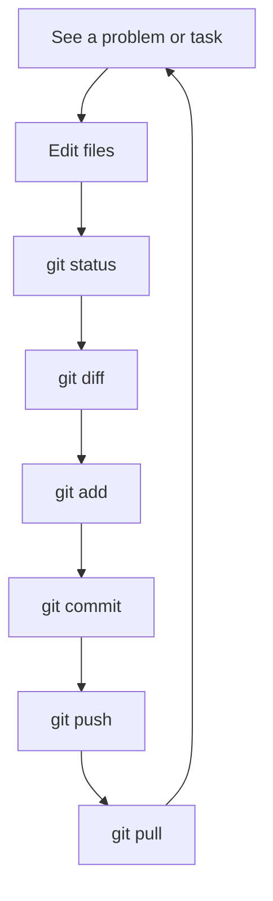

# 01 — Git Workflow

---

## Part 1 — What Problem Does Git Solve?

Start without any commands.

> 🤔 **Imagine this:** three developers work on the same project.
>
> - Developer A changes `EmployeeController.cs`
> - Developer B changes the same file
> - Developer C deletes something by accident
>
> **How do we know who changed what?**

Discuss these problems as a group:

| Problem | What happens |
|---------|--------------|
| Losing work | Someone overwrites your file with an older version |
| Overwriting changes | Two people save the same file — the last save wins |
| No history | You cannot see who changed a line or when |
| Collaboration | You cannot safely work on the same project at the same time |
| Going back | A new change broke the API — you cannot return to the old version |
| Isolation | You cannot try a feature without affecting others |
| Review | Nobody checks the code before it reaches the main project |

### The Answer: Git

> **Git is a version control system that records changes to a project and helps developers work together safely.**

Every time you record a change in Git, you create a **commit** — a saved snapshot of the project with:

- what changed
- who changed it
- when it changed
- a message explaining why

> 💡 **Senior Developer Note:** A clean Git history can save hours when you debug a production problem. The history tells you *when* a bug appeared and *which change* introduced it.

---

## 🧠 The Git Mental Model

Before commands, understand the **four places** your code can live:

```text
Working Directory
       ↓
Staging Area
       ↓
Repository
       ↓
Remote Repository
```

| Area | In simple words |
|------|-----------------|
| **Working Directory** | "I am working on these changes." — the files you see and edit |
| **Staging Area** | "These are the changes I want in my next commit." — your selection |
| **Repository** | "I have recorded this version." — the local history on your machine |
| **Remote** | "My team can access this history." — the shared server (GitHub, GitLab, Azure DevOps) |

### A Simple Analogy

```text
Working Directory = your desk, papers everywhere
Staging Area      = the folder you prepare for the archive
Repository        = the archive cabinet in your office
Remote            = the company archive, shared by everyone
```

> 🤔 **Question:** Why does Git have a *staging area* between your files and your history?
>
> Because you can change 10 files but only commit 3 of them — the ones that belong to one logical change.

---

## 📋 The Basic Daily Workflow

This is what a developer does many times each day:



---

## 🛠️ The Commands You Will Actually Use

You do not need to know every Git command. You need these:

### `git status` — Where am I?

```bash
git status
```

**What it does:** shows which files changed, which are staged, which branch you are on.
**Why:** never run `git add` or `git commit` without looking at status first.
**When:** all the time — it is your compass.

```text
On branch feature/employee-search
Changes not staged for commit:
  modified:   EmployeeService.cs

Changes to be committed:
  modified:   EmployeeController.cs
```

---

### `git diff` — What exactly changed?

```bash
git diff                # changes in working directory (not staged yet)
git diff --staged       # changes that are staged for the next commit
```

**What it does:** shows line-by-line differences.
**Why:** to check your own work before you record it.
**When:** before every `git add` and every `git commit`.

---

### `git add` — Choose what goes into the next commit

```bash
git add EmployeeService.cs        # one file
git add src/                      # a folder
git add .                         # everything (careful)
```

**What it does:** moves changes from the Working Directory to the Staging Area.
**Why:** one commit should contain one logical change — not your whole day.
**When:** after you checked `git diff` and the change is complete.

---

### `git commit` — Record a version

```bash
git commit -m "Add employee search by name"
```

**What it does:** stores the staged changes as a new snapshot with a message.
**Why:** this is how history is built.
**When:** when a small, complete, working piece of work is ready.

---

### `git log` — Read the history

```bash
git log
git log --oneline        # short view, one line per commit
```

**What it does:** shows the commit history.
**Why:** to understand what happened in the project.
**When:** when you ask "what changed recently?" or "who wrote this?"

```text
a1b2c3d Add employee search by name
d4e5f6a Fix salary calculation rounding
7a8b9c1 Update department seed data
```

---

### `git push` — Send your commits to the remote

```bash
git push
git push -u origin feature/employee-search   # first push of a new branch
```

**What it does:** uploads your local commits to the shared repository.
**Why:** your team can only see your work after you push it.
**When:** when a commit (or a set of commits) is complete and tested.

> ⚠️ Pushing is **not** the same as merging. Pushing only uploads your commits to *your branch* on the server.

---

### `git pull` — Get the latest changes

```bash
git pull
```

**What it does:** downloads new commits from the remote **and** merges them into your current branch.
**Why:** your teammate may have pushed changes since your last pull.
**When:** at the start of your work session, and before you push if others work on the same branch.

---

### `git fetch` — Look without touching

```bash
git fetch
```

**What it does:** downloads new commits from the remote but does **not** merge them into your branch.
**Why:** to see what others did before deciding what to do.

> 🤔 **What is the difference between `git fetch` and `git pull` at a practical level?**
>
> `git fetch` = download and let me look.
> `git pull` = download and merge into my branch right now.

---

## 🧪 Exercise 1 — Understand the Working Tree

Open a terminal inside your project repository and answer **before** running each command:

1. What do you think `git status` will show?
2. Run it. What branch are you on?
3. Create a new file `NOTES.md` with one line of text.
4. Run `git status` again. What changed?
5. Run `git diff`. What do you see? Why is the diff empty for a *new* file?
6. Run `git add NOTES.md`, then `git status`. Where is the file now?
7. Run `git diff --staged`. What do you see now?

> 🤔 **Question:** Is this a Git problem or a normal state? (It is a normal state — Git is simply telling you the truth about your files.)

---

## 📝 Part 2 — Commits

### What does a commit represent?

A commit is **one logical change**, finished and working.

```text
Good commit:    Add employee search endpoint
Weak commit:    changes
Bad commit:     fix stuff
```

### Compare

| Message | Quality | Why |
|---------|---------|-----|
| `Add employee search endpoint` | ✅ Good | Says what was added |
| `Fix salary rounding in calculation` | ✅ Good | Says what was fixed |
| `changes` | ❌ Weak | Says nothing |
| `fix stuff` | ❌ Bad | Cannot be understood later |
| `wip` repeated 12 times | ❌ Bad | History becomes noise |

### Small, logical commits

```text
One commit = one purpose

✅  Add department table mapping
✅  Add validation for employee salary
✅  Fix null reference when department is missing

❌  Add search + fix login + update README + rename variable
    (four unrelated changes in one commit)
```

**Atomic change:** if this commit is reverted, only *this* feature is undone — nothing else breaks.

### Why history matters

> 💡 **Senior Developer Note:** A commit is not just a backup. It is part of the project's history. A future developer should be able to understand *what* changed, *why* it changed, and *when* — from the message alone.

---

## 🧪 Exercise 2 — Your First Meaningful Commit

You received the Employee API project. Make your first meaningful change.

**Task:** add a short description file `API-FEATURES.md` that lists the four features (Employees, Departments, Positions, Authentication).

Steps — predict what each command will show **before** you run it:

```bash
git status
# Your prediction: ...

# create the file with your editor, then:

git diff
# Your prediction: ...

git add API-FEATURES.md
git status
# Your prediction: ...

git commit -m "Add API features overview document"
git log --oneline
# Your prediction: ...
```

**Check:** does the commit message describe the change without you needing to open the diff?

---

## 🚫 Common Mistakes (Part 1)

| Mistake | Why it hurts | Better |
|---------|--------------|--------|
| Committing directly to `main` | Everyone sees unfinished work; no review | Create a branch (File 02) |
| Committing unrelated changes together | History becomes unreadable; revert breaks other things | One commit = one purpose |
| Meaningless messages (`fix`, `update`) | Nobody understands the history later | Describe the *change*, not the action |
| Running `git add .` without checking status | Secret files, temp files, broken code enter history | Always `git status` and `git diff` first |
| Forgetting to `git pull` when the team shares a branch | Push fails, or you build on old code | Pull at the start of your session |
| Treating `push` as "done" | Work is uploaded but not reviewed or merged | Push opens the conversation (File 03) |

---

## ✅ Check Yourself

Before moving on:

- [ ] I can explain the four Git areas in my own words
- [ ] I know when to use `status`, `diff`, `add`, `commit`, `log`
- [ ] I know the difference between `push` and `pull`
- [ ] I can write a commit message someone else can understand
- [ ] I completed Exercise 1 and Exercise 2

**Next: [02 — Branching and Merging](02-Branching-and-Merging.md)**
