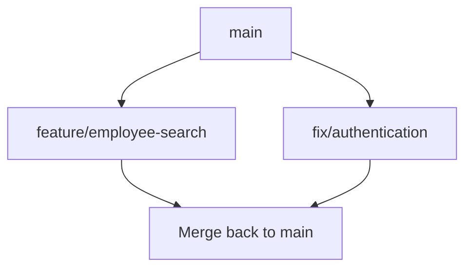

# 02 — Branching and Merging

---

## The Problem

> 🤔 **You need to develop employee search while Developer B is fixing authentication. Should both of you work directly on `main`?**

What could go wrong:

- your unfinished search code breaks the login for everyone
- you cannot test your work independently
- if something goes wrong, you cannot separate *your* change from *theirs*

**What do professional teams do?** Each change gets its own **branch**.

---

## 🌿 What Is a Branch?

> **A branch lets us work on a change without directly changing the main branch.**

```text
main
  │
  ├── feature/employee-search
  │
  └── fix/authentication
```

While you work on `feature/employee-search`, `main` stays stable and usable.



### Why branches are useful

| Benefit | Meaning |
|---------|---------|
| Isolation | Your experiment cannot break `main` |
| Parallel work | Two developers work at the same time |
| Review | Work is checked before it reaches `main` |
| Rollback | If the feature is cancelled, delete the branch |
| Clarity | The branch name explains the purpose of the change |

> 💡 **Senior Developer Note:** A branch is not a replacement for communication. It isolates *code*, not *people*. Talk to your team about who is working on what.

---

## 🏷️ Branch Naming

Practical examples:

```text
feature/employee-search
feature/add-department-api
fix/employee-validation
bugfix/incorrect-salary-calculation
refactor/employee-service
```

| Prefix | Use for |
|--------|---------|
| `feature/` | new functionality |
| `fix/` or `bugfix/` | correcting broken behavior |
| `refactor/` | restructuring code without changing behavior |
| `chore/` | maintenance: dependencies, configuration, build |

Names help everyone understand the purpose of a branch before opening it.

> ⚠️ Teams choose their own conventions. One prefix style is **not** universally mandatory. What matters: the name must be clear and short.

---

## 🧪 Exercise 3 — Branch Workflow

**Task:** create a small change on your own branch.

```bash
# 1. Where am I?
git branch

# 2. Make sure main is up to date (if the team uses a remote)
git pull

# 3. Create a branch and switch to it in one step
git switch -c feature/employee-search

# 4. Verify
git branch
```

Now make a small change — for example, add one endpoint description to `API-FEATURES.md`.

```bash
# 5. Inspect
git status
git diff

# 6. Commit on your branch
git add API-FEATURES.md
git commit -m "Describe employee search endpoint"

# 7. Return to main
git switch main

# 8. Observe the difference
git log --oneline
```

> 🤔 **Question:** Is your commit visible on `main`? It should not be. Where did it go? (It is on `feature/employee-search` — branches are independent lines of history.)

### Useful commands

```bash
git branch                    # list branches, * shows current
git switch <branch>           # go to an existing branch
git switch -c <branch>        # create a branch and go to it
git switch main               # go back to main
```

Modern Git uses `switch` for changing branches and `restore` for undoing file changes. Older tutorials show `git checkout` for both — it still works, but it is confusing, which is why we prefer `switch` today.

---

## 🔀 Part 3 — Merging

### The situation

```text
main
 │
 └── feature/employee-search
          │
          ├── commit 1  (add search service)
          ├── commit 2  (add controller action)
          └── commit 3  (add tests)
```

Your work is finished and tested. Now it must reach `main`:

```text
feature/employee-search
          ↓
        merge
          ↓
         main
```

**Merging** means: take the commits from one branch and integrate them into another.

### How do we get there?

A common path:

```bash
git switch main
git pull                # update main (if working with a remote)
git switch feature/employee-search
git pull                # update your branch (if shared)
git switch main
git merge feature/employee-search
git push
```

In a team, the merge often happens through a **Pull Request** instead — see File 03.

### Two shapes of a merge

**1. Fast-forward** — `main` has no new commits since you branched:

```text
Before:  main: A --- B
                  \
         feature:  C --- D

After:   main: A --- B --- C --- D     (main simply moves forward)
```

Nothing was "combined" — `main` just advanced to your latest commit.

**2. Merge commit** — both branches moved forward:

```text
Before:  main: A --- B --- E
                  \
         feature:  C --- D

After:   main: A --- B --- E --- M --- (merge commit M)
                            /
                   C --- D
```

Git creates a special commit `M` that joins both lines of history.

> 🤔 **Question:** What happens if `main` changed your file while you were working on your branch? Git may combine the changes automatically — or report a **conflict** (File 04).

---

## ⚖️ Merge vs Rebase

Both integrate changes. They create **different histories**.

| | `git merge` | `git rebase` |
|---|-------------|--------------|
| What it does | Adds a merge commit joining both lines | Replays your commits on top of the other branch, creating new copies |
| History | Preserves the original graph, including branches | Produces a straight, linear line |
| Shared commits | Safe on branches others already pulled | Dangerous on commits others already pulled |

### What does "rewriting shared history" mean?

Rebase creates **new commits** (new IDs) replacing the old ones. If a teammate already pulled your old commits, their repository now disagrees with yours. Their next merge becomes painful.

```text
Safe rule:

  ✅ Rebase your own local commits before pushing     → usually fine
  ⚠️ Rebase commits that are already pushed/shared    → avoid it
```

> 💡 **Senior Developer Note:** Do not treat rebase as "the professional option" and merge as "the beginner option." Both are standard tools. Rebase gives cleaner history for your *private* work; merge is safe for *shared* branches. Teams choose differently — follow your team's convention.

---

## 🧪 Exercise 4 — Merge a Feature Branch

```bash
# 1. Make sure your feature branch has at least 2 commits
git log --oneline main..feature/employee-search

# 2. Switch to main
git switch main

# 3. Merge
git merge feature/employee-search

# 4. Inspect the result
git log --oneline
git status

# 5. Push if you work with a remote
git push
```

**Answer these:**

1. Did Git perform a fast-forward or create a merge commit? How can you tell from `git log`?
2. Are your feature commits now part of `main`?
3. What would happen if you now `git switch feature/employee-search` — would you see the same history? (You would see your branch's own history.)

**Optional cleanup** — after the merge, teams often delete the finished branch:

```bash
git branch -d feature/employee-search
```

---

## 🚫 Common Mistakes (Part 2)

| Mistake | Why it hurts | Better |
|---------|--------------|--------|
| Working directly on `main` | No isolation, no review | Branch for every change |
| Branch names like `test`, `new1`, `stuff` | Nobody knows what the branch is for | Use `feature/…`, `fix/…` |
| Branch lives for weeks | It becomes impossible to merge | Keep branches small and short-lived |
| Merging without pulling first | You merge an outdated version | Pull both branches before merging |
| Rebase on a shared branch | Rewrites history your team already pulled | Merge shared work; rebase only private commits |
| Deleting a branch before it is merged | Work becomes hard to find | Merge first, then delete |

---

## ✅ Check Yourself

- [ ] I can explain why a branch is useful in one sentence
- [ ] I created a branch, committed, and returned to `main`
- [ ] I can explain fast-forward vs merge commit simply
- [ ] I understand why rebasing shared history is risky
- [ ] I merged a feature branch and inspected the result

**Next: [03 — Pull Requests and Code Review](03-Pull-Requests-and-Code-Review.md)**
