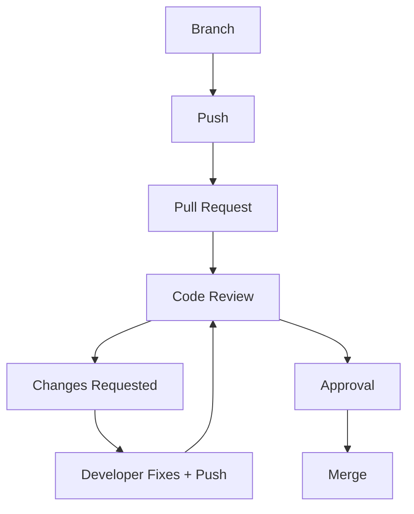

# 03 — Pull Requests and Code Review

---

## The Problem

> 🤔 **Should every developer be allowed to directly merge code into the `main` branch?**

If the answer is *no*, developers need a way to say:

> "Here is my change. Please look at it before it becomes part of the project."

That is a **Pull Request** (PR). GitLab calls it a **Merge Request** (MR). Same idea.

---

## 🔄 What Is a Pull Request?

A Pull Request is a **request to merge one branch into another**, together with:

- the full list of changed files and lines
- a place for discussion and questions
- review comments and approvals
- the result of automated checks (build, tests), when the team uses them
- a record of *why* the change was made

> 💡 **Senior Developer Note:** A Pull Request is a technical conversation, not just a button you click.

### The lifecycle



---

## 📝 A Realistic Pull Request

**Title:**

```text
Add employee search endpoint
```

**Description:**

```text
Added search by name
Added department filter
Added pagination
Added tests

Testing:
- Unit tests added
- Manual API testing completed
```

### What makes this PR useful?

| Element | Why it matters |
|---------|----------------|
| Clear title | Reviewers understand the purpose in one line |
| List of changes | Reviewer knows what to expect |
| Testing notes | Reviewer knows how it was verified |
| Small scope | Reviewer can actually read it in a few minutes |

> ⚠️ **Huge Pull Requests are the most common PR problem.** A PR with 40 files is not reviewed — it gets approved. Keep PRs small.

---

## 🧪 Exercise 5 — Write a Pull Request

You finished `feature/employee-search` with these changes:

- `EmployeeSearchService.cs` — new file, filtering logic
- `EmployeesController.cs` — new `GET /api/employees/search` action
- `EmployeeSearchTests.cs` — 5 tests
- `README.md` — one line about the new endpoint

**Write your PR now** (on paper or in your platform):

1. **Title** — one line, says what and not how
2. **Description** — bullet list of the changes
3. **Testing** — what you ran and what you checked
4. **Risk note** — anything the reviewer should look at carefully

**Compare with your neighbour.** Which description would you rather review?

> 🤔 **Question:** Would you include renaming 12 unrelated variables in this PR? (No — it hides the real change. Separate PR, separate branch.)

---

## 👀 Part 2 — Code Review

### What code review is NOT

> ❌ "Find mistakes so we can blame the developer."

### What code review IS

A collaboration process that improves:

- **correctness** — does it do what the task asked?
- **readability** — can the next developer understand it?
- **maintainability** — where will this break in six months?
- **security** — are inputs validated? are secrets exposed?
- **consistency** — does it follow the project's style?
- **test coverage** — is the important behavior tested?

---

## 🔍 Code Review Example

Here is a change in the Employee Management API:

```csharp
public Employee Get(int id)
{
    var employee = db.Employees.First(x => x.Id == id);
    return employee;
}
```

> 🤔 **What would you review here?**

Think for two minutes before reading on.

### Possible concerns (context matters)

| Concern | Question to ask |
|---------|-----------------|
| Missing employee | What happens when no employee has this id? `First` throws — is that intended? |
| Alternatives | Would `FirstOrDefault` + an explicit "not found" response be clearer? |
| Naming | Is `Get` clear enough? Does it match the rest of the class? |
| Async | This performs database I/O — does the project use async data access elsewhere? |
| Layering | Should the controller talk to `db` directly, or go through a service? Depends on the architecture being taught |
| Tests | Is there a test for the "employee exists" and "employee does not exist" paths? |

> ⚠️ Not every concern is an absolute rule. A throw-on-missing pattern can be perfectly valid if the framework converts it to a 404 consistently. **Judgement beats checklists.**

---

## 💬 How to Write Review Comments

### Poor

```text
This is wrong.
```

### Better

```text
Could we handle the case where the employee does not exist?
```

### Better

```text
Could we use the async data-access method here? This endpoint performs I/O.
```

### Comment types — be clear which one you are giving

| Type | Meaning | Example |
|------|---------|---------|
| **Blocking** | Must change before merge | "This can throw a NullReferenceException for new employees." |
| **Suggestion** | Nice to have, optional | "Consider extracting this condition for readability." |
| **Question** | You want to understand | "Is this query indexed? It runs on every request." |
| **Praise** | Good work | "Nice test for the empty-search case." |

> 💡 **Senior Developer Note:** Review the code, not the person. "This throws" is about the code. "You forgot" is about the person.

---

## 🎮 Exercise 6 — Code Review Role-Play

Divide into groups of three:

```text
Developer   → presents a small Pull Request
Reviewer    → reviews it using the checklist
Observer    → watches how the conversation goes
```

### The Developer's task

Present this change (write it on a card or screen):

```csharp
// PR: Add employee search
public List<Employee> Search(string name, int departmentId)
{
    var all = db.Employees.ToList();
    var result = new List<Employee>();

    foreach (var e in all)
    {
        if (e.FullName.ToLower().Contains(name.ToLower()) &&
            e.DepartmentId == departmentId)
        {
            result.Add(e);
        }
    }

    return result;
}
```

### The Reviewer's checklist

- [ ] Correctness — does it do what the task asked?
- [ ] Behavior when `name` is null or empty
- [ ] Behavior when no employee matches
- [ ] Database access — reads the whole table into memory?
- [ ] Naming and clarity
- [ ] Tests — are they present?
- [ ] Separate blocking issues from suggestions

**The Reviewer must:**

1. Identify at least two issues
2. Ask at least one question
3. Explain the reasoning, not just the verdict
4. Clearly mark what is **blocking** and what is a **suggestion**

**Then switch roles.** The Observer gives feedback on the conversation itself:

- Were the comments about code or about the person?
- Did the Developer become defensive? How did the Reviewer help?

---

## ❓ Classroom Questions

- 🎯 Would you approve this Pull Request? Why or why not?
- 👀 What would you write as your first review comment?
- 🤔 Is a missing test blocking or a suggestion? (Answer: it depends on your team's rules — say which one you mean.)
- 💬 How do you disagree with a reviewer respectfully?

---

## 🚫 Common Mistakes (Part 3)

| Mistake | Why it hurts | Better |
|---------|--------------|--------|
| Huge PRs | Reviewers cannot review them properly | Small PRs, one purpose |
| Vague PR descriptions | Reviewer must guess what changed | Describe changes and testing |
| Treating review as personal criticism | Trust breaks; people hide problems | Comment on the code, not the person |
| Ignoring review comments | Review becomes a formality | Answer every comment, even with a question |
| Approving without reading | Broken code reaches `main` | Read the diff; ask questions |
| Defending every line | Discussion turns into a fight | Assume good intent; explain, then decide together |

---

## ✅ Check Yourself

- [ ] I can explain a Pull Request to someone who has never used one
- [ ] I wrote a realistic PR description (Exercise 5)
- [ ] I know the difference between blocking issues and suggestions
- [ ] I can write a review comment that helps instead of blames
- [ ] I completed the role-play with a partner

**Next: [04 — Merge Conflicts](04-Merge-Conflicts.md)**
