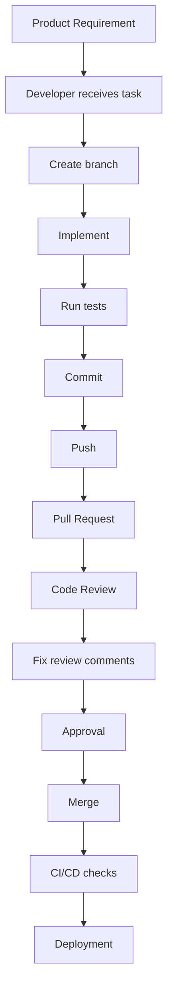

# 06 — Real-World Development Practices

---

## 🎫 Tickets — How Work Arrives

In a real team, tasks do not appear as chat messages like "add something to the API." They come from a tracked item: a **ticket** (also called a task, issue, or story) in a tool such as Azure DevOps, Jira, or GitHub Issues.

```text
Requirement
    ↓
Task (ticket with an ID and clear description)
    ↓
Branch (often named after the ticket)
    ↓
Implementation
    ↓
Pull Request (references the ticket)
    ↓
Code Review
    ↓
Testing
    ↓
Merge
    ↓
Ticket closed
```

A useful ticket answers three questions:

```text
What      → what must be built
Why       → what problem it solves
Done when → how we know it is finished
```

> 💡 **Senior Developer Note:** If you cannot say what "done" means before you start, you are not ready to code. Ask the question first.

---

## ✅ Definition of Done

A task is **not** finished simply because the code was written.

A common checklist (teams adjust it):

- [ ] Implementation complete
- [ ] Tests written and passing
- [ ] Code reviewed
- [ ] Documentation updated when needed
- [ ] No known blocking issues
- [ ] Ready for merge

> ⚠️ This is **not** a universal standard. Each team defines its own. The important habit: **agree on the checklist before starting the work.**

---

## 🔐 Never Commit Secrets

This is a hard professional rule.

**Do NOT commit:**

```text
passwords
API keys
connection strings containing secrets
private keys
tokens
credentials
```

Any secret that enters Git history is **shared with everyone who can read the repository** — and history is hard to erase.

Use clearly fake placeholders when demonstrating:

```text
Server=localhost;Database=EmployeeDb;User Id=sa;Password=YourLocalDevPassword;
```

### What `.gitignore` does

`.gitignore` tells Git which files to **never track** — typically files each developer generates locally.

A simple .NET example:

```gitignore
bin/
obj/
.vs/
*.user
```

| Entry | Meaning |
|-------|---------|
| `bin/`, `obj/` | build output, regenerated on every build |
| `.vs/` | Visual Studio local settings |
| `*.user` | per-developer project settings |

> ⚠️ This list is **not** sufficient for every .NET project. `.gitignore` should match *your* project's actual needs — copy the template from GitHub's `VisualStudio.gitignore` and adjust it.

### The critical lesson

> **`.gitignore` is not a secret-management system.**

Why:

1. `.gitignore` only affects files Git has **never tracked**. A file that was already committed stays tracked until you explicitly remove it from the index.
2. `.gitignore` does not encrypt anything. It only hides files from `git add`.
3. Secrets belong in **environment variables**, user secrets, a key vault, or your platform's secret store — outside the repository.

```bash
# If a tracked file must stop being tracked (example for local config):
git rm --cached appsettings.Development.json
git commit -m "Stop tracking local development settings"
```

> ⚠️ Removing the file from the *current* commit does **not** remove it from *older* commits. If a real secret was ever pushed, treat it as **compromised**: rotate the secret immediately, then ask your team about cleaning history.

---

## 🧑‍💻 Professional Team Workflow



We will not go deep into deployment today. The objective is understanding **professional collaboration** — the steps above are what you will see on your first team.

---

## 🎮 Final Team Simulation

Work in small teams of 3–4.

**Feature request (your ticket):**

> **Add employee search by name and department.**

### Your workflow

```text
 1. Read the task and agree on what "done" means
 2. Decide the branch name
 3. Implement a small change
 4. Commit with a meaningful message
 5. Push the branch
 6. Create a Pull Request
 7. Review ANOTHER team's Pull Request
 8. Receive review comments on yours
 9. Make the requested changes
10. Resolve a controlled conflict (use Exercise 7's file)
11. Test
12. Merge
```

### Rules of the simulation

- No direct commits to `main`
- Every PR needs a title, a description, and testing notes
- Every reviewer must give at least one **blocking** comment and one **suggestion**
- Every conflict must be resolved by *understanding both sides* — never by clicking "ours"

### Debrief questions

- 🤔 Which step took the longest? Why?
- 👀 Was the review comment useful? What made it useful?
- ⚠️ What would have happened if someone committed directly to `main`?
- 🎯 Did the final code match what "done" meant at the start?

---

## 🚫 Common Mistakes (Part 6)

| Mistake | Why it hurts | Better |
|---------|--------------|--------|
| Starting code before understanding the task | You build the wrong thing | Clarify "done when" first |
| Ignoring the Definition of Done | "Finished" code that cannot ship | Use the checklist |
| Committing secrets | Credentials are exposed to everyone | Use secret stores; use `.gitignore` for local files |
| Assuming `.gitignore` protects an already-tracked secret | The secret stays in history | Never track it in the first place; rotate if exposed |
| Skipping review because of a deadline | Defects reach production | Small PRs keep review fast |
| Working alone for days without pushing | Huge merges, late surprises | Push and share early |

---

## 🧠 Knowledge Check

### Question 1

What is the purpose of Git?

- A) To compile C# code
- B) To record changes to a project and help developers work together
- C) To run databases
- D) To deploy applications

**Answer:** B) To record changes to a project and help developers work together.

---

### Question 2

In which order does code normally move in Git?

- A) Repository → Staging Area → Working Directory
- B) Working Directory → Staging Area → Repository → Remote
- C) Remote → Repository → Working Directory
- D) Staging Area → Remote → Repository

**Answer:** B) Working Directory → Staging Area → Repository → Remote.

---

### Question 3

What does `git status` show?

- A) The commit history
- B) Changed files, staged files, and the current branch
- C) The difference between two files
- D) The remote address

**Answer:** B) Changed files, staged files, and the current branch.

---

### Question 4

What is the practical difference between `git fetch` and `git pull`?

- A) They are the same
- B) `fetch` downloads without merging; `pull` downloads and merges
- C) `pull` only works on `main`
- D) `fetch` deletes old commits

**Answer:** B) `fetch` downloads without merging; `pull` downloads and merges into your current branch.

---

### Question 5

Which is the best commit message?

- A) `changes`
- B) `fix`
- C) `Add employee search by name`
- D) `update files`

**Answer:** C) `Add employee search by name`.

---

### Question 6

What is the purpose of a branch?

- A) To make Git faster
- B) To work on a change without directly changing the main branch
- C) To store the database
- D) To replace code review

**Answer:** B) To work on a change without directly changing the main branch.

---

### Question 7

Which branch name best explains its purpose?

- A) `test`
- B) `new2`
- C) `fix/employee-validation`
- D) `stuff`

**Answer:** C) `fix/employee-validation`.

---

### Question 8

What is a Pull Request?

- A) A request to download Git
- B) A request to merge one branch into another, with discussion and review
- C) A type of bug report
- D) A Git configuration file

**Answer:** B) A request to merge one branch into another, with discussion and review.

---

### Question 9

You encounter a merge conflict. What should you do first?

- A) Choose "theirs" immediately
- B) Delete the file
- C) Read and understand both changes before deciding
- D) Abort the project

**Answer:** C) Read and understand both changes before deciding.

---

### Question 10

Why is blindly choosing "ours" dangerous?

- A) It makes Git slower
- B) The incoming change may be required — someone's work silently disappears
- C) It deletes your branch
- D) It is not allowed by Git

**Answer:** B) The incoming change may be required — someone's work silently disappears.

---

### Question 11

What makes a useful code review comment?

- A) `This is wrong.`
- B) `You clearly do not understand C#.`
- C) `Could we handle the case where the employee does not exist?`
- D) `LGTM` with no reading

**Answer:** C) A specific, respectful question about the code.

---

### Question 12

What is the first step when debugging an unknown problem?

- A) Change five things and re-run
- B) Reproduce the problem
- C) Rewrite the method
- D) Ignore it

**Answer:** B) Reproduce the problem.

---

### Question 13

Which file should NEVER contain a real password?

- A) The unit test file
- B) Any file committed to Git
- C) The README
- D) The branch name

**Answer:** B) Any file committed to Git.

---

### Question 14

What does `.gitignore` do?

- A) Encrypts your secrets
- B) Tells Git which files not to track
- C) Deletes files from your computer
- D) Reviews your code

**Answer:** B) Tells Git which files not to track. It is not a secret-management system.

---

### Question 15

A task is "Done" when:

- A) The code compiles
- B) The developer says it works on their machine
- C) The agreed checklist is complete: implementation, tests, review, no blocking issues
- D) The branch is created

**Answer:** C) The agreed checklist is complete.

---

## 🧭 Final Summary

```text
Today I learned:

✓ Why Git is important
✓ How the Git workflow works
✓ How to create branches
✓ How to make meaningful commits
✓ How merging works
✓ What Pull Requests are
✓ How code review works
✓ How to resolve merge conflicts
✓ How to debug systematically
✓ How professional development teams collaborate
✓ Why secrets never belong in Git
```

---

## 🔜 Next: Day 5 — Advanced SQL

Tomorrow you go deeper into SQL Server:

- complex queries
- views
- stored procedures
- transactions
- indexes
- query optimization
- database project

The connection: the code you branch, review, and merge today will query the database you optimize tomorrow.

---

> **A professional developer does not only write code. They know how to work safely with other developers.**

**End of Day 4.**
