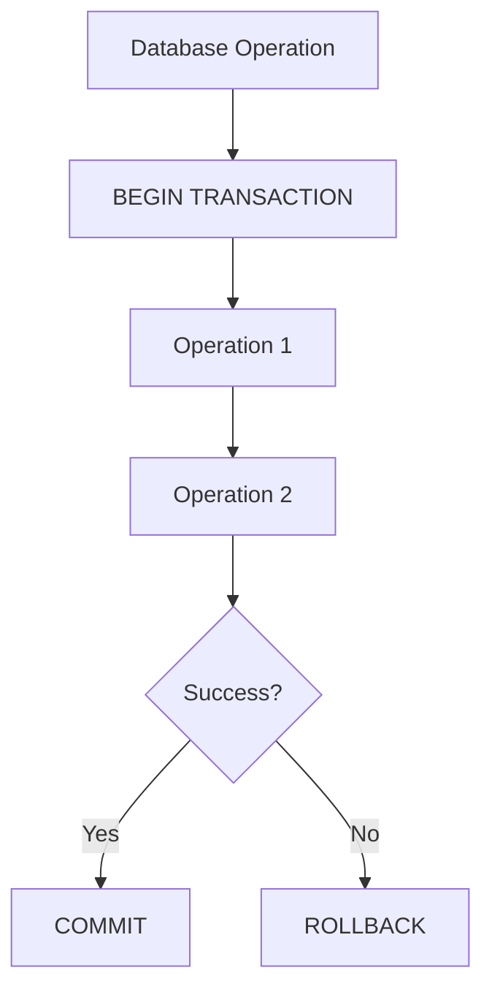

# 03 — Transactions

---

## The Real Problem

> **An employee is moved from Department A to Department B, and a related record must also be updated. What happens if the second operation fails?**

```text
Operation 1:  UPDATE Employees SET DepartmentId = 2 WHERE EmployeeId = 10   → succeeds
Operation 2:  UPDATE EmployeeProjects SET ... WHERE ...                      → FAILS
```

Without protection, Operation 1 **stays** in the database. The data is now in a state that never existed in the business world.

### The key idea

> **Either all required changes succeed, or none of them do.**

A **transaction** groups operations so they behave like **one unit**.



---

## 🛠️ The Three Commands

| Command | Meaning |
|---------|---------|
| `BEGIN TRANSACTION` | Start the unit of work |
| `COMMIT` | Keep all changes made inside the transaction |
| `ROLLBACK` | Undo **all** changes made inside the transaction |

### Basic example

```sql
BEGIN TRANSACTION;

UPDATE Employees
SET DepartmentId = 2
WHERE EmployeeId = 10;

-- Additional related operation
UPDATE EmployeeProjects
SET ProjectId = 3
WHERE EmployeeId = 10;

COMMIT;
```

If something goes wrong between the two statements:

```sql
ROLLBACK;
```

After `ROLLBACK`, the database is as it was **before** `BEGIN TRANSACTION`.

> 💡 **Senior Developer Note:** A transaction protects a **business operation**, not just a group of SQL statements. Always ask: *what real-world action am I protecting?*

---

## 🧠 Atomicity (and ACID, Briefly)

**Atomicity:** *"The group of operations behaves like one unit."* — all or nothing.

You may see the full acronym **ACID** in real projects:

| Letter | Word | Simple meaning |
|--------|------|----------------|
| A | Atomicity | All or nothing |
| C | Consistency | Rules of the database are not broken |
| I | Isolation | Concurrent transactions do not see each other's unfinished work |
| D | Durability | Once committed, the change survives a system failure |

That is enough theory for today. **Atomicity** is the concept you will use daily.

---

## 🛡️ A Safer Pattern — Error Handling

If an error occurs inside a transaction and nothing handles it, SQL Server may roll the transaction back for you (behavior depends on the error and settings). A deliberate pattern makes the intent explicit:

```sql
BEGIN TRY
    BEGIN TRANSACTION;

    UPDATE Employees
    SET DepartmentId = 2
    WHERE EmployeeId = 10;

    UPDATE EmployeeProjects
    SET ProjectId = 3
    WHERE EmployeeId = 10;

    COMMIT;
END TRY
BEGIN CATCH
    IF @@TRANCOUNT > 0
        ROLLBACK;

    THROW;
END CATCH;
```

### Reading it step by step

```text
TRY:     run the operations inside a transaction → COMMIT if all succeed
CATCH:   if an error occurs:
            - is a transaction still open? (@@TRANCOUNT > 0)
            - roll it back
            - re-throw the error so the caller knows it failed
```

| Piece | Meaning |
|-------|---------|
| `BEGIN TRY` / `END TRY` | Code that might fail |
| `BEGIN CATCH` / `END CATCH` | Code that runs when it fails |
| `@@TRANCOUNT` | How many transactions are currently open |
| `THROW` | Send the original error onward (T-SQL) |

> ⚠️ This pattern is a solid starting point — it does **not** solve every transaction design problem. Isolation levels, deadlocks, and concurrency are deeper topics for later.

---

## 🧪 Exercise 6 — Multi-Step Operation With a Simulated Error

### Scenario

Move employee `Ali` (EmployeeId 1) from his department to **Finance**, and remove one of his project assignments. **Simulate an error between the two operations.**

### Step 1 — Observe the danger (no transaction)

```sql
-- Run the first statement alone:
UPDATE Employees
SET DepartmentId = 3
WHERE EmployeeId = 1;

-- Simulate a failure before the second statement:
-- (intentionally cause an error, for example:)
SELECT 1/0;

-- The second statement never ran:
DELETE FROM EmployeeProjects
WHERE EmployeeId = 1;
```

> 🤔 **What is the state of the data now?** (The department changed, the project assignment did not — a half-finished business operation.)

### Step 2 — Fix it with a transaction

Run the same two operations inside `BEGIN TRY / BEGIN TRANSACTION`, with the same simulated error, and let `CATCH` roll it back.

> **What should happen?** The department change must be undone — as if the operation never started.

### Step 3 — Prove it

```sql
SELECT EmployeeId, FullName, DepartmentId
FROM Employees
WHERE EmployeeId = 1;
```

Compare the data after Step 1 and after Step 2.

### Without vs with

```text
Without transaction:
Operation 1 succeeds
Operation 2 fails
Database left in an unwanted state

With transaction:
Operation 1 succeeds
Operation 2 fails
ROLLBACK → database unchanged
```

Keep the dataset small — you need to **see** the state, not measure performance.

---

## 📝 Classroom Questions

- ⚠️ **What happens if the second UPDATE fails?**
- 🧠 **Which real business operation does this transaction protect?** (Name it in business words, not SQL words.)
- 🤔 **Is everything a transaction?** (No — a single simple statement usually does not need an explicit one.)
- 💭 **Where should the transaction start and end?** (Around the *business unit of work*, not an arbitrary number of lines.)

---

## 🚫 Common Mistakes (Part 3)

| Mistake | Why it hurts | Better |
|---------|--------------|--------|
| Transactions without understanding their scope | Too small: partial updates remain. Too long: other users wait | Wrap exactly the business unit |
| Forgetting rollback/error handling | Errors leave uncertain states | Use `TRY/CATCH` with `ROLLBACK` |
| Committing too early | Second half can still fail after the first committed | Commit only when the whole unit succeeded |
| Ignoring concurrency | Two users updating the same rows can conflict | Discuss isolation with your team; test multi-user cases |
| One giant transaction for the whole application | Long waits, lock pressure | Small, purposeful transactions |

---

## ✅ Check Yourself

- [ ] I can explain a transaction in one sentence
- [ ] I know what `COMMIT` and `ROLLBACK` each do
- [ ] I can explain atomicity with a business example
- [ ] I used `TRY/CATCH` with `ROLLBACK` and `THROW`
- [ ] I completed Exercise 6 and saw the difference

**Next: [04 — Indexes](04-Indexes.md)**
