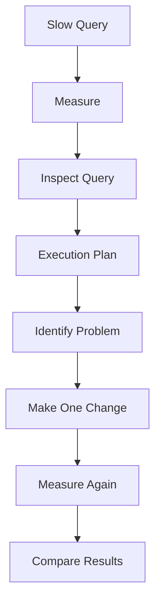

# 05 — Query Optimization

---

## Start Here

> **"A query is slow. What should we do?"**

Bad first answer: *"Add an index."*

Good first answer: **investigate**.



> 💡 **Senior Developer Note:** Do not optimize a query before understanding **why** it is slow.

---

## 📊 Execution Plans — A Practical Introduction

An **execution plan** shows **how SQL Server plans to run your query**.

How to see it (SSMS): run the query, then use **Display Estimated Execution Plan**, or enable **Include Actual Execution Plan** and run the query again.

| Plan type | What it shows |
|-----------|---------------|
| **Estimated** | What SQL Server *expects* to do, based on statistics |
| **Actual** | What it *really* did, including real row counts |

### Operations you will meet first

| Operation | Simple meaning |
|-----------|----------------|
| **Table scan** | Read through the table's rows |
| **Index scan** | Read through an index's entries |
| **Index seek** | Use an index to jump to matching entries |
| **Hash join / nested loop** | Ways of joining two result sets |

> 🎯 The practical question: *did SQL Server read far more rows than it returned?* That gap is where performance often hides.

> ⚠️ We do not teach every execution-plan operator today. Learn to **notice expensive steps and ask why they exist**.

---

## 🔎 A Practical Example

```sql
SELECT
    EmployeeId,
    FullName,
    Salary
FROM Employees
WHERE DepartmentId = 3;
```

Think before acting:

1. **What is SQL Server looking for?** Rows where `DepartmentId = 3`.
2. **How many rows will that be?** (Cardinality — how selective is the filter?)
3. **Does an index exist** on `DepartmentId`?
4. **What does the plan say?** Scan or seek?

> 📊 If you show example plan output in class, label it as an **illustrative example** — never as a measured result from someone's machine.

**Comparing before and after:**

```text
1. Run the query with the plan → note the operations
2. Create your proposed index (or change the query)
3. Run again → note the operations again
4. Compare — and measure timing if the data is large enough to matter
```

> ⚠️ With a tiny classroom table, everything is instant. Use the plan to learn the **reasoning**; use larger data when you need real measurements.

---

## 🚫 Performance Myths — Do Not Teach or Trust These

| Myth | Reality |
|------|---------|
| "Indexes always make queries faster" | Indexes help *some* queries and cost writes |
| "`SELECT *` is always slow" | It depends on what is selected, how much data, and how it is used |
| "JOINs are slow" | JOINs are fundamental; how they run depends on structure and indexes |
| "Subqueries are always slower than JOINs" | The optimizer may rewrite both into similar plans |
| "CTEs are always faster" | CTEs are about **readability**; speed comes from the whole plan |
| "Stored procedures are always faster" | Sometimes better plans are cached — it depends on the situation |

Performance depends on:

```text
data + indexes + query shape + statistics + cardinality
+ execution plan + workload + SQL Server version/configuration
```

> ⚠️ Never claim "this makes it 10x faster" without an actual measurement on actual data.

---

## 🧪 Exercise 8 — Execution Plan Investigation

Run this query and **include the actual execution plan**:

```sql
SELECT
    EmployeeId,
    FullName
FROM Employees
WHERE DepartmentId = 3;
```

Answer:

1. What operation does SQL Server use? (scan / seek / other)
2. How many rows does it read vs return? (from the actual plan)
3. Is any step obviously more expensive than the others?

---

## 🧪 Exercise 9 — Propose and Test an Improvement

Using your answer from Exercise 8:

1. Propose **one** change (an index is one option — a different query shape is another).
2. Write the change.
3. Run the query again with the plan.
4. Compare the plan before and after.
5. Explain the reasoning in one or two sentences.

> 🔑 **One change at a time.** If you change five things, you learn nothing.

---

## 🕵️ SQL Performance Detective Challenge

You are called to investigate a query that is **suspected** of being slow.

### Evidence Pack

**Table** (relevant part):

```sql
CREATE TABLE Employees
(
    EmployeeId   INT IDENTITY(1,1) PRIMARY KEY,
    FullName     NVARCHAR(100) NOT NULL,
    Salary       DECIMAL(10,2),
    DepartmentId INT
);
```

**Data characteristics** (illustrative description for the exercise):

- the table contains a large number of rows in a real system
- the classroom copy may be small — reason about the *plan*, not the stopwatch

**Current indexes:**

```text
PK_Employees  → clustered index on EmployeeId (from the primary key)
(no other indexes)
```

**The query:**

```sql
SELECT
    EmployeeId,
    FullName
FROM Employees
WHERE DepartmentId = 3;
```

**Expected result:** only the employees of department 3.

### Your mission

```text
Find the problem
      ↓
Collect evidence        (execution plan, row counts)
      ↓
Form a hypothesis       (why is it doing that?)
      ↓
Make one change
      ↓
Measure again           (plan comparison)
      ↓
Explain the result
```

### Guiding questions (do not skip to the answer)

1. What does the query filter on?
2. Which column is `DepartmentId` in the current indexes?
3. What does the execution plan show — how are rows found?
4. What is your hypothesis?
5. What single change do you propose?
6. What evidence proves your change helped?

> 🎯 The objective is **not** a specific speed number. The objective is a **scientific investigation** with evidence.

<details>
<summary>A likely direction (reveal after discussion)</summary>

The filter is on `DepartmentId`, but no index exists on that column. SQL Server may have to read broadly to find matching rows.

A candidate change:

```sql
CREATE INDEX IX_Employees_DepartmentId
ON Employees(DepartmentId);
```

Then re-run with the plan and compare. Whether the plan uses it and whether you see a timing difference depends on your data — **verify, do not assume**.

</details>

---

## 🧠 The Optimization Mindset

| Habit | Why it matters |
|-------|----------------|
| Measure before and after | Otherwise you have a story, not evidence |
| Change one thing | Attribution stays clear |
| Compare using the same data | Different data = different result |
| Read the plan, not only the clock | The plan explains *why* |
| Question your hypothesis | The plan often surprises you |

---

## 🚫 Common Mistakes (Part 5)

| Mistake | Why it hurts | Better |
|---------|--------------|--------|
| Optimizing without measuring | You cannot show improvement | Measure first |
| Trusting estimated results only | Estimates can be wrong | Use the **actual** plan |
| Changing multiple things at once | No idea what helped | One change at a time |
| Comparing runs on different datasets | Meaningless comparison | Same data, same conditions |
| Adding an index before reading the plan | Guessing, not engineering | Evidence first |
| Optimizing a query that is not a problem | Wasted effort | Find the real bottleneck |

---

## ✅ Check Yourself

- [ ] I can write the investigation process from memory
- [ ] I can explain scan vs seek in simple words
- [ ] I know the difference between estimated and actual plans
- [ ] I completed Exercises 8 and 9
- [ ] I can name at least three performance myths and why they are wrong
- [ ] I attempted the detective challenge with evidence

**Next: [06 — Database Project](06-Database-Project.md)**
