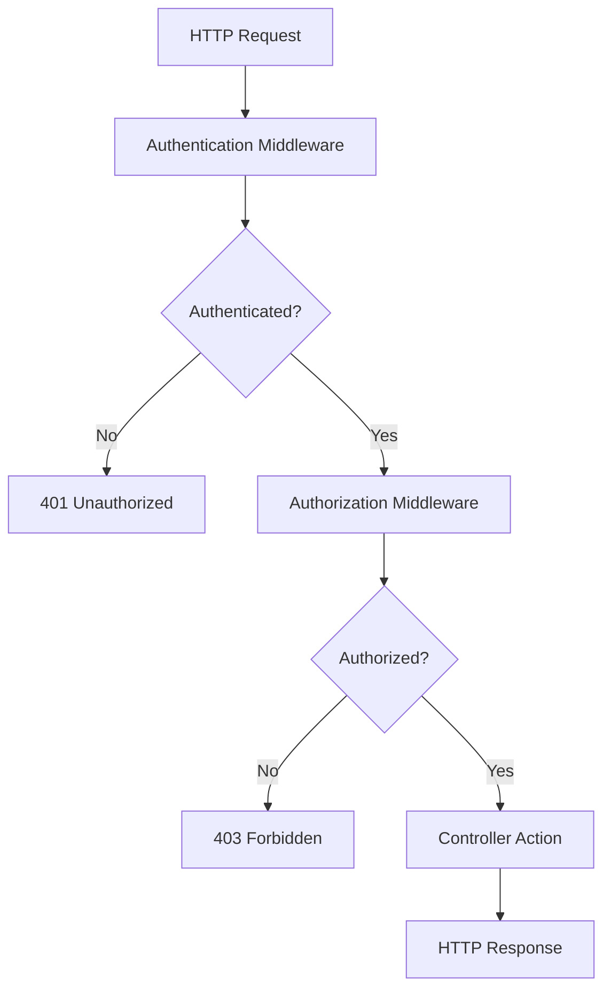
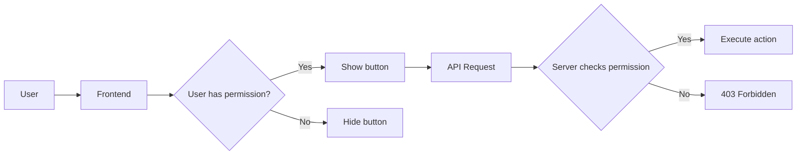

# 01 — Authentication vs Authorization

**Duration**: Conceptual (no fixed time)

---

## Definitions

**Authentication** answers one question: *Who are you?*

It is the process of verifying a user's identity. You present credentials (a username and password, a token, a certificate), and the system confirms whether those credentials are valid. If valid, you are **authenticated** — the system knows your identity.

**Authorization** answers a different question: *What can you do?*

Once the system knows who you are, authorization determines what actions you are permitted to perform. Can you read employee records? Can you delete them? Can you view salary data? Authorization enforces permissions based on your identity, role, or policy.

Authentication without authorization is like checking someone's ID at the door but letting them do anything once inside. Authorization without authentication is like having a list of rules but no way to know who you are applying them to.

---

## The Difference Explained

Consider the EmployeeManagement API. Four scenarios illustrate the distinction:

### Scenario 1: Anonymous user tries to access the API

```text
Request: GET /api/employees
Identity: None
```

No credentials provided. No token in the header. The system has no idea who is making this request. Authentication fails because there is nothing to authenticate.

**Result**: `401 Unauthorized` — the system does not know who you are.

### Scenario 2: Authenticated employee views their own data

```text
Request: GET /api/employees/42
Identity: Employee #42 (authenticated via JWT)
Permission: Employee can view their own record
```

The system validates the JWT token and identifies the user as Employee #42. The authorization check confirms that employees can view their own data.

**Result**: `200 OK` — identity confirmed, permission granted.

### Scenario 3: Authenticated employee tries to view all salaries

```text
Request: GET /api/employees/salaries
Identity: Employee #42 (authenticated via JWT)
Permission: Employee does NOT have permission to view salary data
```

The system validates the JWT token and identifies the user as Employee #42. The authorization check determines that viewing all salary data requires the "HR" or "Admin" role. Employee #42 has neither.

**Result**: `403 Forbidden` — identity confirmed, permission denied.

### Scenario 4: Authenticated admin deletes all employees

```text
Request: DELETE /api/employees
Identity: Admin user (authenticated via JWT)
Permission: Admin has full access
```

The system validates the JWT token and identifies the user as an Admin. The authorization check confirms that the Admin role has permission to delete employee records.

**Result**: `204 No Content` — identity confirmed, permission granted.

---

## HTTP Status Codes

The HTTP protocol provides specific status codes for authentication and authorization failures:

| Code | Meaning | When |
|---|---|---|
| `401 Unauthorized` | "I don't know who you are" | Authentication failed or credentials are missing |
| `403 Forbidden` | "I know who you are, but you can't do that" | Authentication succeeded, but authorization failed |
| `200 OK` | "Here is what you asked for" | Authentication and authorization both succeeded |

### When to return 401

- No `Authorization` header in the request
- The JWT token is expired
- The JWT token has an invalid signature
- The JWT token was issued by a different issuer
- The token is malformed or missing required claims

### When to return 403

- The user is authenticated but lacks the required role
- The user is authenticated but a policy requirement is not met
- The user is authenticated but the resource belongs to another user and they do not have override permission

### The critical distinction

```text
401 = The door is locked. Prove who you are.
403 = The door is open. You cannot enter this room.
```

Returning `403` when you should return `401` leaks information — it tells an attacker that your authentication layer is working but they lack permission, when in fact they never authenticated at all.

Returning `401` when you should return `403` confuses clients — it tells them their credentials are invalid when the real problem is insufficient permissions.

---

## The Request Pipeline

Every request passes through authentication before authorization. This is not optional. The order matters.



The pipeline runs in this order:

1. **HTTP Request** arrives at the server
2. **Authentication Middleware** extracts and validates credentials (JWT token from the `Authorization` header)
3. If authentication fails, the pipeline stops and returns `401`
4. If authentication succeeds, the **Authorization Middleware** checks permissions (roles, policies, requirements)
5. If authorization fails, the pipeline stops and returns `403`
6. If authorization succeeds, the **Controller Action** executes
7. **HTTP Response** is returned to the client

Notice that the controller action never runs unless both authentication and authorization succeed. This is a key architectural property: security is enforced *before* business logic executes.

---

## Where Each Happens

### Authentication: Middleware

Authentication runs as middleware in the request pipeline. In ASP.NET Core, you configure it in `Program.cs`:

```csharp
app.UseAuthentication();
app.UseAuthorization();
```

The order of these two lines is critical. Authentication must come before authorization. If reversed, the authorization middleware runs before the user's identity is established, and every request appears unauthenticated.

### Authorization: Middleware + Attributes

Authorization also runs as middleware, but it works in conjunction with attributes on your controllers and actions:

```csharp
[Authorize(Roles = "Admin")]
[HttpGet]
public async Task<ActionResult<IEnumerable<EmployeeDto>>> GetAll()
```

The `[Authorize]` attribute tells the authorization middleware what requirements must be met. If the current user does not meet them, the middleware returns `403` without calling the action.

You can also apply `[Authorize]` at the controller level to protect all actions in a controller:

```csharp
[Authorize]
[ApiController]
[Route("api/[controller]")]
public class EmployeesController : ControllerBase
```

Or use `[AllowAnonymous]` to exempt specific actions from controller-level authorization:

```csharp
[Authorize]
[ApiController]
[Route("api/[controller]")]
public class EmployeesController : ControllerBase
{
    [AllowAnonymous]
    [HttpGet("public")]
    public IActionResult GetPublicInfo() => Ok("This is public");
}
```

### Controller: Runs last

The controller action runs only after both authentication and authorization succeed. Inside the action, you can access the authenticated user's identity through the `User` property:

```csharp
[Authorize]
[HttpGet("me")]
public IActionResult GetCurrentUser()
{
    var userId = User.FindFirst(ClaimTypes.NameIdentifier)?.Value;
    var username = User.Identity?.Name;
    var roles = User.FindAll(ClaimTypes.Role).Select(c => c.Value);

    return Ok(new { UserId = userId, Username = username, Roles = roles });
}
```

---

## Server-Side Enforcement

This cannot be overstated: **authorization must be enforced on the server**.

Hiding a "Delete All" button in the frontend does not prevent deletion. It only prevents *seeing* the button. A user can open browser dev tools, inspect the network tab, and send a `DELETE` request directly to the API endpoint. If the server does not check authorization, the deletion proceeds.

```text
Frontend hides button    = UX (User Experience)
Backend checks permission = Security
```

Both matter. But only the backend check is security.

### The correct approach

1. Frontend hides the button for users who lack permission (UX improvement)
2. Backend checks authorization before executing the action (security enforcement)
3. The API returns `403` if the user lacks permission, regardless of what the frontend displays



The frontend check is a convenience. The server check is the law.

---

## In Our Application

The current `EmployeesController` has no authentication and no authorization. Here is what exists:

```csharp
[ApiController]
[Route("api/[controller]")]
public class EmployeesController : ControllerBase
{
    private readonly IEmployeeService _employeeService;

    public EmployeesController(IEmployeeService employeeService)
    {
        _employeeService = employeeService;
    }

    [HttpGet]
    public async Task<ActionResult<IEnumerable<EmployeeDto>>> GetAll()
    {
        var employees = await _employeeService.GetAllEmployeesAsync();
        return Ok(employees);
    }

    [HttpGet("{id}")]
    public async Task<ActionResult<EmployeeDto>> GetById(int id)
    {
        var employee = await _employeeService.GetEmployeeByIdAsync(id);
        return Ok(employee);
    }

    [HttpPost]
    public async Task<ActionResult<EmployeeDto>> Create([FromBody] CreateEmployeeDto dto)
    {
        var employee = await _employeeService.CreateEmployeeAsync(dto);
        return CreatedAtAction(nameof(GetById), new { id = employee.Id }, employee);
    }
}
```

Every endpoint is publicly accessible. No `[Authorize]` attributes. No authentication middleware configured in `Program.cs`. No JWT settings in `appsettings.json`.

This means:

- **Anyone** can list all employees, including their salary data
- **Anyone** can create new employee records
- **Anyone** can view any employee's details by ID
- There is no concept of a "user" — the API treats all requests as anonymous

This is the problem this module solves. You will add:

1. JWT authentication so the API knows who is making each request
2. Role-based authorization so different users have different permissions
3. Policy-based authorization for complex rules (e.g., "employees can view their own data but not others'")
4. Input validation so invalid data never reaches the database
5. Global exception handling so errors do not leak sensitive information
6. Logging so you can diagnose problems and detect attacks

---

## Key Takeaways

- **Authentication** verifies identity (who are you?). **Authorization** verifies permission (what can you do?).
- They are separate concerns. Authentication must happen before authorization.
- `401 Unauthorized` means "prove who you are." `403 Forbidden` means "I know who you are, but you cannot do that."
- Authentication and authorization are enforced **server-side**, in middleware, before the controller action runs.
- Frontend hiding of UI elements is UX. Backend enforcement of permissions is security. Both are needed; only the backend is reliable.
- The current EmployeeManagement API has neither authentication nor authorization. Every endpoint is public. This module fixes that.

---

## Common Mistakes

### 1. Confusing 401 and 403

Returning `401` when the user is authenticated but lacks permission, or returning `403` when the user has no credentials at all. ASP.NET Core handles this correctly by default when you configure authentication and authorization middleware properly. Do not override this behavior without understanding the implications.

### 2. Relying only on frontend for security

Hiding buttons, disabling links, or removing menu items does not secure the API. The API must enforce its own permissions independently of any client. A malicious user bypasses the frontend entirely.

### 3. Forgetting the middleware order

`app.UseAuthentication()` must come before `app.UseAuthorization()` in `Program.cs`. If reversed, every request appears unauthenticated because the identity has not been established when authorization runs.

### 4. Applying `[Authorize]` to some actions but not others without a strategy

If you protect `Create` and `Delete` but forget to protect `GetAll`, sensitive data remains exposed. Decide on a default policy (e.g., require authentication for all endpoints) and use `[AllowAnonymous]` to opt out specific public endpoints.

### 5. Not testing unauthorized access

Developers test the happy path: log in, get token, make request, see data. They forget to test: what happens without a token? What happens with an expired token? What happens with a token for a different role? These failure paths are where security bugs live.
