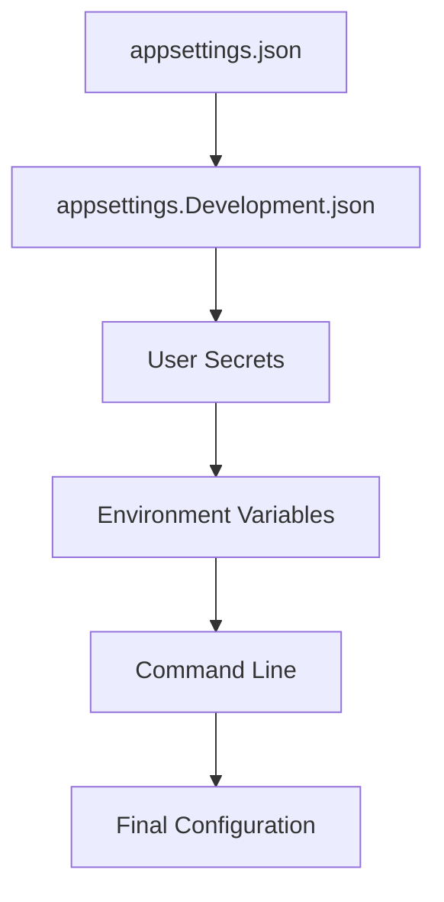

# 09 — Configuration and Secrets

**Duration**: 30 minutes

---

## Why Configuration Matters

Every non-trivial application needs configuration. Connection strings tell you where the database lives. API keys grant access to external services. JWT settings control how tokens are issued and validated. Logging levels control how much detail you see during debugging versus production.

How you manage this configuration directly affects both security and maintainability. A secret hardcoded in source code cannot be rotated without a redeploy. A connection string embedded in a service class cannot be changed per environment. A signing key committed to git is potentially exposed to every person who has ever cloned the repository.

Good configuration management means:

- Secrets stay secret
- Settings change per environment without code changes
- The application validates its configuration at startup
- Developers can work locally without production credentials

---

## Configuration Sources in ASP.NET Core

ASP.NET Core provides a layered configuration system. Multiple sources feed into a single configuration object, and **later sources override earlier ones**. This allows you to set safe defaults in a file and override them with environment-specific or secret values at runtime.

The default sources, in order of precedence (lowest to highest):

1. **appsettings.json** — base configuration
2. **appsettings.{Environment}.json** — environment-specific overrides (e.g., `appsettings.Development.json`, `appsettings.Production.json`)
3. **User Secrets** — local development secrets (only in Development environment)
4. **Environment variables** — set per process or machine
5. **Command-line arguments** — passed at startup



Each layer overrides the previous. If `appsettings.json` sets `JwtSettings:ExpiryInMinutes` to `60` and an environment variable sets it to `30`, the final value is `30`.

---

## appsettings.json

This is the base configuration file. It lives in the project root and is committed to source control. It should contain **non-sensitive defaults** that apply across all environments.

```json
{
  "ConnectionStrings": {
    "DefaultConnection": "Server=(localdb)\\mssqllocaldb;Database=EmployeeManagementDb;Trusted_Connection=True"
  },
  "Logging": {
    "LogLevel": {
      "Default": "Information",
      "Microsoft.AspNetCore": "Warning"
    }
  },
  "AllowedHosts": "*",
  "JwtSettings": {
    "Issuer": "EmployeeManagementApi",
    "Audience": "EmployeeManagementClient",
    "ExpiryInMinutes": 60
  }
}
```

What belongs here:

- Connection strings for local development (SQL Server LocalDB is safe — it only works on the developer's machine)
- Logging defaults
- Non-sensitive application settings (JWT issuer, audience, token expiry)
- `AllowedHosts`

What does **NOT** belong here:

- JWT signing keys
- Third-party API keys
- Production connection strings with passwords
- Any secret or credential

> **Important:** Anything committed to `appsettings.json` is visible to anyone with access to the repository. Treat it as public.

---

## appsettings.Development.json

Environment-specific files override the base file when the application runs in that environment. ASP.NET Core determines the environment from the `ASPNETCORE_ENVIRONMENT` environment variable (or launchSettings.json during development).

```json
{
  "Logging": {
    "LogLevel": {
      "Default": "Debug",
      "Microsoft.AspNetCore": "Information"
    }
  }
}
```

This file lowers the log level during development so you see more detail. The `ConnectionStrings` and `JwtSettings` sections are not repeated here because the base values from `appsettings.json` still apply.

You could also create `appsettings.Production.json` for production-specific non-sensitive settings, but production **secrets** should come from environment variables or a secret manager — not from a file in source control.

---

## User Secrets for Development

.NET User Secrets provide a way to store sensitive values locally during development without putting them in source control. Secrets are stored in a JSON file on the developer's machine, outside the project directory.

### Setting Up User Secrets

```bash
# Initialize user secrets for the project
dotnet user-secrets init

# Set a secret (key uses colon : as separator for nested objects)
dotnet user-secrets set "JwtSettings:SecretKey" "YourSuperSecretKeyThatIsAtLeast32CharactersLong!"

# List all secrets
dotnet user-secrets list

# Remove a specific secret
dotnet user-secrets remove "JwtSettings:SecretKey"

# Clear all secrets
dotnet user-secrets clear
```

After running `dotnet user-secrets init`, a `<UserSecretsId>` element is added to the `.csproj` file. This GUID identifies which secret file belongs to this project.

### Where Secrets Are Stored

On Windows, secrets are stored in:

```
%APPDATA%\Microsoft\UserSecrets\<UserSecretsId>\secrets.json
```

The file looks like this:

```json
{
  "JwtSettings:SecretKey": "YourSuperSecretKeyThatIsAtLeast32CharactersLong!"
}
```

### Key Facts About User Secrets

- They are **never committed to source control** (the file lives outside the project)
- They are **only loaded in the Development environment**
- They **override** values from `appsettings.json`
- They are **not encrypted** — they protect against accidental commits, not against a determined attacker with access to the machine
- Each developer has their own secrets file — secrets are not shared between team members

---

## Production Secret Management

User Secrets are for development only. Production requires a different approach. The secret must be injected into the running application from outside the codebase.

### Options for Production

**Environment Variables**

The simplest approach. Set variables in the deployment environment (container orchestrator, cloud service, CI/CD pipeline). ASP.NET Core reads them automatically. Environment variable keys use `__` (double underscore) as separator instead of `:`:

```
JwtSettings__SecretKey=YourSuperSecretKeyThatIsAtLeast32CharactersLong!
JwtSettings__Issuer=EmployeeManagementApi
```

**Azure Key Vault**

Store secrets in Azure Key Vault and load them at startup using the `Azure.Extensions.AspNetCore.Configuration.Secrets` package. Secrets are encrypted at rest, access is controlled via Azure RBAC, and rotation can happen without redeployment.

**AWS Secrets Manager**

Similar to Azure Key Vault but on AWS. Secrets are encrypted, access-controlled, and automatically rotatable.

**HashiCorp Vault**

A third-party secret management solution that works across cloud providers and on-premises. Provides dynamic secrets, encryption as a service, and detailed audit logs.

**Docker Secrets**

For containerized deployments, Docker secrets provide a way to pass sensitive data to containers without embedding it in the image.

### The Rule

> **Never commit production secrets to source control. Never put them in appsettings.json. Never hardcode them.**

The application code should be identical across environments. Only the configuration source changes.

---

## Strongly Typed Configuration

Reading configuration values with string keys (`Configuration["JwtSettings:SecretKey"]`) is error-prone. No compile-time checking, no IntelliSense, typos discovered at runtime. ASP.NET Core supports **strongly typed options** instead.

### Step 1: Create a Settings Class

```csharp
public class JwtSettings
{
    public string SecretKey { get; set; } = string.Empty;
    public string Issuer { get; set; } = string.Empty;
    public string Audience { get; set; } = string.Empty;
    public int ExpiryInMinutes { get; set; }
}
```

Property names must match the configuration keys. The configuration system maps `JwtSettings:SecretKey` to the `SecretKey` property automatically.

### Step 2: Register the Options

In `Program.cs`:

```csharp
builder.Services.Configure<JwtSettings>(
    builder.Configuration.GetSection("JwtSettings"));
```

This binds the `JwtSettings` section of the configuration to the `JwtSettings` class and registers it in the DI container.

### Step 3: Inject Where Needed

```csharp
public class TokenService
{
    private readonly JwtSettings _settings;

    public TokenService(IOptions<JwtSettings> options)
    {
        _settings = options.Value;
    }

    public string GenerateToken(ApplicationUser user)
    {
        var key = new SymmetricSecurityKey(
            Encoding.UTF8.GetBytes(_settings.SecretKey));
        // ... use _settings.Issuer, _settings.Audience, etc.
    }
}
```

Benefits:

- **Compile-time safety** — misspelled property names fail to build
- **IntelliSense** — IDE shows available properties
- **Testability** — inject mock options in unit tests
- **Single responsibility** — the class does not depend on the entire configuration system

---

## Configuration Validation

An application that starts with missing or invalid configuration will fail at some unpredictable point later. Better to fail fast at startup with a clear error message.

```csharp
var jwtSettings = builder.Configuration
    .GetSection("JwtSettings")
    .Get<JwtSettings>();

if (string.IsNullOrEmpty(jwtSettings?.SecretKey))
{
    throw new InvalidOperationException(
        "JWT SecretKey is not configured. " +
        "Set it via User Secrets (development) or environment variables (production).");
}

if (jwtSettings.SecretKey.Length < 32)
{
    throw new InvalidOperationException(
        "JWT SecretKey must be at least 32 characters for HS256.");
}

if (jwtSettings.ExpiryInMinutes <= 0)
{
    throw new InvalidOperationException(
        "JwtSettings:ExpiryInMinutes must be greater than zero.");
}
```

Place this validation in `Program.cs` after building the configuration but before starting the application. If a required setting is missing, the application exits immediately with a clear message instead of returning 500 errors at runtime.

---

## Environment-Specific Behavior

Sometimes the application itself needs to behave differently per environment — not just different values, but different logic.

```csharp
var app = builder.Build();

if (app.Environment.IsDevelopment())
{
    app.UseDeveloperExceptionPage();
}
else
{
    app.UseExceptionHandler("/error");
    app.UseHsts();
}

app.UseHttpsRedirection();

if (app.Environment.IsDevelopment())
{
    app.UseCors("Development");
}
else
{
    app.UseCors("Production");
}
```

The `IWebHostEnvironment` service (injected or accessed via `app.Environment`) exposes:

- `app.Environment.IsDevelopment()`
- `app.Environment.IsProduction()`
- `app.Environment.IsStaging()`
- `app.Environment.EnvironmentName` (for custom environments)

Use this to enable detailed error pages in development, strict security headers in production, permissive CORS during testing, and restrictive CORS in production.

---

## Configuration Best Practices

1. **Use strongly typed options.** Bind configuration sections to classes. Avoid string-based lookups in business logic.

2. **Validate required settings at startup.** Fail fast with a clear message if a critical setting is missing or invalid.

3. **Use User Secrets for development.** Keep secrets out of source control. Each developer manages their own secrets.

4. **Use environment variables or a secret manager for production.** Azure Key Vault, AWS Secrets Manager, or environment variables injected by the deployment pipeline.

5. **Never commit secrets to source control.** Not in `appsettings.json`, not in code comments, not in test files. Add `appsettings.*.json` files with secrets to `.gitignore`.

6. **Use different configuration per environment.** Development uses LocalDB and debug logging. Production uses real databases, restricted CORS, and minimal logging.

7. **Document required configuration settings.** A `README.md` or wiki page listing every required setting, its purpose, and where to obtain it helps new developers and operations teams.

---

## Common Mistakes

### Mistake 1: Committing Secrets to Git

```json
// appsettings.json — DO NOT DO THIS
{
  "JwtSettings": {
    "SecretKey": "MyProductionSecretKey123!"
  }
}
```

Once pushed, the secret is in git history forever. Even if you remove it later, anyone with access to the repository's history can find it. Use User Secrets for development and environment variables for production.

### Mistake 2: Hardcoding Connection Strings

```csharp
// DO NOT DO THIS
var connectionString = "Server=prod-server;Database=EmployeeDb;User=sa;Password=P@ssw0rd!";
```

Hardcoded values cannot change per environment, cannot be rotated, and are visible in source control.

### Mistake 3: Not Validating Configuration

Starting the application without checking whether required settings exist leads to `NullReferenceException` at unpredictable points during runtime. Validate at startup.

### Mistake 4: Using the Same Secrets in Development and Production

If the development JWT signing key is the same as production, a token generated locally will work against the production API. Use different secrets per environment.

### Mistake 5: Storing Secrets in Environment Variables on Developer Machines

Setting production secrets as system environment variables on your laptop means every project on that machine can read them. Use User Secrets, which are scoped to a specific project.
