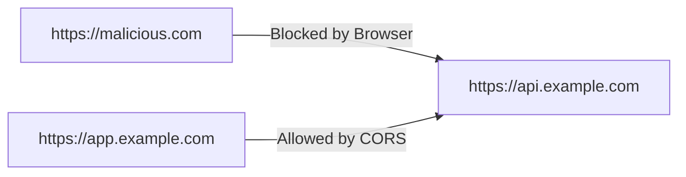

# 10 — CORS

**Duration**: 25 minutes

---

## What Is CORS?

**Cross-Origin Resource Sharing** (CORS) is a browser security mechanism. It controls which **origins** (websites, single-page applications) are allowed to access your API from a different origin.

Without CORS, a malicious website at `https://evil.com` could use JavaScript to call your API at `https://api.yourcompany.com` and read the response — potentially accessing data on behalf of an authenticated user. CORS gives you a way to say which origins can make those requests.

---

## Understanding Origins

An **origin** is the combination of three components:

- **Scheme** (protocol): `http` or `https`
- **Host** (domain): `example.com`, `api.example.com`
- **Port**: `80`, `443`, `8080`, etc.

Two URLs are the same origin only if all three match.

| URL | Origin |
|-----|--------|
| `https://example.com` | Origin A |
| `https://example.com:443` | Origin A (port 443 is default for https) |
| `https://example.com:8080` | Origin B (different port) |
| `http://example.com` | Origin C (different scheme) |
| `https://app.example.com` | Origin D (different host) |

Each of these is a **different origin**. An API at `https://api.example.com` is a different origin from a frontend at `https://app.example.com`.

---

## Why Browsers Enforce CORS

Browsers implement the **Same-Origin Policy**: by default, JavaScript running on one origin cannot read responses from a different origin. This prevents a malicious website from silently accessing APIs on behalf of a logged-in user.



The browser blocks the response from reaching the JavaScript on `malicious.com`. The request might still reach the server, but the browser discards the response.

CORS is the mechanism that lets the server explicitly tell the browser: "This origin is allowed to read the response."

---

## When CORS Applies

CORS is enforced by **browsers only**. It matters when:

- A browser-based client (JavaScript, `fetch`, `XMLHttpRequest`, Axios) makes a request
- The request is **cross-origin** (the frontend origin differs from the API origin)

CORS does **NOT** apply to:

- **Server-to-server calls** — a backend calling another backend does not involve a browser, so no CORS check
- **Mobile apps** — native HTTP clients do not enforce CORS
- **Desktop apps** — same as mobile
- **Same-origin requests** — if the frontend and API share the same origin, the Same-Origin Policy does not block anything
- **Tools like Postman or curl** — these are not browsers

This distinction matters. If your API is consumed only by server-to-server calls or mobile apps, CORS configuration is irrelevant for those clients. But if a browser-based SPA calls your API, CORS is essential.

---

## CORS in ASP.NET Core

### Configuring CORS

```csharp
var builder = WebApplication.CreateBuilder(args);

// Add CORS service
builder.Services.AddCors(options =>
{
    options.AddPolicy("AllowFrontend", policy =>
    {
        policy.WithOrigins("https://app.example.com", "https://admin.example.com")
              .WithMethods("GET", "POST", "PUT", "DELETE")
              .WithHeaders("Content-Type", "Authorization")
              .AllowCredentials();
    });
});

var app = builder.Build();

// Use CORS middleware — must be BEFORE UseAuthorization
app.UseCors("AllowFrontend");

app.UseAuthentication();
app.UseAuthorization();
app.MapControllers();
```

### What Each Setting Means

- **`WithOrigins`** — Which origins are allowed to access the API. Must be exact URLs (no wildcards). The browser compares the requesting page's origin against this list.

- **`WithMethods`** — Which HTTP methods the client is allowed to use. `GET`, `POST`, `PUT`, `DELETE`, `PATCH`, etc.

- **`WithHeaders`** — Which request headers the client is allowed to send. `Content-Type` and `Authorization` are the most common. If the client sends a header not listed here, the browser blocks the request.

- **`AllowCredentials`** — Whether the browser should include cookies and the `Authorization` header in cross-origin requests. Required when the frontend sends authenticated requests.

---

## Preflight Requests

For certain cross-origin requests, the browser sends a **preflight** request before the actual one. This is an `OPTIONS` request that asks the server: "Is this real request okay to send?"

### When Does a Preflight Occur?

A preflight is sent when any of these conditions are true:

- The method is `PUT`, `DELETE`, `PATCH`, or another non-simple method
- The request includes headers beyond the "simple" ones (`Accept`, `Content-Type` with limited values, `Accept-Language`)
- The `Content-Type` is something other than `application/x-www-form-urlencoded`, `multipart/form-data`, or `text/plain`
- The request includes an `Authorization` header (which your API almost certainly requires)

In practice, **most API requests with JWT authentication trigger a preflight** because they include the `Authorization` header.

### The Preflight Flow

1. Browser sends `OPTIONS` request with headers:
   - `Origin: https://app.example.com`
   - `Access-Control-Request-Method: POST`
   - `Access-Control-Request-Headers: Content-Type, Authorization`

2. Server responds with:
   - `Access-Control-Allow-Origin: https://app.example.com`
   - `Access-Control-Allow-Methods: GET, POST, PUT, DELETE`
   - `Access-Control-Allow-Headers: Content-Type, Authorization`
   - `Access-Control-Allow-Credentials: true`

3. If the response allows the request, the browser sends the actual `POST` request. If not, the browser blocks it and the JavaScript receives a CORS error.

ASP.NET Core handles preflight responses automatically when the CORS middleware is configured. You do not need to write OPTIONS endpoint handlers.

---

## Middleware Ordering

CORS middleware **must** be placed before authentication and authorization middleware:

```csharp
app.UseCors("AllowFrontend");     // BEFORE
app.UseAuthentication();
app.UseAuthorization();
app.MapControllers();
```

Why? The CORS middleware needs to add response headers to **every** response, including preflight `OPTIONS` requests. Preflight requests are anonymous — they carry no authentication token. If the authentication middleware runs first, it may reject the preflight before the CORS middleware has a chance to add the allow headers.

Getting this order wrong is one of the most common CORS bugs. The symptom: preflight requests return `401 Unauthorized` and the browser reports a CORS error.

---

## CORS vs Authentication/Authorization

This is a critical distinction:

**CORS is not security.**

CORS is a **browser restriction**. It tells browsers what they are allowed to do. A browser respects CORS. A malicious script running outside a browser does not.

- A `curl` command ignores CORS
- A Python script ignores CORS
- Postman ignores CORS
- A custom HTTP client ignores CORS

CORS protects against one specific threat: a malicious website using a victim's browser to access your API. It does not replace authentication, authorization, or any other security measure.

Your API still needs:

- **Authentication** — verify who is making the request
- **Authorization** — verify what they are allowed to do
- **Input validation** — reject malicious input
- **HTTPS** — encrypt data in transit

Think of CORS as a sign on the door saying "Delivery trucks from Company A only." It does not stop someone from walking in the back door.

---

## Development vs Production CORS

### Development

During development, you want to focus on building features, not debugging CORS errors. A permissive policy lets any origin access the API:

```csharp
options.AddPolicy("Development", policy =>
{
    policy.AllowAnyOrigin()
          .AllowAnyMethod()
          .AllowAnyHeader();
});
```

This accepts requests from any origin, any method, any header. Convenient but insecure. **Never use this in production.**

Note: `AllowAnyOrigin()` cannot be combined with `AllowCredentials()`. If your development frontend sends authenticated requests, you must specify explicit origins even in development:

```csharp
options.AddPolicy("Development", policy =>
{
    policy.WithOrigins("http://localhost:3000", "http://localhost:5173")
          .AllowAnyMethod()
          .AllowAnyHeader()
          .AllowCredentials();
});
```

### Production

In production, lock down CORS to only the origins that should access the API:

```csharp
options.AddPolicy("Production", policy =>
{
    policy.WithOrigins("https://app.example.com", "https://admin.example.com")
          .WithMethods("GET", "POST", "PUT", "DELETE")
          .WithHeaders("Content-Type", "Authorization");
});
```

Restrict origins to your known frontend applications. Restrict methods to only those your API uses. Restrict headers to only those clients need to send.

### Using Environment-Specific Policies

```csharp
if (app.Environment.IsDevelopment())
{
    app.UseCors("Development");
}
else
{
    app.UseCors("Production");
}
```

---

## Credentialed Requests and Wildcard Origins

A common mistake: trying to combine `AllowAnyOrigin()` with `AllowCredentials()`.

```csharp
// THIS WILL FAIL
policy.AllowAnyOrigin()
      .AllowCredentials();
```

ASP.NET Core will throw an `InvalidOperationException` at startup:

```
When AllowCredentials is true, WithOrigins must not contain a wildcard.
```

The CORS specification forbids this combination. If the server responds with `Access-Control-Allow-Origin: *` and `Access-Control-Allow-Credentials: true`, browsers will reject the response. This is by design — allowing any origin to make credentialed requests would defeat the purpose of CORS.

The fix: use explicit origins when credentials are involved.

```csharp
policy.WithOrigins("https://app.example.com")
      .AllowCredentials();
```

---

## Common Mistakes

### Mistake 1: Using AllowAnyOrigin in Production

```csharp
policy.AllowAnyOrigin()
      .AllowAnyMethod()
      .AllowAnyHeader();
```

This tells every website on the internet that they can make credentialess requests to your API. In production, always specify explicit origins.

### Mistake 2: Placing CORS Middleware in the Wrong Order

```csharp
// WRONG — CORS after authentication
app.UseAuthentication();
app.UseAuthorization();
app.UseCors("AllowFrontend");
```

Preflight requests have no authentication token. They will fail with `401 Unauthorized` before CORS headers are added. Place `UseCors` before `UseAuthentication`.

### Mistake 3: Thinking CORS Is Security

CORS is a browser constraint. It does not stop non-browser clients. It does not authenticate. It does not authorize. It is one layer in a defense-in-depth strategy, not a replacement for proper security.

### Mistake 4: Not Allowing Necessary Headers

```csharp
policy.WithOrigins("https://app.example.com")
      .WithMethods("GET", "POST")
      .WithHeaders("Content-Type");
// Missing: Authorization header
```

If the client sends an `Authorization` header and it is not listed in `WithHeaders`, the preflight fails. Always include `Authorization` in the allowed headers for authenticated APIs.

### Mistake 5: Forgetting AllowCredentials

```csharp
policy.WithOrigins("https://app.example.com")
      .WithMethods("GET", "POST")
      .WithHeaders("Content-Type", "Authorization");
// Missing: AllowCredentials()
```

Without `AllowCredentials()`, the browser will not include cookies or the `Authorization` header in the cross-origin request. The request goes through, but unauthenticated.
