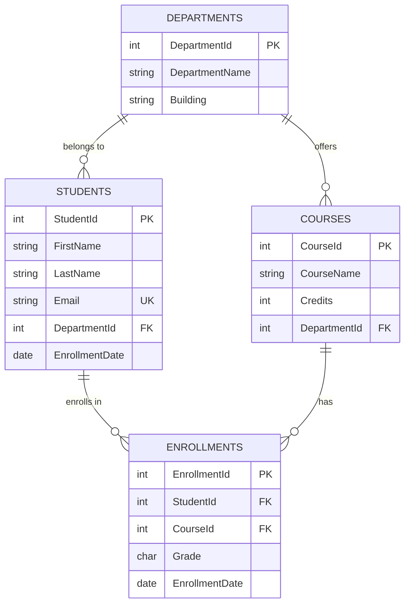
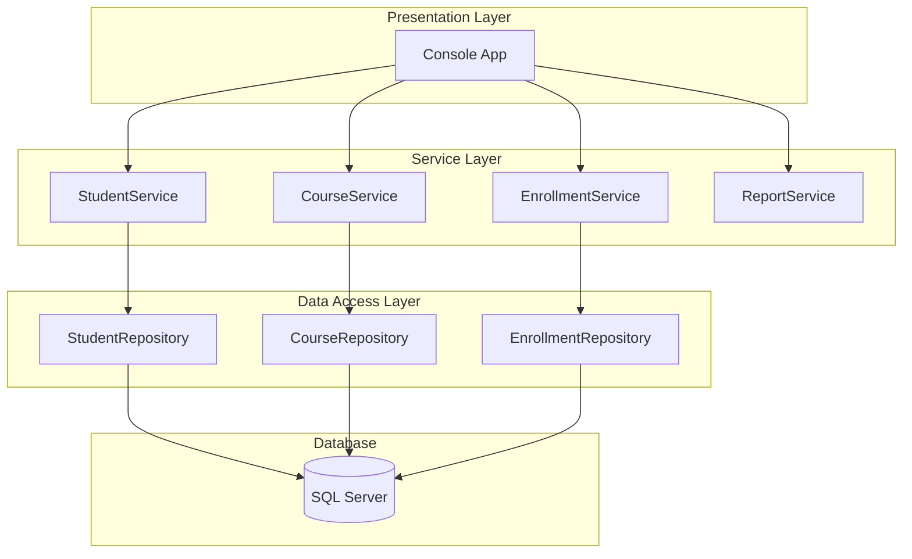

# 🎓 C# & SQL Server Engineering Masterclass

## Week 1 — Professional Software Engineering Fundamentals

> **Course Level:** Beginner → Intermediate
> **Duration:** 5 Days (8 hours/day recommended)
> **Prerequisites:** Basic computer literacy, any prior programming experience helpful but not required
> **Tools Required:** Visual Studio 2022+ (Community or higher), SQL Server (Developer/Express), Git, SSMS or Azure Data Studio

---

## 📋 Weekly Curriculum Overview

| Day | Theme | Focus Area |
|-----|-------|------------|
| **1** | C# Fundamentals & OOP | Core syntax, classes, interfaces, polymorphism, exception handling |
| **2** | Advanced C# & Async Programming | Collections, LINQ, lambdas, async/await, Tasks |
| **3** | SQL Server & Relational Design | Schema design, keys, constraints, JOINs, basic queries |
| **4** | Git & Professional Practices | Version control, branching, PRs, code review, debugging |
| **5** | Advanced SQL & Database Optimization | CTEs, stored procedures, ACID, indexes, execution plans, capstone |

---

# 📅 Day 1 — C# Fundamentals & OOP

## Learning Objectives

By the end of this session, students will be able to:

- Write, compile, and execute C# console applications
- Understand C# syntax: variables, types, control flow, and methods
- Apply Object-Oriented Programming principles (Encapsulation, Inheritance, Polymorphism, Abstraction)
- Design and implement classes, interfaces, and abstract classes
- Handle exceptions gracefully using try-catch-finally

---

### 1.1 — C# Language Foundations

#### The Anatomy of a C# Program

Every C# application begins with a `Program` class and a `Main` entry point (or top-level statements in .NET 6+).

```csharp
// Modern C# 12 — Top-Level Statements (no explicit Main needed)
Console.WriteLine("Welcome to the C# & SQL Server Masterclass!");

// Traditional structure (still valid and important to understand)
namespace Masterclass
{
    public class Program
    {
        static void Main(string[] args)
        {
            Console.WriteLine("Traditional entry point.");
        }
    }
}
```

#### Variables and Type System

C# is a **strongly-typed, statically-typed** language. The compiler enforces type safety at build time.

```csharp
// Explicit type declarations
int studentCount = 42;
double courseRating = 4.8;
string courseName = "C# & SQL Masterclass";
bool isEnrolled = true;

// Use 'var' when the type is obvious from the right-hand side (best practice)
var year = 2025;            // compiler infers int
var instructor = "Dr. Smith"; // compiler infers string

// Constants — cannot be reassigned
const double TaxRate = 0.08;

// Value types vs Reference types
// Value types (stack): int, double, bool, char, DateTime, struct
// Reference types (heap): string, object, arrays, classes, interfaces
```

> 💡 **Senior Dev Tip:** Use `var` when the type is obvious from assignment. It reduces verbosity without sacrificing clarity. Don't use `var` when the type isn't clear from context — readability trumps brevity.

#### Control Flow

```csharp
// if/else with pattern matching (C# 9+)
object grade = 85;
string letterGrade = grade switch
{
    >= 90 => "A",
    >= 80 => "B",
    >= 70 => "C",
    >= 60 => "D",
    _ => "F"
};

// for loop — when you know iteration count
for (int i = 0; i < 5; i++)
{
    Console.WriteLine($"Iteration {i}");
}

// foreach — when iterating a collection
string[] languages = { "C#", "SQL", "TypeScript" };
foreach (var lang in languages)
{
    Console.WriteLine(lang);
}

// while — when condition-dependent
int attempts = 0;
while (attempts < 3)
{
    Console.WriteLine($"Attempt {attempts + 1}");
    attempts++;
}
```

#### Methods

```csharp
public class Calculator
{
    // Expression-bodied method (single statement — preferred)
    public static int Add(int a, int b) => a + b;

    // Traditional method body
    public static double CalculateArea(double radius)
    {
        const double Pi = 3.14159265359;
        return Pi * radius * radius;
    }

    // Method with default parameters
    public static string FormatCurrency(double amount, string currency = "USD")
    {
        return $"{currency} {amount:N2}";
    }

    // Out parameters — return multiple values
    public static bool TryDivide(int a, int b, out double result)
    {
        if (b == 0)
        {
            result = 0;
            return false;
        }
        result = (double)a / b;
        return true;
    }

    // Value tuples — modern alternative to out parameters
    public static (double min, double max, double average) GetStats(double[] numbers)
    {
        return (numbers.Min(), numbers.Max(), numbers.Average());
    }
}
```

---

### 1.2 — Object-Oriented Programming (OOP)

#### The Four Pillars

| Pillar | Purpose | C# Mechanism |
|--------|---------|--------------|
| **Encapsulation** | Hide internal state, expose controlled access | Properties, access modifiers |
| **Inheritance** | Share behavior across related types | `:` base class |
| **Polymorphism** | Same interface, different behavior | `virtual`/`override`, interfaces |
| **Abstraction** | Define contracts, hide implementation | `abstract` classes, interfaces |

#### Encapsulation — Classes and Properties

```csharp
public class BankAccount
{
    // Private backing field — encapsulation in action
    private decimal _balance;

    // Public properties with controlled access
    public string AccountHolder { get; }
    public string AccountNumber { get; }
    public decimal Balance => _balance; // read-only externally

    // Constructor — enforce valid state at creation
    public BankAccount(string accountHolder, string accountNumber, decimal initialDeposit)
    {
        if (string.IsNullOrWhiteSpace(accountHolder))
            throw new ArgumentException("Account holder name is required.", nameof(accountHolder));
        if (initialDeposit < 0)
            throw new ArgumentOutOfRangeException(nameof(initialDeposit), "Initial deposit cannot be negative.");

        AccountHolder = accountHolder;
        AccountNumber = accountNumber;
        _balance = initialDeposit;
    }

    // Method that enforces business rules
    public void Deposit(decimal amount)
    {
        if (amount <= 0)
            throw new ArgumentOutOfRangeException(nameof(amount), "Deposit must be positive.");

        _balance += amount;
    }

    public bool Withdraw(decimal amount)
    {
        if (amount <= 0 || amount > _balance)
            return false;

        _balance -= amount;
        return true;
    }

    public override string ToString()
        => $"[{AccountNumber}] {AccountHolder} — Balance: {Balance:C}";
}
```

#### Inheritance

```csharp
// Base class
public class Animal
{
    public string Name { get; set; }
    public int Age { get; set; }

    // Virtual — can be overridden by derived classes
    public virtual string Speak()
        => $"{Name} makes a sound.";

    public override string ToString()
        => $"{Name} (Age: {Age})";
}

// Derived class — Dog inherits from Animal
public class Dog : Animal
{
    public string Breed { get; set; }

    // Override the virtual method
    public override string Speak()
        => $"{Name} barks! Woof!";

    // Dog-specific method
    public string Fetch(string item)
        => $"{Name} fetches the {item}!";
}

// Derived class — Cat inherits from Animal
public class Cat : Animal
{
    public bool IsIndoor { get; set; }

    public override string Speak()
        => $"{Name} meows!";

    public string Purr()
        => $"{Name} purrs contentedly...";
}
```

#### Interfaces — Defining Contracts

```csharp
// Interface — a contract that types must fulfill
public interface IMovable
{
    int X { get; }
    int Y { get; }
    void Move(int dx, int dy);
}

public interface IDrawable
{
    void Draw();
}

// A class can implement multiple interfaces
public class Player : IMovable, IDrawable
{
    public int X { get; private set; }
    public int Y { get; private set; }

    public void Move(int dx, int dy)
    {
        X += dx;
        Y += dy;
    }

    public void Draw()
    {
        Console.WriteLine($"Drawing player at ({X}, {Y})");
    }
}

// Interface-based programming — program to the interface
public static void RenderScene(IDrawable[] drawables)
{
    foreach (var item in drawables)
    {
        item.Draw(); // polymorphic call
    }
}
```

#### Polymorphism in Practice

```csharp
public abstract class Shape
{
    public string Name { get; set; } = string.Empty;

    // Abstract method — no implementation, derived classes MUST implement
    public abstract double CalculateArea();

    // Virtual method — has default, can be overridden
    public virtual string Describe()
        => $"{Name}: Area = {CalculateArea():F2}";
}

public class Circle : Shape
{
    public double Radius { get; set; }

    public override double CalculateArea()
        => Math.PI * Radius * Radius;
}

public class Rectangle : Shape
{
    public double Width { get; set; }
    public double Height { get; set; }

    public override double CalculateArea()
        => Width * Height;

    public override string Describe()
        => $"{Name}: {Width}x{Height}, Area = {CalculateArea():F2}";
}

public class Triangle : Shape
{
    public double Base { get; set; }
    public double Height { get; set; }

    public override double CalculateArea()
        => 0.5 * Base * Height;
}

// Polymorphism — same code, different behavior based on actual type
public static void PrintShapeReport(Shape[] shapes)
{
    Console.WriteLine("=== Shape Report ===");
    foreach (var shape in shapes)
    {
        // Correct behavior selected at runtime via virtual dispatch
        Console.WriteLine(shape.Describe());
    }
}

// Usage
var shapes = new Shape[]
{
    new Circle { Name = "Circle", Radius = 5 },
    new Rectangle { Name = "Rectangle", Width = 4, Height = 6 },
    new Triangle { Name = "Triangle", Base = 3, Height = 8 }
};

PrintShapeReport(shapes);
```

---

### 1.3 — Exception Handling

#### The Philosophy

Exceptions are not flow control — they represent **exceptional conditions**. Handle them where you can recover; let them propagate where the caller can.

```csharp
public class FileProcessor
{
    // Structured exception handling
    public static List<string> ReadLines(string filePath)
    {
        // Argument validation — fail fast
        if (string.IsNullOrWhiteSpace(filePath))
            throw new ArgumentException("File path cannot be null or empty.", nameof(filePath));

        StreamReader? reader = null;
        try
        {
            reader = new StreamReader(filePath);
            var lines = new List<string>();
            string? line;
            while ((line = reader.ReadLine()) != null)
            {
                lines.Add(line);
            }
            return lines;
        }
        catch (FileNotFoundException ex)
        {
            // Specific handling for expected failure
            Console.WriteLine($"File not found: {filePath}");
            Console.WriteLine($"Details: {ex.Message}");
            return new List<string>();
        }
        catch (UnauthorizedAccessException ex)
        {
            // Permission issues — different recovery path
            Console.WriteLine($"Access denied to {filePath}: {ex.Message}");
            throw; // re-throw when you can't recover
        }
        catch (IOException ex)
        {
            // General I/O failure
            Console.WriteLine($"I/O error reading {filePath}: {ex.Message}");
            return new List<string>();
        }
        finally
        {
            // ALWAYS executes — cleanup belongs here
            reader?.Dispose();
        }
    }

    // Modern approach — using statement (IDisposable auto-dispose)
    public static List<string> ReadLinesModern(string filePath)
    {
        if (string.IsNullOrWhiteSpace(filePath))
            throw new ArgumentException("File path cannot be null or empty.", nameof(filePath));

        // 'using' declaration ensures Dispose is called even on exception
        using var reader = new StreamReader(filePath);
        var lines = new List<string>();
        string? line;
        while ((line = reader.ReadLine()) != null)
        {
            lines.Add(line);
        }
        return lines;
    }

    // Custom exception for domain-specific errors
    public class InvalidDataException : Exception
    {
        public string FieldName { get; }

        public InvalidDataException(string fieldName, string message)
            : base(message)
        {
            FieldName = fieldName;
        }
    }

    public static void ValidateStudentRecord(string name, int age)
    {
        if (string.IsNullOrWhiteSpace(name))
            throw new InvalidDataException(nameof(name), "Student name is required.");
        if (age < 16 || age > 100)
            throw new InvalidDataException(nameof(age), $"Age must be between 16 and 100. Got: {age}");
    }
}
```

> 💡 **Senior Dev Tip:** Catch specific exceptions, never bare `catch`. Catching `Exception` swallows bugs and makes debugging a nightmare. If you can't recover, let it bubble up. The caller might know what to do.

---

### 🏋️ Day 1 — Practical Exercise

**Challenge:** Build a `Student` management system with OOP and exception handling.

**Requirements:**
1. Create a `Student` class with properties: `Id`, `Name`, `Email`, `Grade` (enum: A, B, C, D, F)
2. Create an `Enrollment` class that links a `Student` to a `Course`
3. Implement `Course` class with capacity limits (throw custom exception when full)
4. Create a `CourseManager` class with methods to enroll/drop students
5. Handle all edge cases: duplicate enrollments, capacity limits, invalid student data

**Starter Skeleton:**

```csharp
public enum Grade { A, B, C, D, F }

// Your implementation here
public class Student { /* ... */ }
public class Course { /* ... */ }
public class Enrollment { /* ... */ }
public class CourseManager { /* ... */ }
```

> **Expected time:** 45 minutes. This exercise reinforces every concept from Day 1.

---

# 📅 Day 2 — Advanced C# & Asynchronous Programming

## Learning Objectives

By the end of this session, students will be able to:

- Use generic collections and custom generic types
- Query data with LINQ (query syntax and method syntax)
- Write lambda expressions for concise, functional-style code
- Build asynchronous applications with async/await and Task
- Apply best practices for concurrent operations

---

### 2.1 — Collections and Generics

#### Built-in Collections

```csharp
using System.Collections.Generic;

// List<T> — dynamic array, O(1) random access, O(n) insert/remove
var students = new List<string> { "Alice", "Bob", "Charlie" };
students.Add("Diana");
students.RemoveAt(0); // remove by index
string second = students[1]; // O(1) access

// Dictionary<TKey, TValue> — key-value pairs, O(1) lookup
var studentGrades = new Dictionary<int, string>
{
    [1001] = "Alice",
    [1002] = "Bob",
    [1003] = "Charlie"
};

if (studentGrades.TryGetValue(1002, out var name))
{
    Console.WriteLine($"Student: {name}");
}

// HashSet<T> — unique elements, O(1) contains check
var uniqueSkills = new HashSet<string> { "C#", "SQL", "Git" };
bool hasCSharp = uniqueSkills.Contains("C#"); // true

// Queue<T> — FIFO
var taskQueue = new Queue<string>();
taskQueue.Enqueue("Process Order");
taskQueue.Enqueue("Send Email");
string nextTask = taskQueue.Dequeue(); // "Process Order"

// Stack<T> — LIFO
var undoStack = new Stack<string>();
undoStack.Push("Edit 1");
undoStack.Push("Edit 2");
string lastEdit = undoStack.Pop(); // "Edit 2"
```

#### Custom Generics — Write Reusable Code

```csharp
// Generic repository — works with any entity type
public class Repository<T> where T : class, new()
{
    private readonly List<T> _items = new();

    public void Add(T item)
    {
        ArgumentNullException.ThrowIfNull(item);
        _items.Add(item);
    }

    public T? GetById(Func<T, bool> predicate)
        => _items.FirstOrDefault(predicate);

    public IEnumerable<T> GetAll() => _items.AsReadOnly();

    public bool Remove(Func<T, bool> predicate)
    {
        var item = _items.FirstOrDefault(predicate);
        if (item is null) return false;
        return _items.Remove(item);
    }
}

// Usage — same repository works for any type
var studentRepo = new Repository<Student>();
studentRepo.Add(new Student { Id = 1, Name = "Alice" });

var courseRepo = new Repository<Course>();
courseRepo.Add(new Course { Id = 101, Name = "C# Fundamentals" });
```

#### Generic Constraints

```csharp
// where T : class          — reference type
// where T : struct        — value type
// where T : new()         — has parameterless constructor
// where T : BaseClass     — inherits from BaseClass
// where T : IInterface    — implements interface
// where T : notnull       — non-nullable

public static T FindMin<T>(T[] items) where T : IComparable<T>
{
    if (items.Length == 0)
        throw new InvalidOperationException("Array is empty.");

    T min = items[0];
    for (int i = 1; i < items.Length; i++)
    {
        if (items[i].CompareTo(min) < 0)
            min = items[i];
    }
    return min;
}
```

---

### 2.2 — LINQ (Language Integrated Query)

LINQ lets you query any collection with a consistent, readable syntax.

```csharp
using System.Linq;

var students = new List<Student>
{
    new() { Id = 1, Name = "Alice",   Age = 22, Grade = Grade.A, EnrollmentYear = 2023 },
    new() { Id = 2, Name = "Bob",     Age = 19, Grade = Grade.B, EnrollmentYear = 2024 },
    new() { Id = 3, Name = "Charlie", Age = 21, Grade = Grade.A, EnrollmentYear = 2023 },
    new() { Id = 4, Name = "Diana",   Age = 20, Grade = Grade.C, EnrollmentYear = 2024 },
    new() { Id = 5, Name = "Eve",     Age = 23, Grade = Grade.B, EnrollmentYear = 2023 },
    new() { Id = 6, Name = "Frank",   Age = 18, Grade = Grade.A, EnrollmentYear = 2025 },
};

// ═══ Method Syntax (fluent) — more common in production ═══

// Filter
var honorRoll = students.Where(s => s.Grade == Grade.A).ToList();

// Project (select specific fields)
var summaries = students.Select(s => new { s.Name, s.Age });

// Order
var byAge = students.OrderBy(s => s.Age).ThenByDescending(s => s.Name);

// Aggregate
var averageAge = students.Average(s => s.Age);
var oldest = students.MaxBy(s => s.Age);

// Group
var byYear = students.GroupBy(s => s.EnrollmentYear);
foreach (var group in byYear)
{
    Console.WriteLine($"Year {group.Key}: {string.Join(", ", group.Select(s => s.Name))}");
}

// First, Single, Any, All
var firstSenior = students.First(s => s.Age >= 22);
bool allAdults = students.All(s => s.Age >= 18);
bool anySeniors = students.Any(s => s.Age >= 21);

// Complex query — method chaining
var result = students
    .Where(s => s.Age >= 20)
    .OrderByDescending(s => s.Grade)
    .ThenBy(s => s.Name)
    .Select(s => new { s.Name, s.Age, Grade = s.Grade.ToString() })
    .ToList();

// ═══ Query Syntax (SQL-like) — good for complex joins ═══

var queryResult =
    from s in students
    where s.Age >= 20
    orderby s.Grade, s.Name
    select new { s.Name, s.Age };

// ═══ Join ═══
var enrollments = new List<Enrollment>
{
    new() { StudentId = 1, CourseId = 101 },
    new() { StudentId = 1, CourseId = 102 },
    new() { StudentId = 2, CourseId = 101 },
    new() { Id = 101, Name = "C# Fundamentals" },  // Assume these are courses
};

var enrolledCourses = students
    .Join(enrollments,
        student => student.Id,
        enrollment => enrollment.StudentId,
        (student, enrollment) => new { student.Name, CourseId = enrollment.CourseId });
```

---

### 2.3 — Lambda Expressions

Lambdas are anonymous functions — concise inline code blocks.

```csharp
// Lambda syntax
// (parameters) => expression
// (parameters) => { statements; }

// As a delegate
Func<int, int, int> add = (a, b) => a + b;
Func<string, bool> isLong = s => s.Length > 10;
Action<string> print = message => Console.WriteLine(message);

// With LINQ
var shortNames = students.Where(s => s.Name.Length <= 4);
var sorted = students.OrderBy(s => s.LastName ?? s.Name);

// As method arguments
students.ForEach(s => Console.WriteLine(s.Name));

// Multi-line lambda
Func<int, string> classify = age =>
{
    if (age < 18) return "Minor";
    if (age < 65) return "Adult";
    return "Senior";
};

// Closure — lambda captures outer variable
int threshold = 21;
var adults = students.Where(s => s.Age >= threshold);
```

---

### 2.4 — Asynchronous Programming

#### Why Async?

Synchronous code blocks the thread while waiting for I/O (database, file, network). Async frees the thread to do other work during the wait.

```
Sync:  [====Query DB====] [====Process====] [====Save====] = total time
Async: [====Query DB====]
       [====Process====] [====Save====]                   = less idle time
```

#### async/await Fundamentals

```csharp
using System.Net.Http;

public class StudentService
{
    private readonly HttpClient _httpClient = new();

    // Async method — returns Task<T>
    public async Task<List<Student>> GetStudentsFromApiAsync()
    {
        // 'await' suspends this method but frees the thread
        HttpResponseMessage response = await _httpClient.GetAsync("https://api.example.com/students");

        // Execution resumes here after the HTTP call completes
        response.EnsureSuccessStatusCode();

        string json = await response.Content.ReadAsStringAsync();

        // In production, use System.Text.Json or Newtonsoft.Json
        return JsonSerializer.Deserialize<List<Student>>(json) ?? new();
    }

    // Async void — ONLY for event handlers (fire-and-forget)
    // async void is dangerous — exceptions can't be caught
    // Always use async Task instead

    // Parallel async operations
    public async Task<(List<Student> students, List<Course> courses)> GetAllDataAsync()
    {
        // Start both tasks concurrently — don't await immediately
        Task<List<Student>> studentsTask = FetchStudentsAsync();
        Task<List<Course>> coursesTask = FetchCoursesAsync();

        // Await both — total time = max(individual times), not sum
        await Task.WhenAll(studentsTask, coursesTask);

        return (studentsTask.Result, coursesTask.Result);
    }

    private async Task<List<Student>> FetchStudentsAsync()
    {
        await Task.Delay(1000); // simulate DB call
        return new List<Student>();
    }

    private async Task<List<Course>> FetchCoursesAsync()
    {
        await Task.Delay(1500); // simulate API call
        return new List<Course>();
    }
}
```

#### Cancellation and Timeouts

```csharp
public class ResilientService
{
    // Always pass CancellationToken through async chains
    public async Task<string> FetchDataWithTimeoutAsync(CancellationToken ct = default)
    {
        using var cts = CancellationTokenSource.CreateLinkedTokenSource(ct);
        cts.CancelAfter(TimeSpan.FromSeconds(30)); // 30-second timeout

        try
        {
            // The cancellation token propagates through the call chain
            await Task.Delay(5000, cts.Token);
            return "Data loaded";
        }
        catch (OperationCanceledException) when (cts.IsCancellationRequested)
        {
            Console.WriteLine("Request timed out or was cancelled.");
            return "Timeout — using cached data";
        }
    }

    // Parallel tasks with cancellation
    public async Task ProcessBatchAsync(IEnumerable<string> items, CancellationToken ct)
    {
        var tasks = items.Select(item => ProcessItemAsync(item, ct));
        await Task.WhenAll(tasks);
    }

    private async Task ProcessItemAsync(string item, CancellationToken ct)
    {
        ct.ThrowIfCancellationRequested();
        await Task.Delay(100, ct); // simulate work
        Console.WriteLine($"Processed: {item}");
    }
}
```

> 💡 **Senior Dev Tip:** Never use `Task.Result` or `Task.Wait()` in production — they block the thread and can cause deadlocks. Always `await`. If you need synchronous access, you haven't designed your async flow correctly.

---

### 🏋️ Day 2 — Practical Exercise

**Challenge:** Build an async data pipeline.

**Requirements:**
1. Create a `DataLoader` class that simulates fetching student data from 3 different APIs (use `Task.Delay` to simulate network latency)
2. Use `Task.WhenAll` to fetch all 3 datasets concurrently
3. Merge results using LINQ
4. Filter for students with GPA > 3.5, sort by name
5. Use a `CancellationTokenSource` with a 5-second timeout
6. Handle the timeout gracefully

**Bonus:** Add retry logic (up to 3 retries) for failed requests.

---

# 📅 Day 3 — SQL Server & Relational Database Design

## Learning Objectives

By the end of this session, students will be able to:

- Design normalized relational database schemas
- Define tables with appropriate keys and constraints
- Model entity relationships (1:1, 1:N, M:N)
- Write fundamental SQL queries with filtering, sorting, and JOINs

---

### 3.1 — Database Design Principles

#### Normalization

Normalization eliminates data redundancy. The key normal forms:

| Normal Form | Rule | Example Violation → Fix |
|-------------|------|------------------------|
| **1NF** | Atomic values, no repeating groups | `Subjects: "Math,Science"` → separate `StudentSubjects` table |
| **2NF** | No partial dependencies on composite keys | `StudentName` depends only on `StudentId`, not `(StudentId, CourseId)` |
| **3NF** | No transitive dependencies | `DepartmentName` via `DeptId` in Student table → move to `Departments` table |

> 💡 **Senior Dev Tip:** Aim for 3NF as a default. Denormalize deliberately (and document why) for performance-critical reads. Every denormalization is a consistency trade-off.

#### Entity-Relationship Diagram



---

### 3.2 — Tables, Keys, and Constraints

```sql
-- Create the database
CREATE DATABASE MasterclassDB;
GO
USE MasterclassDB;
GO

-- Departments table
CREATE TABLE Departments (
    DepartmentId   INT          NOT NULL IDENTITY(1,1),
    DepartmentName NVARCHAR(100) NOT NULL,
    Building       NVARCHAR(50)  NULL,
    Budget         DECIMAL(12,2) NOT NULL DEFAULT 0.00,
    CreatedAt      DATETIME2     NOT NULL DEFAULT SYSUTCDATETIME(),

    CONSTRAINT PK_Departments PRIMARY KEY (DepartmentId),
    CONSTRAINT UQ_DepartmentName UNIQUE (DepartmentName),
    CONSTRAINT CK_Budget_Positive CHECK (Budget >= 0)
);
GO

-- Students table
CREATE TABLE Students (
    StudentId      INT           NOT NULL IDENTITY(1,1),
    FirstName      NVARCHAR(50)  NOT NULL,
    LastName       NVARCHAR(50)  NOT NULL,
    Email          NVARCHAR(100) NOT NULL,
    DateOfBirth    DATE          NOT NULL,
    DepartmentId   INT           NOT NULL,
    EnrollmentDate DATE          NOT NULL DEFAULT CAST(SYSUTCDATETIME() AS DATE),
    IsActive       BIT           NOT NULL DEFAULT 1,
    CreatedAt      DATETIME2     NOT NULL DEFAULT SYSUTCDATETIME(),

    CONSTRAINT PK_Students PRIMARY KEY (StudentId),
    CONSTRAINT UQ_StudentEmail UNIQUE (Email),
    CONSTRAINT FK_Students_Departments FOREIGN KEY (DepartmentId)
        REFERENCES Departments(DepartmentId),
    CONSTRAINT CK_Email_Format CHECK (Email LIKE '%@%.%'),
    CONSTRAINT CK_Age_Range CHECK (DATEDIFF(YEAR, DateOfBirth, SYSUTCDATETIME()) BETWEEN 16 AND 100)
);
GO

-- Courses table
CREATE TABLE Courses (
    CourseId       INT           NOT NULL IDENTITY(1,1),
    CourseName     NVARCHAR(100) NOT NULL,
    CourseCode     NVARCHAR(10)  NOT NULL,
    Credits        INT           NOT NULL DEFAULT 3,
    DepartmentId   INT           NOT NULL,
    MaxEnrollment  INT           NOT NULL DEFAULT 30,
    IsActive       BIT           NOT NULL DEFAULT 1,
    CreatedAt      DATETIME2     NOT NULL DEFAULT SYSUTCDATETIME(),

    CONSTRAINT PK_Courses PRIMARY KEY (CourseId),
    CONSTRAINT UQ_CourseCode UNIQUE (CourseCode),
    CONSTRAINT FK_Courses_Departments FOREIGN KEY (DepartmentId)
        REFERENCES Departments(DepartmentId),
    CONSTRAINT CK_Credits_Range CHECK (Credits BETWEEN 1 AND 6),
    CONSTRAINT CK_MaxEnrollment CHECK (MaxEnrollment > 0)
);
GO

-- Enrollments (Many-to-Many bridge)
CREATE TABLE Enrollments (
    EnrollmentId   INT  NOT NULL IDENTITY(1,1),
    StudentId      INT  NOT NULL,
    CourseId       INT  NOT NULL,
    EnrollmentDate DATE NOT NULL DEFAULT CAST(SYSUTCDATETIME() AS DATE),
    Grade          CHAR(1) NULL,
    IsCompleted    BIT  NOT NULL DEFAULT 0,
    CreatedAt      DATETIME2 NOT NULL DEFAULT SYSUTCDATETIME(),

    CONSTRAINT PK_Enrollments PRIMARY KEY (EnrollmentId),
    CONSTRAINT FK_Enrollments_Students FOREIGN KEY (StudentId)
        REFERENCES Students(StudentId) ON DELETE CASCADE,
    CONSTRAINT FK_Enrollments_Courses FOREIGN KEY (CourseId)
        REFERENCES Courses(CourseId) ON DELETE CASCADE,
    CONSTRAINT UQ_StudentCourse UNIQUE (StudentId, CourseId),
    CONSTRAINT CK_Grade_Valid CHECK (Grade IS NULL OR Grade IN ('A','B','C','D','F'))
);
GO
```

---

### 3.3 — Fundamental SQL Queries

```sql
-- ═══ SELECT with filtering and sorting ═══

-- Basic selection with WHERE
SELECT
    s.StudentId,
    s.FirstName + ' ' + s.LastName AS FullName,
    s.Email,
    d.DepartmentName
FROM Students s
INNER JOIN Departments d ON s.DepartmentId = d.DepartmentId
WHERE s.IsActive = 1
ORDER BY s.LastName, s.FirstName;

-- Aggregate queries
SELECT
    d.DepartmentName,
    COUNT(s.StudentId) AS StudentCount,
    AVG(CAST(YEAR(s.EnrollmentDate) AS FLOAT)) AS AvgEnrollmentYear
FROM Departments d
LEFT JOIN Students s ON d.DepartmentId = s.DepartmentId
GROUP BY d.DepartmentName
HAVING COUNT(s.StudentId) > 0
ORDER BY StudentCount DESC;

-- ═══ JOIN Operations ═══

-- INNER JOIN — only matching rows from both tables
SELECT
    s.FirstName,
    c.CourseName,
    e.Grade
FROM Students s
INNER JOIN Enrollments e ON s.StudentId = e.StudentId
INNER JOIN Courses c ON e.CourseId = c.CourseId
ORDER BY s.LastName, c.CourseName;

-- LEFT JOIN — all from left table, matching from right (NULL if no match)
SELECT
    c.CourseName,
    COUNT(e.StudentId) AS EnrollmentCount
FROM Courses c
LEFT JOIN Enrollments e ON c.CourseId = e.CourseId
GROUP BY c.CourseName
ORDER BY EnrollmentCount DESC;

-- SELF JOIN — join table to itself
-- Example: Find students enrolled in the same course
SELECT
    s1.FirstName AS Student1,
    s2.FirstName AS Student2,
    c.CourseName
FROM Enrollments e1
INNER JOIN Enrollments e2
    ON e1.CourseId = e2.CourseId
    AND e1.StudentId < e2.StudentId -- avoid duplicates and self-matches
INNER JOIN Students s1 ON e1.StudentId = s1.StudentId
INNER JOIN Students s2 ON e2.StudentId = s2.StudentId
INNER JOIN Courses c ON e1.CourseId = c.CourseId;

-- ═══ Subqueries ═══

-- Students with above-average grades
SELECT s.FirstName, s.LastName
FROM Students s
WHERE s.StudentId IN (
    SELECT e.StudentId
    FROM Enrollments e
    WHERE e.Grade IN ('A', 'B')
    GROUP BY e.StudentId
    HAVING COUNT(*) > 2
);

-- Students in the most popular course
SELECT s.FirstName, s.LastName
FROM Students s
WHERE s.StudentId IN (
    SELECT TOP 1 WITH TIES e.StudentId
    FROM Enrollments e
    GROUP BY e.StudentId
    ORDER BY COUNT(*) DESC
);
```

---

### 🏋️ Day 3 — Practical Exercise

**Challenge:** Design and query a library management database.

**Requirements:**
1. Design tables: `Books`, `Authors`, `Members`, `Loans`
2. Implement proper keys and constraints
3. Write queries:
   - All currently loaned books with member and author info
   - Most borrowed books (top 5)
   - Members with overdue loans
   - Books by a specific author, sorted by publication year

---

# 📅 Day 4 — Git & Professional Software Engineering Practices

## Learning Objectives

By the end of this session, students will be able to:

- Use Git for version control with confidence
- Apply branching and merging strategies
- Create and review Pull Requests professionally
- Resolve merge conflicts methodically
- Debug systematically using professional tools and techniques

---

### 4.1 — Git Fundamentals

#### Core Workflow

```bash
# Initialize a repository
git init

# Check status — your best friend
git status

# Stage changes
git add File.cs              # stage one file
git add src/                 # stage entire directory
git add .                    # stage everything (use carefully)
git add -p                   # stage specific hunks (interactive)

# Commit with a meaningful message
git commit -m "feat: add student enrollment validation logic"

# View history
git log --oneline --graph --all

# View changes before staging
git diff
git diff --staged            # changes already staged
```

#### The Git Commit Convention

Write commits that tell a story. Use conventional commits:

```
feat:     new feature
fix:      bug fix
docs:     documentation only
style:    formatting (no code change)
refactor: code restructuring (no feature change)
test:     adding/fixing tests
chore:    build, CI, tooling
```

```
# Good commit messages
feat: add JWT authentication to API endpoints
fix: resolve null reference in StudentService.GetById
refactor: extract validation logic into StudentValidator class
docs: update README with setup instructions

# Bad commit messages (avoid)
fixed stuff
wip
asdfasdf
updated files
```

---

### 4.2 — Branching and Merging

```bash
# Branch management
git branch                    # list local branches
git branch -a                 # list all branches (including remote)
git branch feature/login      # create new branch
git checkout feature/login    # switch to branch
git switch -c feature/login   # create and switch (modern way)
git branch -d feature/login   # delete branch (safe)
git branch -D feature/login   # delete branch (force)

# Merging
git switch main               # switch to target branch
git merge feature/login       # merge feature branch into main

# Merge strategies
git merge --squash feature/big-feature  # squash all commits into one
git merge --no-ff feature/experiment    # always create merge commit
```

#### Branching Strategy: Git Flow (Simplified)

```
main ──────────────────────────────────── production releases
  │
  └── develop ─────────────────────────── integration branch
        │
        ├── feature/student-validation ── new features
        ├── feature/enrollment-api ────── new features
        │
        └── release/v1.2 ──────────────── release prep
              │
              └── hotfix/fix-login ─────── production fixes
```

```bash
# Feature workflow
git switch develop
git switch -c feature/student-validation
# ... work on feature ...
git add .
git commit -m "feat: add StudentValidator with email regex check"
git push -u origin feature/student-validation
# ... create PR on GitHub/GitLab ...

# After PR is approved and merged
git switch develop
git pull origin develop
git branch -d feature/student-validation
```

---

### 4.3 — Pull Requests and Code Review

#### Anatomy of a Good PR

```
Title: feat: add student enrollment capacity check

Description:
- Validates enrollment capacity before adding student
- Throws CourseFullException when capacity exceeded
- Adds unit tests for edge cases (capacity=0, negative capacity)

Changes:
- src/Services/EnrollmentService.cs (modified)
- src/Exceptions/CourseFullException.cs (new)
- tests/EnrollmentServiceTests.cs (new)

Closes #47
```

#### Code Review Checklist

When reviewing someone's PR:

```markdown
## Functionality
- [ ] Does the code do what it claims?
- [ ] Are edge cases handled?
- [ ] Are error messages helpful?

## Code Quality
- [ ] Is the code readable and well-structured?
- [ ] Are names descriptive and consistent?
- [ ] Is there duplicated code that could be extracted?

## Security
- [ ] Any SQL injection risks?
- [ ] Sensitive data in logs?
- [ ] Input validation at trust boundaries?

## Performance
- [ ] N+1 query problems?
- [ ] Unnecessary allocations in hot paths?
- [ ] Appropriate use of async?

## Tests
- [ ] Are the tests meaningful (not just green)?
- [ ] Do they cover edge cases?
- [ ] Are they independent and idempotent?
```

---

### 4.4 — Resolving Merge Conflicts

```bash
# When a conflict occurs during merge
git merge feature/login
# CONFLICT (content): Merge conflict in src/Services/StudentService.cs

# Open the conflicted file — look for conflict markers:
<<<<<<< HEAD
    public string GetStudentName(int id) => _db.Find(id)?.Name ?? "Unknown";
=======
    public async Task<string> GetStudentNameAsync(int id)
    {
        var student = await _db.FindAsync(id);
        return student?.Name ?? "Unknown";
    }
>>>>>>> feature/login

# Resolution strategy:
# 1. Decide which version to keep (or combine)
# 2. Remove conflict markers
# 3. Test the result
# 4. Stage and commit

git add src/Services/StudentService.cs
git commit -m "merge: resolve conflict in StudentService — keep async version"
```

> 💡 **Senior Dev Tip:** The best merge conflicts are the ones that never happen. Communicate with your team about who's working on what files. Short-lived branches (1-2 days) have fewer conflicts than week-long feature branches.

---

### 4.5 — Debugging and Problem Solving

#### Systematic Debugging Approach

```
1. REPRODUCE — Can you make the bug happen reliably?
2. ISOLATE — What's the smallest input/code that triggers it?
3. HYPOTHESIZE — What do you think is wrong?
4. TEST — Verify your hypothesis (don't guess and pray)
5. FIX — Make the minimal change that addresses root cause
6. VERIFY — Confirm the fix works AND doesn't break other things
7. PREVENT — Add a test that catches this regression
```

#### C# Debugging Tools

```csharp
// Breakpoints — pause execution at specific lines
// Debug → Toggle Breakpoint (F9)

// Conditional breakpoints — only pause when condition is true
// Right-click breakpoint → Condition → student.Age < 0

// Immediate Window — execute code while paused
// Type expressions to inspect state:
// ? student.Name
// ? students.Where(s => s.Age < 0).ToList()

// Debug.WriteLine — output during debug builds
Debug.WriteLine($"Processing student: {student.Name}");

// Tracepoint — like a breakpoint but continues execution
// Right-click line → "Insert Tracepoint" → log message

// Data Visualizers — inspect complex objects
// Hover over variable → click magnifying glass → XML/JSON/Text view
```

#### Defensive Coding Practices

```csharp
// Null checks — use pattern matching
public string GetStudentEmail(Student? student)
{
    return student switch
    {
        null => "No student provided",
        { Email: null } => "No email on file",
        { Email: var email } when email.Contains('@') => email,
        _ => "Invalid email format"
    };
}

// Guard clauses — fail fast at the top of methods
public void EnrollStudent(Student student, Course course)
{
    ArgumentNullException.ThrowIfNull(student);
    ArgumentNullException.ThrowIfNull(course);

    if (!student.IsActive)
        throw new InvalidOperationException("Cannot enroll inactive student.");
    if (!course.IsActive)
        throw new InvalidOperationException("Course is not active.");

    // Main logic follows — no defensive nesting needed
    _enrollmentRepository.Add(new Enrollment(student.Id, course.Id));
}
```

---

### 🏋️ Day 4 — Practical Exercise

**Challenge:** Simulate a team Git workflow.

**Requirements:**
1. Initialize a Git repository
2. Create a `develop` branch from `main`
3. Create a `feature/student-search` branch
4. Implement a search feature (any C# code)
5. Create a merge conflict deliberately (edit same file on two branches)
6. Resolve the conflict professionally
7. Create a Pull Request (on GitHub or simulate locally)
8. Write a proper code review comment

---

# 📅 Day 5 — Advanced SQL Server & Database Optimization

## Learning Objectives

By the end of this session, students will be able to:

- Write complex SQL using CTEs, subqueries, and window functions
- Create and manage Views and Stored Procedures
- Understand ACID properties and transaction control
- Read execution plans and optimize queries with indexes

---

### 5.1 — Complex SQL Queries

#### Common Table Expressions (CTEs)

CTEs make complex queries readable by breaking them into named steps.

```sql
-- Recursive CTE — generate a date range
WITH DateRange AS (
    -- Anchor: starting date
    SELECT CAST('2025-01-01' AS DATE) AS ReportDate

    UNION ALL

    -- Recursive: add one day until end of year
    SELECT DATEADD(DAY, 1, ReportDate)
    FROM DateRange
    WHERE ReportDate < '2025-12-31'
)
SELECT ReportDate
FROM DateRange
OPTION (MAXRECURSION 366);

-- CTE for complex aggregation — semester GPA calculation
WITH SemesterGrades AS (
    SELECT
        s.StudentId,
        s.FirstName + ' ' + s.LastName AS StudentName,
        c.CourseName,
        e.Grade,
        c.Credits,
        CASE e.Grade
            WHEN 'A' THEN 4.0
            WHEN 'B' THEN 3.0
            WHEN 'C' THEN 2.0
            WHEN 'D' THEN 1.0
            WHEN 'F' THEN 0.0
        END AS GradePoints
    FROM Students s
    INNER JOIN Enrollments e ON s.StudentId = e.StudentId
    INNER JOIN Courses c ON e.CourseId = c.CourseId
    WHERE e.IsCompleted = 1
),
WeightedGPA AS (
    SELECT
        StudentId,
        StudentName,
        SUM(GradePoints * Credits) AS TotalPoints,
        SUM(Credits) AS TotalCredits,
        CAST(SUM(GradePoints * Credits) / NULLIF(SUM(Credits), 0) AS DECIMAL(3,2)) AS GPA
    FROM SemesterGrades
    GROUP BY StudentId, StudentName
)
SELECT
    StudentName,
    GPA,
    CASE
        WHEN GPA >= 3.7 THEN 'Dean''s List'
        WHEN GPA >= 3.0 THEN 'Honors'
        WHEN GPA >= 2.0 THEN 'Satisfactory'
        ELSE 'Academic Warning'
    END AS AcademicStanding
FROM WeightedGPA
ORDER BY GPA DESC;
```

#### Window Functions

```sql
-- Ranking functions
SELECT
    s.FirstName + ' ' + s.LastName AS StudentName,
    c.CourseName,
    e.Grade,
    -- Rank within each course (ties get same rank)
    RANK() OVER (PARTITION BY c.CourseId ORDER BY e.Grade) AS CourseRank,
    -- Dense rank (no gaps)
    DENSE_RANK() OVER (PARTITION BY c.CourseId ORDER BY e.Grade) AS DenseRank,
    -- Row number (always unique)
    ROW_NUMBER() OVER (PARTITION BY c.CourseId ORDER BY e.Grade) AS RowNum
FROM Enrollments e
INNER JOIN Students s ON e.StudentId = s.StudentId
INNER JOIN Courses c ON e.CourseId = c.CourseId;

-- Running totals and moving averages
SELECT
    s.StudentId,
    e.EnrollmentDate,
    e.Grade,
    -- Running count of enrollments
    COUNT(*) OVER (PARTITION BY s.StudentId ORDER BY e.EnrollmentDate) AS RunningTotal,
    -- Average grade of last 3 enrollments
    AVG(CASE e.Grade
        WHEN 'A' THEN 4.0 WHEN 'B' THEN 3.0
        WHEN 'C' THEN 2.0 WHEN 'D' THEN 1.0 WHEN 'F' THEN 0.0
    END) OVER (
        PARTITION BY s.StudentId
        ORDER BY e.EnrollmentDate
        ROWS BETWEEN 2 PRECEDING AND CURRENT ROW
    ) AS MovingAvgGrade
FROM Enrollments e
INNER JOIN Students s ON e.StudentId = s.StudentId;
```

#### PIVOT and UNPIVOT

```sql
-- PIVOT — rows to columns
SELECT *
FROM (
    SELECT
        s.FirstName + ' ' + s.LastName AS StudentName,
        c.CourseName,
        e.Grade
    FROM Enrollments e
    INNER JOIN Students s ON e.StudentId = s.StudentId
    INNER JOIN Courses c ON e.CourseId = c.CourseId
) AS SourceTable
PIVOT (
    MAX(Grade)
    FOR CourseName IN ([C# Fundamentals], [SQL Server], [Git Basics])
) AS PivotTable;
```

---

### 5.2 — Views and Stored Procedures

#### Views

```sql
-- Create a view — reusable query that acts like a virtual table
CREATE VIEW vw_StudentSummary AS
SELECT
    s.StudentId,
    s.FirstName + ' ' + s.LastName AS FullName,
    s.Email,
    d.DepartmentName,
    COUNT(e.EnrollmentId) AS TotalCourses,
    SUM(CASE WHEN e.Grade IN ('A', 'B') THEN 1 ELSE 0 END) AS PassingCourses,
    CAST(
        SUM(CASE WHEN e.Grade IN ('A', 'B') THEN 1 ELSE 0 END) * 100.0
        / NULLIF(COUNT(e.EnrollmentId), 0)
        AS DECIMAL(5,2)
    ) AS PassRate
FROM Students s
LEFT JOIN Departments d ON s.DepartmentId = d.DepartmentId
LEFT JOIN Enrollments e ON s.StudentId = e.StudentId
WHERE s.IsActive = 1
GROUP BY s.StudentId, s.FirstName, s.LastName, s.Email, d.DepartmentName;
GO

-- Use the view like any table
SELECT * FROM vw_StudentSummary WHERE PassRate > 80 ORDER BY FullName;
```

#### Stored Procedures

```sql
-- Create a stored procedure with parameters
CREATE PROCEDURE usp_EnrollStudent
    @StudentId   INT,
    @CourseId    INT,
    @ResultMessage NVARCHAR(200) OUTPUT
AS
BEGIN
    SET NOCOUNT ON;

    BEGIN TRY
        BEGIN TRANSACTION;

        -- Validate student exists and is active
        IF NOT EXISTS (SELECT 1 FROM Students WHERE StudentId = @StudentId AND IsActive = 1)
        BEGIN
            SET @ResultMessage = 'Student not found or inactive.';
            ROLLBACK TRANSACTION;
            RETURN;
        END

        -- Validate course exists and is active
        IF NOT EXISTS (SELECT 1 FROM Courses WHERE CourseId = @CourseId AND IsActive = 1)
        BEGIN
            SET @ResultMessage = 'Course not found or inactive.';
            ROLLBACK TRANSACTION;
            RETURN;
        END

        -- Check capacity
        DECLARE @CurrentEnrollment INT;
        DECLARE @MaxEnrollment INT;

        SELECT @MaxEnrollment = MaxEnrollment FROM Courses WHERE CourseId = @CourseId;
        SELECT @CurrentEnrollment = COUNT(*) FROM Enrollments WHERE CourseId = @CourseId;

        IF @CurrentEnrollment >= @MaxEnrollment
        BEGIN
            SET @ResultMessage = 'Course is at full capacity.';
            ROLLBACK TRANSACTION;
            RETURN;
        END

        -- Check for duplicate enrollment
        IF EXISTS (SELECT 1 FROM Enrollments WHERE StudentId = @StudentId AND CourseId = @CourseId)
        BEGIN
            SET @ResultMessage = 'Student is already enrolled in this course.';
            ROLLBACK TRANSACTION;
            RETURN;
        END

        -- Perform enrollment
        INSERT INTO Enrollments (StudentId, CourseId, EnrollmentDate)
        VALUES (@StudentId, @CourseId, CAST(SYSUTCDATETIME() AS DATE));

        SET @ResultMessage = 'Enrollment successful.';
        COMMIT TRANSACTION;
    END TRY
    BEGIN CATCH
        IF @@TRANCOUNT > 0
            ROLLBACK TRANSACTION;

        SET @ResultMessage = ERROR_MESSAGE();
    END CATCH
END;
GO

-- Execute the stored procedure
DECLARE @Message NVARCHAR(200);
EXEC usp_EnrollStudent @StudentId = 1, @CourseId = 101, @ResultMessage = @Message OUTPUT;
PRINT @Message;
```

---

### 5.3 — ACID Transactions and Concurrency

#### ACID Properties

| Property | Guarantee | Implementation |
|----------|-----------|----------------|
| **Atomicity** | All or nothing | `BEGIN TRANSACTION` / `COMMIT` / `ROLLBACK` |
| **Consistency** | Valid state transitions | Constraints, triggers, stored procedures |
| **Isolation** | Concurrent transactions don't interfere | Isolation levels (READ COMMITTED, SERIALIZABLE, etc.) |
| **Durability** | Committed data survives crashes | Write-ahead logging, transaction log |

```sql
-- Transaction example — transfer credits between students
BEGIN TRANSACTION;

    DECLARE @SourceStudentId INT = 1;
    DECLARE @TargetStudentId INT = 2;
    DECLARE @CreditsToTransfer INT = 3;

    -- Debit source
    UPDATE Students
    SET Credits = Credits - @CreditsToTransfer
    WHERE StudentId = @SourceStudentId
      AND Credits >= @CreditsToTransfer;

    -- Check if debit succeeded
    IF @@ROWCOUNT = 0
    BEGIN
        ROLLBACK TRANSACTION;
        THROW 50001, 'Insufficient credits.', 1;
    END

    -- Credit target
    UPDATE Students
    SET Credits = Credits + @CreditsToTransfer
    WHERE StudentId = @TargetStudentId;

    COMMIT TRANSACTION;
```

#### Isolation Levels

```sql
-- READ COMMITTED (default) — reads don't block writes
SET TRANSACTION ISOLATION LEVEL READ COMMITTED;

-- REPEATABLE READ — consistent reads within transaction
SET TRANSACTION ISOLATION LEVEL REPEATABLE READ;

-- SERIALIZABLE — full isolation, highest locking
SET TRANSACTION ISOLATION LEVEL SERIALIZABLE;

-- SNAPSHOT — uses row versioning instead of locks
SET TRANSACTION ISOLATION LEVEL SNAPSHOT;
```

---

### 5.4 — Indexes and Query Optimization

#### Index Types

```sql
-- Clustered Index — determines physical row order (one per table)
-- Created automatically with PRIMARY KEY
CREATE CLUSTERED INDEX IX_Students_StudentId
    ON Students(StudentId);

-- Non-Clustered Index — separate structure for fast lookups
CREATE NONCLUSTERED INDEX IX_Students_Email
    ON Students(Email);

-- Covering Index — includes all columns needed by a query
CREATE NONCLUSTERED INDEX IX_Enrollments_Covering
    ON Enrollments(StudentId, CourseId)
    INCLUDE (Grade, EnrollmentDate);

-- Filtered Index — index a subset of rows
CREATE NONCLUSTERED INDEX IX_Students_Active
    ON Students(LastName, FirstName)
    WHERE IsActive = 1;
```

#### Reading Execution Plans

```sql
-- Enable execution plan display
SET STATISTICS IO ON;
SET STATISTICS TIME ON;

-- Example: examine query performance
SELECT
    s.FirstName,
    s.LastName,
    c.CourseName
FROM Students s
INNER JOIN Enrollments e ON s.StudentId = e.StudentId
INNER JOIN Courses c ON e.CourseId = c.CourseId
WHERE s.LastName = 'Smith';

-- Look for:
-- ✅ Index Seek (good — using index efficiently)
-- ⚠️ Index Scan (check — reading more than needed)
-- ❌ Table Scan (bad — no index, full table read)
-- ❌ Key Lookup (check — may need covering index)
```

#### Optimization Checklist

```
□  Add indexes on columns used in WHERE, JOIN, ORDER BY
□  Use covering indexes to avoid key lookups
□  Avoid SELECT * — fetch only needed columns
□  Use EXISTS instead of IN for subqueries
□  Replace correlated subqueries with JOINs
□  Use SET NOCOUNT ON in stored procedures
□  Parameterize queries to use execution plan cache
□  Use appropriate data types (don't use VARCHAR(MAX) for a name)
□  Avoid functions on indexed columns in WHERE clauses
□  Use/page size (TOP/OFFSET-FETCH) for large result sets
```

---

### 🏋️ Day 5 — Practical Exercise

**Challenge:** Optimize a slow database and build analytics.

**Requirements:**
1. Write a stored procedure that generates a full student transcript
2. Create a view that shows department-level analytics
3. Use CTEs to calculate semester rankings
4. Add appropriate indexes based on query patterns
5. Use `SET STATISTICS IO ON` to verify improvement

---

# 🏗️ Capstone Project — Student Management System

## Project Overview

Build a complete Student Management System integrating C#, SQL Server, and Git workflow from the entire week.



### Database Schema

```sql
-- Complete capstone schema
CREATE DATABASE CapstoneDB;
GO
USE CapstoneDB;
GO

CREATE TABLE AcademicDepartments (
    DepartmentId   INT           NOT NULL IDENTITY(1,1),
    DepartmentName NVARCHAR(100) NOT NULL,
    HeadFaculty    NVARCHAR(100) NOT NULL,
    CreatedAt      DATETIME2     NOT NULL DEFAULT SYSUTCDATETIME(),
    CONSTRAINT PK_Departments PRIMARY KEY (DepartmentId),
    CONSTRAINT UQ_DepartmentName UNIQUE (DepartmentName)
);

CREATE TABLE Students (
    StudentId      INT           NOT NULL IDENTITY(1,1),
    FirstName      NVARCHAR(50)  NOT NULL,
    LastName       NVARCHAR(50)  NOT NULL,
    Email          NVARCHAR(100) NOT NULL,
    DateOfBirth    DATE          NOT NULL,
    DepartmentId   INT           NOT NULL,
    EnrollmentDate DATE          NOT NULL DEFAULT CAST(SYSUTCDATETIME() AS DATE),
    GPA            DECIMAL(3,2)  NOT NULL DEFAULT 0.00,
    IsActive       BIT           NOT NULL DEFAULT 1,
    CreatedAt      DATETIME2     NOT NULL DEFAULT SYSUTCDATETIME(),
    CONSTRAINT PK_Students PRIMARY KEY (StudentId),
    CONSTRAINT UQ_StudentEmail UNIQUE (Email),
    CONSTRAINT FK_Students_Department FOREIGN KEY (DepartmentId)
        REFERENCES AcademicDepartments(DepartmentId),
    CONSTRAINT CK_GPA_Range CHECK (GPA BETWEEN 0.00 AND 4.00)
);

CREATE TABLE Courses (
    CourseId       INT           NOT NULL IDENTITY(1,1),
    CourseCode     NVARCHAR(10)  NOT NULL,
    CourseName     NVARCHAR(100) NOT NULL,
    Credits        INT           NOT NULL DEFAULT 3,
    DepartmentId   INT           NOT NULL,
    MaxEnrollment  INT           NOT NULL DEFAULT 30,
    IsActive       BIT           NOT NULL DEFAULT 1,
    CONSTRAINT PK_Courses PRIMARY KEY (CourseId),
    CONSTRAINT UQ_CourseCode UNIQUE (CourseCode),
    CONSTRAINT FK_Courses_Department FOREIGN KEY (DepartmentId)
        REFERENCES AcademicDepartments(DepartmentId)
);

CREATE TABLE Enrollments (
    EnrollmentId   INT  NOT NULL IDENTITY(1,1),
    StudentId      INT  NOT NULL,
    CourseId       INT  NOT NULL,
    EnrollmentDate DATE NOT NULL DEFAULT CAST(SYSUTCDATETIME() AS DATE),
    Grade          CHAR(1) NULL,
    Semester       NVARCHAR(20) NOT NULL, -- e.g., 'Fall 2025'
    IsCompleted    BIT  NOT NULL DEFAULT 0,
    CONSTRAINT PK_Enrollments PRIMARY KEY (EnrollmentId),
    CONSTRAINT FK_Enroll_Student FOREIGN KEY (StudentId)
        REFERENCES Students(StudentId) ON DELETE CASCADE,
    CONSTRAINT FK_Enroll_Course FOREIGN KEY (CourseId)
        REFERENCES Courses(CourseId) ON DELETE CASCADE,
    CONSTRAINT UQ_StudentCourseSemester UNIQUE (StudentId, CourseId, Semester),
    CONSTRAINT CK_Grade_Valid CHECK (Grade IS NULL OR Grade IN ('A','B','C','D','F'))
);
GO

-- Analytics View
CREATE VIEW vw_DepartmentAnalytics AS
SELECT
    d.DepartmentName,
    COUNT(DISTINCT s.StudentId) AS TotalStudents,
    COUNT(DISTINCT e.CourseId) AS TotalCourses,
    AVG(s.GPA) AS AverageGPA,
    SUM(CASE WHEN s.GPA >= 3.5 THEN 1 ELSE 0 END) AS HonorStudents
FROM AcademicDepartments d
LEFT JOIN Students s ON d.DepartmentId = s.DepartmentId AND s.IsActive = 1
LEFT JOIN Enrollments e ON s.StudentId = e.StudentId
GROUP BY d.DepartmentName;
GO
```

### C# Application

```csharp
using System.Data.SqlClient;

namespace Capstone
{
    // ═══ Models ═══

    public class Student
    {
        public int Id { get; set; }
        public string FirstName { get; set; } = string.Empty;
        public string LastName { get; set; } = string.Empty;
        public string Email { get; set; } = string.Empty;
        public DateTime DateOfBirth { get; set; }
        public int DepartmentId { get; set; }
        public decimal GPA { get; set; }
        public bool IsActive { get; set; }

        public string FullName => $"{FirstName} {LastName}";
        public override string ToString() => $"{FullName} (GPA: {GPA:F2})";
    }

    public class Course
    {
        public int Id { get; set; }
        public string Code { get; set; } = string.Empty;
        public string Name { get; set; } = string.Empty;
        public int Credits { get; set; }
        public int DepartmentId { get; set; }
        public int MaxEnrollment { get; set; }
    }

    public class EnrollmentRecord
    {
        public string StudentName { get; set; } = string.Empty;
        public string CourseName { get; set; } = string.Empty;
        public string Grade { get; set; } = string.Empty;
        public string Semester { get; set; } = string.Empty;
    }

    // ═══ Repository Pattern ═══

    public class StudentRepository
    {
        private readonly string _connectionString;

        public StudentRepository(string connectionString)
        {
            _connectionString = connectionString;
        }

        public async Task<List<Student>> GetAllAsync()
        {
            var students = new List<Student>();

            await using var connection = new SqlConnection(_connectionString);
            await connection.OpenAsync();

            const string sql = @"
                SELECT StudentId, FirstName, LastName, Email,
                       DateOfBirth, DepartmentId, GPA, IsActive
                FROM Students
                WHERE IsActive = 1
                ORDER BY LastName, FirstName";

            await using var command = new SqlCommand(sql, connection);
            await using var reader = await command.ExecuteReaderAsync();

            while (await reader.ReadAsync())
            {
                students.Add(new Student
                {
                    Id = reader.GetInt32(0),
                    FirstName = reader.GetString(1),
                    LastName = reader.GetString(2),
                    Email = reader.GetString(3),
                    DateOfBirth = reader.GetDateTime(4),
                    DepartmentId = reader.GetInt32(5),
                    GPA = reader.GetDecimal(6),
                    IsActive = reader.GetBoolean(7)
                });
            }

            return students;
        }

        public async Task<Student?> GetByIdAsync(int id)
        {
            await using var connection = new SqlConnection(_connectionString);
            await connection.OpenAsync();

            const string sql = @"
                SELECT StudentId, FirstName, LastName, Email,
                       DateOfBirth, DepartmentId, GPA, IsActive
                FROM Students
                WHERE StudentId = @Id";

            await using var command = new SqlCommand(sql, connection);
            command.Parameters.AddWithValue("@Id", id);
            await using var reader = await command.ExecuteReaderAsync();

            if (await reader.ReadAsync())
            {
                return new Student
                {
                    Id = reader.GetInt32(0),
                    FirstName = reader.GetString(1),
                    LastName = reader.GetString(2),
                    Email = reader.GetString(3),
                    DateOfBirth = reader.GetDateTime(4),
                    DepartmentId = reader.GetInt32(5),
                    GPA = reader.GetDecimal(6),
                    IsActive = reader.GetBoolean(7)
                };
            }

            return null;
        }

        public async Task<int> CreateAsync(Student student)
        {
            await using var connection = new SqlConnection(_connectionString);
            await connection.OpenAsync();

            const string sql = @"
                INSERT INTO Students (FirstName, LastName, Email, DateOfBirth, DepartmentId, GPA)
                VALUES (@FirstName, @LastName, @Email, @Dob, @DeptId, @GPA);
                SELECT SCOPE_IDENTITY();";

            await using var command = new SqlCommand(sql, connection);
            command.Parameters.AddWithValue("@FirstName", student.FirstName);
            command.Parameters.AddWithValue("@LastName", student.LastName);
            command.Parameters.AddWithValue("@Email", student.Email);
            command.Parameters.AddWithValue("@Dob", student.DateOfBirth);
            command.Parameters.AddWithValue("@DeptId", student.DepartmentId);
            command.Parameters.AddWithValue("@GPA", student.GPA);

            var result = await command.ExecuteScalarAsync();
            return Convert.ToInt32(result);
        }
    }

    // ═══ Service Layer ═══

    public class ReportService
    {
        private readonly string _connectionString;

        public ReportService(string connectionString)
        {
            _connectionString = connectionString;
        }

        public async Task<List<EnrollmentRecord>> GetStudentTranscriptAsync(int studentId)
        {
            var records = new List<EnrollmentRecord>();

            await using var connection = new SqlConnection(_connectionString);
            await connection.OpenAsync();

            const string sql = @"
                SELECT
                    s.FirstName + ' ' + s.LastName AS StudentName,
                    c.CourseName,
                    e.Grade,
                    e.Semester
                FROM Enrollments e
                INNER JOIN Students s ON e.StudentId = s.StudentId
                INNER JOIN Courses c ON e.CourseId = c.CourseId
                WHERE e.StudentId = @StudentId AND e.IsCompleted = 1
                ORDER BY e.Semester, c.CourseName";

            await using var command = new SqlCommand(sql, connection);
            command.Parameters.AddWithValue("@StudentId", studentId);
            await using var reader = await command.ExecuteReaderAsync();

            while (await reader.ReadAsync())
            {
                records.Add(new EnrollmentRecord
                {
                    StudentName = reader.GetString(0),
                    CourseName = reader.GetString(1),
                    Grade = reader.GetString(2),
                    Semester = reader.GetString(3)
                });
            }

            return records;
        }

        public async Task PrintDepartmentAnalyticsAsync()
        {
            await using var connection = new SqlConnection(_connectionString);
            await connection.OpenAsync();

            const string sql = "SELECT * FROM vw_DepartmentAnalytics ORDER BY AverageGPA DESC";

            await using var command = new SqlCommand(sql, connection);
            await using var reader = await command.ExecuteReaderAsync();

            Console.WriteLine("\n╔══════════════════════════════════════════════════╗");
            Console.WriteLine("║         DEPARTMENT ANALYTICS REPORT             ║");
            Console.WriteLine("╠══════════════════════════════════════════════════╣");

            while (await reader.ReadAsync())
            {
                var dept = reader.GetString(0);
                var students = reader.GetInt32(1);
                var courses = reader.GetInt32(2);
                var avgGpa = reader.IsDBNull(3) ? 0 : reader.GetDecimal(3);
                var honors = reader.GetInt32(4);

                Console.WriteLine($"║ {dept,-20} │ Students: {students,3} │ GPA: {avgGpa:F2} ║");
            }

            Console.WriteLine("╚══════════════════════════════════════════════════╝");
        }
    }

    // ═══ Main Application ═══

    public class Program
    {
        private const string ConnectionString =
            @"Server=.\SQLEXPRESS;Database=CapstoneDB;Trusted_Connection=True;TrustServerCertificate=True;";

        public static async Task Main(string[] args)
        {
            Console.WriteLine("╔══════════════════════════════════════════════╗");
            Console.WriteLine("║   STUDENT MANAGEMENT SYSTEM — CAPSTONE      ║");
            Console.WriteLine("╚══════════════════════════════════════════════╝\n");

            var studentRepo = new StudentRepository(ConnectionString);
            var reportService = new ReportService(ConnectionString);

            bool running = true;
            while (running)
            {
                Console.WriteLine("\n--- MAIN MENU ---");
                Console.WriteLine("1. List All Students");
                Console.WriteLine("2. View Student by ID");
                Console.WriteLine("3. Add New Student");
                Console.WriteLine("4. View Student Transcript");
                Console.WriteLine("5. Department Analytics Report");
                Console.WriteLine("0. Exit");
                Console.Write("\nSelect option: ");

                var choice = Console.ReadLine();

                switch (choice)
                {
                    case "1":
                        var students = await studentRepo.GetAllAsync();
                        Console.WriteLine($"\nFound {students.Count} active students:");
                        foreach (var s in students)
                            Console.WriteLine($"  {s}");
                        break;

                    case "2":
                        Console.Write("Enter Student ID: ");
                        if (int.TryParse(Console.ReadLine(), out var id))
                        {
                            var student = await studentRepo.GetByIdAsync(id);
                            Console.WriteLine(student is not null
                                ? $"\nFound: {student}"
                                : "\nStudent not found.");
                        }
                        break;

                    case "3":
                        Console.Write("First Name: ");
                        var first = Console.ReadLine() ?? "";
                        Console.Write("Last Name: ");
                        var last = Console.ReadLine() ?? "";
                        Console.Write("Email: ");
                        var email = Console.ReadLine() ?? "";
                        Console.Write("Date of Birth (yyyy-mm-dd): ");
                        var dob = DateTime.TryParse(Console.ReadLine(), out var d) ? d : DateTime.MinValue;
                        Console.Write("Department ID: ");
                        var deptId = int.TryParse(Console.ReadLine(), out var dept) ? dept : 1;

                        var newStudent = new Student
                        {
                            FirstName = first,
                            LastName = last,
                            Email = email,
                            DateOfBirth = dob,
                            DepartmentId = deptId
                        };

                        var newId = await studentRepo.CreateAsync(newStudent);
                        Console.WriteLine($"\nStudent created with ID: {newId}");
                        break;

                    case "4":
                        Console.Write("Enter Student ID: ");
                        if (int.TryParse(Console.ReadLine(), out var transcriptId))
                        {
                            var transcript = await reportService.GetStudentTranscriptAsync(transcriptId);
                            Console.WriteLine($"\nTranscript ({transcript.Count} courses):");
                            foreach (var r in transcript)
                                Console.WriteLine($"  [{r.Semester}] {r.CourseName} — Grade: {r.Grade}");
                        }
                        break;

                    case "5":
                        await reportService.PrintDepartmentAnalyticsAsync();
                        break;

                    case "0":
                        running = false;
                        break;

                    default:
                        Console.WriteLine("Invalid option. Try again.");
                        break;
                }
            }

            Console.WriteLine("\nGoodbye!");
        }
    }
}
```

### Git Workflow for the Capstone

```bash
# Day 4 exercise — set up the repo
git init capstone-student-system
cd capstone-student-system

# Create initial commit on main
echo "# Student Management System" > README.md
git add .
git commit -m "chore: initialize project"

# Create development branches
git switch -c develop
git switch -c feature/database-schema
# ... implement SQL schema ...
git add .
git commit -m "feat: add complete database schema with constraints"

git switch develop
git merge feature/database-schema
git branch -d feature/database-schema

git switch -c feature/repository-layer
# ... implement repositories ...
git commit -m "feat: implement StudentRepository with async CRUD"

git switch develop
git merge feature/repository-layer

git switch -c feature/console-ui
# ... implement main menu ...
git commit -m "feat: add interactive console menu with all operations"

git switch develop
git merge feature/console-ui

# Tag for release
git tag -a v1.0.0 -m "Capstone v1.0.0 — complete student management system"
```

---

## 📚 Quick Reference — Cheat Sheet

### C# Essentials

| Concept | Syntax |
|---------|--------|
| Null check | `if (x is null)` / `x ?? default` |
| Pattern match | `x is Type t` / `x switch { ... }` |
| Null-conditional | `?.` and `??` |
| Expression body | `=> expression` |
| Using statement | `using var x = new ...` |
| Async method | `async Task<T> MethodAsync()` |
| Lambda | `(args) => expression` |

### SQL Essentials

| Task | Syntax |
|------|--------|
| Filter | `WHERE column = value` |
| Join | `INNER JOIN t2 ON t1.Id = t2.RefId` |
| Aggregate | `GROUP BY ... HAVING COUNT(*) > n` |
| CTE | `WITH cte AS (SELECT ...) SELECT * FROM cte` |
| Window func | `RANK() OVER (PARTITION BY ... ORDER BY ...)` |
| Subquery | `WHERE col IN (SELECT ...)` |

### Git Essentials

| Task | Command |
|------|---------|
| Status | `git status` |
| Stage | `git add <file>` |
| Commit | `git commit -m "type: message"` |
| Branch | `git switch -c <name>` |
| Merge | `git switch main && git merge <branch>` |
| Log | `git log --oneline --graph` |
| Diff | `git diff` / `git diff --staged` |

---

> **End of Week 1 Curriculum**
> Next Week Preview: Week 2 — Entity Framework Core, RESTful APIs, and Azure Deployment
